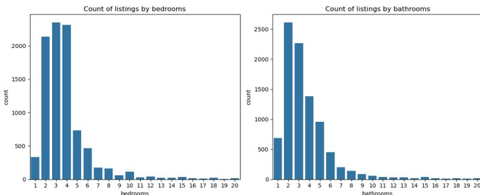
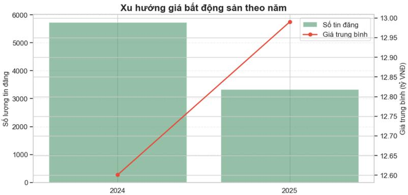
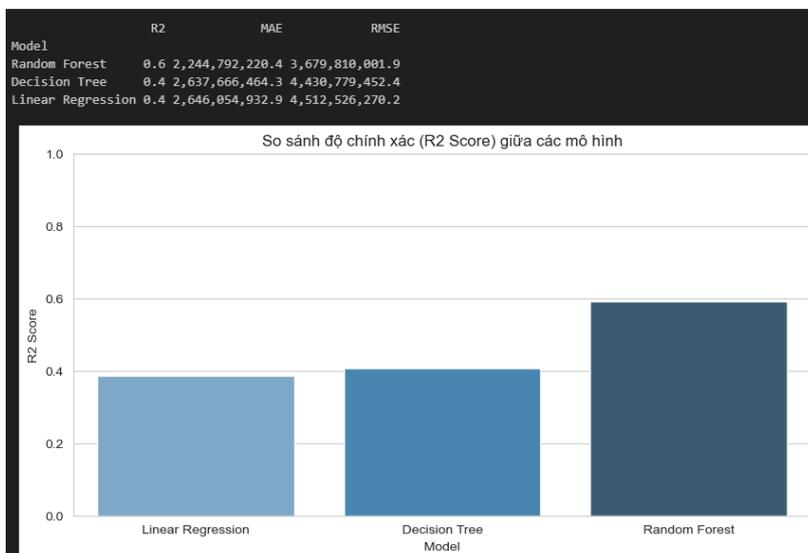
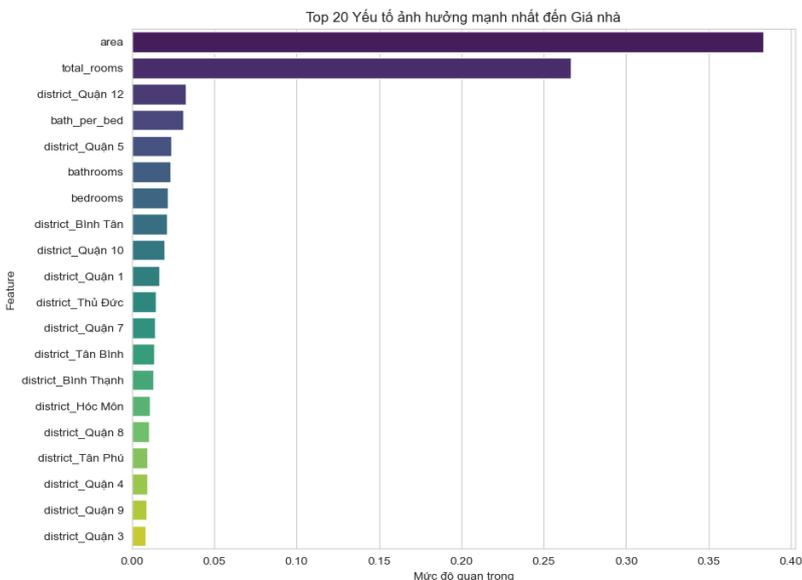

# **TRƯỜNG ĐẠI HỌC SÀI GÒN KHOA CÔNG NGHỆ THÔNG TIN**

-----\*\*\*-----


Logo of Saigon University (SGU) featuring the text 'ĐẠI HỌC SÀI GÒN' and 'SAIGON UNIVERSITY' around a central 'SGU' emblem.

## **BÁO CÁO ĐỒ ÁN MÔN PHÂN TÍCH DỮ LIỆU**

# **TÊN ĐỀ TÀI PHÂN TÍCH THỊ TRƯỜNG BẤT ĐỘNG SẢN TẠI THÀNH PHỐ HỒ CHÍ MINH**

|                                  |                       |
|----------------------------------|-----------------------|
| <b>Giảng viên hướng dẫn:</b>     | <b>TS. Đỗ Như Tài</b> |
| <b>Nhóm sinh viên thực hiện:</b> | <b>19</b>             |
| Hồ Thị Thanh Thảo                | 3122410389            |
| Nguyễn Thị Hồng Thắm             | 3122410392            |
| Phan Văn Thảo                    | 3122410391            |
| Nguyễn Hoàng Thiên Bảo           | 3122410019            |

*Thành phố Hồ Chí Minh, tháng 10 năm 2025*

## PHÂN CÔNG

| Thành viên             | Nhiệm vụ chính                                                                                       | Chương báo cáo        | Hoàn thành |
|------------------------|------------------------------------------------------------------------------------------------------|-----------------------|------------|
| Hồ Thị Thanh Thảo      | Thu thập và tiền xử lý dữ liệu<br>Tổng hợp code và báo cáo<br>Làm slide các phần còn lại             | Chương 1, 3, 5        | 100%       |
| Nguyễn Thị Hồng Thắm   | Trực quan hóa dữ liệu bằng Power BI                                                                  | Chương 2              | 100%       |
| Phan Văn Thảo          | Xây dựng mô hình dự đoán giá (Linear Regression, Random Forest, Decision Tree)<br>Phân cụm (K-Means) | Chương 4 (4.5 -> 4.7) | 100%       |
| Nguyễn Hoàng Thiên Bảo | Phân tích khám phá dữ liệu<br>Làm slide phần eda                                                     | Chương 4 (4.1 -> 4.4) | 100%       |

## NHẬN XÉT CỦA GIẢNG VIÊN

# LỜI MỞ ĐẦU

Trong những năm gần đây, thị trường bất động sản tại Thành phố Hồ Chí Minh đã và đang chứng kiến sự biến động mạnh mẽ về giá bán, nhu cầu nhà ở lẫn xu hướng đầu tư. Đây là một trong những thị trường năng động và có tốc độ đô thị hóa nhanh nhất Việt Nam, nơi bất động sản không chỉ là nhu cầu cư trú mà còn là tài sản đầu tư chiến lược mang lại lợi nhuận dài hạn. Sự phát triển của tầng lớp dân cư trung lưu, tốc độ gia tăng dân số cơ học, nhu cầu nhà ở cho công nhân tri thức, chuyên gia nước ngoài cùng với sự mở rộng hạ tầng đô thị đã góp phần hình thành một bức tranh thị trường đa dạng và đầy cạnh tranh.

Tuy nhiên, cùng với sự phát triển đó là bài toán phức tạp trong việc đánh giá, dự báo và kiểm soát mặt bằng giá. Giá bất động sản tại Thành phố Hồ Chí Minh có sự chênh lệch đáng kể giữa các khu vực, đặc biệt là sự phân hóa mạnh giữa các quận trung tâm (như Quận 1, Quận 3, Quận 5) và khu vực đô thị mở rộng (Thủ Đức, Quận 12, Bình Tân, Bình Chánh, v.v). Điều này đặt ra yêu cầu trong việc nghiên cứu dữ liệu thị trường một cách hệ thống, khách quan và định lượng, nhằm hiểu rõ hơn các yếu tố tác động đến giá và xu hướng biến động theo không gian, thời gian.

Sự phát triển của công nghệ dữ liệu lớn và các nền tảng đăng tin bất động sản trực tuyến, đặc biệt như batdongsan.vn, đã tạo điều kiện thuận lợi cho việc thu thập dữ liệu quy mô lớn, theo thời gian thực và mang tính cập nhật. Nhờ đó, phương pháp phân tích dữ liệu bất động sản không còn dựa trên cảm nhận thị trường hay dự đoán chủ quan, mà dựa trên các mô hình thống kê, machine learning và trực quan hóa dữ liệu.

Xuất phát từ bối cảnh trên, nhóm thực hiện đề tài “Phân tích dữ liệu thị trường bất động sản tại Thành phố Hồ Chí Minh” với mục tiêu xây dựng bộ dữ liệu thực tế gồm gần 10.000 tin đăng nhà đất, xử lý – chuẩn hóa và phân tích nhằm khám phá các mô hình giá theo khu vực, đánh giá xu hướng và dự báo nhằm hỗ trợ ra quyết định đầu tư.

# LỜI CẢM ƠN

Chúng em xin gửi lời cảm ơn chân thành đến *Ths. Đỗ Như Tài*, người đã tận tình hướng dẫn và chia sẻ những kiến thức quý báu trong suốt quá trình thực hiện đề tài này. Sự chỉ bảo tận tình và những góp ý xây dựng từ thầy đã giúp chúng em hiểu rõ hơn về các vấn đề chuyên môn và hoàn thiện sản phẩm một cách tốt nhất.

Mặc dù đã rất cố gắng, nhưng do hạn chế về thời gian và kinh nghiệm, chắc chắn rằng không thể tránh khỏi những sai sót. Chúng em rất mong nhận được ý kiến đóng góp từ thầy để có thể cải thiện và hoàn thiện hơn nữa.

Một lần nữa, chúng em xin chân thành cảm ơn!

# MỤC LỤC

|                                                                     |            |
|---------------------------------------------------------------------|------------|
| <b>DANH MỤC HÌNH ẢNH .....</b>                                      | <b>i</b>   |
| <b>DANH MỤC BẢNG BIỂU.....</b>                                      | <b>iii</b> |
| <b>CHƯƠNG 1. TỔNG QUAN VẤN ĐỀ .....</b>                             | <b>1</b>   |
| 1.1. Lý do chọn đề tài .....                                        | 1          |
| 1.2. Mục tiêu nghiên cứu .....                                      | 3          |
| 1.3. Câu hỏi nghiên cứu.....                                        | 3          |
| 1.4. Đối tượng và phạm vi nghiên cứu .....                          | 4          |
| 1.5. Phương pháp nghiên cứu .....                                   | 5          |
| 1.6. Kết cấu đề tài .....                                           | 6          |
| <b>CHƯƠNG 2. CƠ SỞ LÝ THUYẾT VÀ NGHIÊN CỨU       LIÊN QUAN.....</b> | <b>7</b>   |
| 2.1. Tổng quan về thị trường bất động sản .....                     | 7          |
| 2.1.1. Khái niệm bất động sản nhà ở .....                           | 7          |
| 2.1.2. Các yếu tố ảnh hưởng đến giá bất động sản .....              | 7          |
| 2.2. Các khái niệm cơ bản trong phân tích bất động sản.....         | 8          |
| 2.2.1. Giá và giá trên mỗi mét vuông .....                          | 8          |
| 2.2.2. Phân bố và giá trị ngoại lai .....                           | 9          |
| 2.2.3. Tương quan và mối quan hệ giữa các biến.....                 | 9          |
| 2.3. Phương pháp phân tích dữ liệu .....                            | 10         |
| 2.3.1. Phân tích khám phá dữ liệu .....                             | 10         |
| 2.3.2. Phân cụm dữ liệu .....                                       | 10         |
| 2.3.3. Mô hình dự đoán.....                                         | 11         |
| 2.4. Nghiên cứu liên quan.....                                      | 12         |
| <b>CHƯƠNG 3. DỮ LIỆU VÀ PHƯƠNG PHÁP ĐỀ XUẤT.....</b>                | <b>13</b>  |
| 3.1. Nguồn dữ liệu và quy trình thu thập .....                      | 13         |

|                                                                         |           |
|-------------------------------------------------------------------------|-----------|
| 3.1.1. Nguồn dữ liệu .....                                              | 13        |
| 3.1.2. Quy trình thu thập dữ liệu.....                                  | 13        |
| 3.1.3. Cấu trúc code thu thập dữ liệu.....                              | 14        |
| 3.2. Mô tả dữ liệu.....                                                 | 17        |
| 3.3. Khó khăn và thách thức trong quá trình thu thập .....              | 18        |
| 3.4. Tiền xử lý và làm sạch dữ liệu.....                                | 20        |
| 3.5. Đặc trưng của dữ liệu sau xử lý.....                               | 22        |
| 3.6. Phương pháp đề xuất .....                                          | 22        |
| <b>CHƯƠNG 4. THỰC NGHIỆM VÀ KẾT QUẢ ĐẠT ĐƯỢC .....</b>                  | <b>24</b> |
| 4.1. Giới thiệu chương .....                                            | 24        |
| 4.2. Phân tích mô tả tổng quan .....                                    | 24        |
| 4.2.1. Phân bố giá bất động sản .....                                   | 24        |
| 4.2.2. Phân bố diện tích .....                                          | 25        |
| 4.2.3. Phân bố số phòng ngủ và phòng tắm.....                           | 27        |
| 4.3. Phân tích theo khu vực.....                                        | 27        |
| 4.3.1. Giá trung bình theo quận .....                                   | 27        |
| 4.3.2. Mức giá trên mỗi mét vuông theo quận.....                        | 28        |
| 4.3.3. So sánh phân bố giá giữa các quận TP.HCM.....                    | 30        |
| 4.4. Phân tích theo thời gian và độ biến động .....                     | 32        |
| 4.4.1. Xu hướng giá và lượng tin đăng theo năm .....                    | 32        |
| 4.4.2. Các quận có biến động giá lớn nhất.....                          | 33        |
| 4.5. Phân tích đa biến.....                                             | 34        |
| 4.5.1. Quan hệ diện tích – giá theo từng quận.....                      | 34        |
| 4.5.2. Ma trận tương quan.....                                          | 36        |
| 4.5.3. Ảnh hưởng của số phòng ngủ/toilet đến giá trị bất động sản ..... | 37        |

|                                                                   |           |
|-------------------------------------------------------------------|-----------|
| 4.5.4. Tác động của yếu tố pháp lý đến giá trị bất động sản ..... | 38        |
| 4.6. Phân tích thanh khoản thị trường.....                        | 39        |
| 4.7. Phân cụm bất động sản .....                                  | 40        |
| 4.7.1. Giới thiệu .....                                           | 40        |
| 4.7.2. Mục đích và công dụng.....                                 | 40        |
| 4.7.3. Chuẩn bị dữ liệu.....                                      | 41        |
| 4.7.4. Tìm số cụm tối ưu.....                                     | 42        |
| 4.7.5. Phân tích chi tiết đặc điểm từng cụm.....                  | 44        |
| 4.7.6. Đánh giá chất lượng phân cụm.....                          | 46        |
| 4.8. Xây dựng mô hình dự đoán và đánh giá.....                    | 47        |
| 4.8.1. Giới thiệu .....                                           | 47        |
| 4.8.2. Chiến lược chia dữ liệu huấn luyện và kiểm tra.....        | 48        |
| 4.8.3. Tiền xử lý dữ liệu và xây dựng Pipeline huấn luyện.....    | 48        |
| 4.8.4. Mô hình sử dụng .....                                      | 49        |
| 4.8.5. So sánh độ chính xác giữa các mô hình.....                 | 51        |
| 4.8.6. Feature important.....                                     | 52        |
| 4.8.7. So sánh giá thực tế và giá dự đoán .....                   | 54        |
| <b>CHƯƠNG 5. KẾT LUẬN VÀ KHUYẾN NGHỊ .....</b>                    | <b>55</b> |
| 5.1. Kết luận chung .....                                         | 55        |
| 5.2. Tóm tắt kết quả nghiên cứu .....                             | 55        |
| 5.3. Đóng góp và ý nghĩa của nghiên cứu .....                     | 56        |
| 5.4. Hạn chế của nghiên cứu.....                                  | 57        |
| 5.5. Hướng phát triển và kiến nghị .....                          | 57        |
| <b>TÀI LIỆU THAM KHẢO.....</b>                                    | <b>60</b> |

# **DANH MỤC HÌNH ẢNH**

|                                                                               |    |
|-------------------------------------------------------------------------------|----|
| Hình 1.1. Bản đồ các quận huyện tại thành phố Hồ Chí Minh cũ.....             | 4  |
| Hình 1.2. Tóm tắt luồng công việc kỹ thuật của toàn bộ đề tài .....           | 5  |
| Hình 3.1. Minh họa nguồn dữ liệu thực tế của sàn giao dịch batdongsan.vn..... | 13 |
| Hình 3.2. Dữ liệu bị missing.....                                             | 20 |
| Hình 4.1. Phân bố giá bất động sản .....                                      | 24 |
| Hình 4.2. Thông tin phân bố giá bất động sản.....                             | 25 |
| Hình 4.3. Phân bố diện tích .....                                             | 26 |
| Hình 4.4. Thông tin phân bố diện tích bất động sản.....                       | 26 |
| Hình 4.5. Phân bố số phòng ngủ và phòng tắm.....                              | 27 |
| Hình 4.6. Giá trung bình bất động sản theo quận/huyện .....                   | 28 |
| Hình 4.7. Giá trung bình trên mỗi mét vuông theo quận/huyện.....              | 29 |
| Hình 4.8. Phân bố giá bất động sản theo quận/huyện TP.HCM.....                | 31 |
| Hình 4.9. Xu hướng giá bất động sản TP.HCM giai đoạn 2024–2025 .....          | 32 |
| Hình 4.10. Mức độ biến động giá bất động sản theo quận/huyện .....            | 33 |
| Hình 4.11. Chi tiết giá trung bình, trung vị và độ lệch chuẩn theo quận.....  | 33 |
| Hình 4.12. Quan hệ giá và diện tích theo từng quận/huyện .....                | 34 |
| Hình 4.13. Ma trận tương quan giữa các biến số bất động sản .....             | 36 |
| Hình 4.14. Giá trung bình theo số lượng phòng ngủ/toilet.....                 | 37 |
| Hình 4.15. Giá trung bình theo tình trạng pháp lý.....                        | 38 |
| Hình 4.16. Số lượng tin đăng theo quận/huyện .....                            | 39 |
| Hình 4.17. Biểu đồ phân phối giá sau khi xử lý ngoại lai .....                | 42 |
| Hình 4.18. Phương pháp Elbow xác định số cụm tối ưu .....                     | 43 |
| Hình 4.19. Số lượng nhà trong mỗi cụm .....                                   | 43 |
| Hình 4.20. Phân khúc thị trường nhà ở bằng K-Means .....                      | 44 |

|                                                               |    |
|---------------------------------------------------------------|----|
| Hình 4.21. Bảng thống kê mô tả các cụm.....                   | 45 |
| Hình 4.22. Phân phối giá trong từng cụm.....                  | 46 |
| Hình 4.23. Đánh giá chất lượng phân cụm.....                  | 47 |
| Hình 4.24. Hiệu suất mô hình Linear Regression.....           | 49 |
| Hình 4.25. Hiệu suất mô hình Decision Tree .....              | 50 |
| Hình 4.26. Hiệu suất mô hình Random Forest .....              | 50 |
| Hình 4.27. So sánh độ chính xác giữa các mô hình.....         | 51 |
| Hình 4.28. Top 20 yếu tố ảnh hưởng mạnh nhất đến giá nhà..... | 52 |
| Hình 4.29. Trực quan hóa kết quả thực tế và dự đoán.....      | 54 |

# **DANH MỤC BẢNG BIỂU**

|                               |    |
|-------------------------------|----|
| Bảng 3.1. Mô tả dữ liệu ..... | 17 |
|-------------------------------|----|

# CHƯƠNG 1. TỔNG QUAN VẤN ĐỀ

### 1.1. Lý do chọn đề tài

Thị trường bất động sản Thành phố Hồ Chí Minh từ lâu đã được xem là một trong những thị trường sôi động, nhạy cảm và có sức ảnh hưởng mạnh mẽ nhất trong nền kinh tế Việt Nam. Sự phát triển không ngừng của đô thị, tốc độ đô thị hóa nhanh chóng cùng với sự gia tăng dân số cơ học đã biến nơi đây thành một "sân chơi" đầy tiềm năng nhưng cũng không kém phần phức tạp cho cả nhà đầu tư lẫn người có nhu cầu an cư thực sự. Tuy nhiên, đằng sau sự sôi động ấy là một thực trạng đáng quan tâm: thị trường vận hành trong một môi trường thông tin nhiều mảng rời, thiếu tính hệ thống và thiếu sự minh bạch cần thiết.

Thông tin về bất động sản hiện nay chủ yếu được phân tán trên hàng loạt các nền tảng trực tuyến, các trang rao vặt với định dạng, tiêu chuẩn và mức độ cập nhật khác nhau. Sự đa dạng về nguồn tin, mặc dù mang lại nhiều lựa chọn, lại vô tình tạo ra một "ma trận thông tin" khiến người tìm kiếm khó có được cái nhìn tổng thể, chính xác và kịp thời. Giá cả biến động không ngừng, với mức chênh lệch đôi khi lên đến hàng chục lần giữa các khu vực trung tâm sầm uất và vùng ven đang phát triển, càng làm gia tăng sự hoang mang và khó khăn trong việc đánh giá, so sánh và đưa ra quyết định tài chính quan trọng. Trong bối cảnh đó, nhiều quyết định mua bán vẫn còn dựa nhiều vào kinh nghiệm cá nhân, cảm tính thị trường hoặc những thông tin chưa được kiểm chứng, tiềm ẩn nhiều rủi ro.

Chính những thách thức từ thực tiễn này đã mở ra một hướng tiếp cận mới, nơi mà khoa học dữ liệu và trí tuệ nhân tạo có thể phát huy vai trò then chốt. Là những sinh viên đang theo đuổi chuyên ngành Công nghệ Thông tin, chúng em nhận thấy đây không chỉ là một vấn đề kinh tế - xã hội thú vị, mà còn là một "bài toán thực tế" hoàn hảo để áp dụng và thử nghiệm những kiến thức, kỹ năng đã được trang bị trong suốt quá trình học tập. Từ các kỹ thuật thu thập dữ liệu tự động (Web Scraping), xử lý và làm sạch dữ liệu (Data Cleaning), đến các phương pháp phân tích khám phá (Exploratory Data Analysis - EDA), phân cụm (Clustering) và xây dựng mô hình dự đoán (Predictive Modeling), tất cả đều có thể được vận dụng để "giải mã" thị trường bất động sản từ chính dữ liệu thô của nó.

Xuất phát từ nhận thức đó, đề tài "Phân tích thị trường bất động sản tại Thành phố Hồ Chí Minh" được lựa chọn với hai mục tiêu song hành. Trước hết, về mặt học thuật và đào tạo, đây là cơ hội quý giá để chúng em thực hành một quy trình phân tích dữ liệu chuyên nghiệp và hoàn chỉnh, từ bước đầu thu thập dữ liệu từ các nguồn công khai như *batdongsan.vn*, xử lý những thách thức về chất lượng dữ liệu, đến việc áp dụng các thuật toán machine learning để tìm ra các mẫu hình, xu hướng ẩn sâu bên trong tập dữ liệu. Qua đó, kỹ năng lập trình, tư duy phân tích và giải quyết vấn đề của nhóm sẽ được nâng cao một cách thiết thực.

Thứ hai, về mặt ý nghĩa thực tiễn và xã hội, nghiên cứu này kỳ vọng sẽ góp phần tạo ra một công cụ hoặc một nguồn tham khảo hữu ích, dựa trên nền tảng dữ liệu khách quan. Kết quả phân tích có thể mang lại giá trị thiết thực cho nhiều đối tượng tham gia thị trường. Đối với người mua nhà và nhà đầu tư, nghiên cứu cung cấp một bức tranh toàn cảnh và có hệ thống về mặt bằng giá theo từng khu vực cụ thể, đồng thời làm rõ mức độ ảnh hưởng của các yếu tố như vị trí, diện tích, pháp lý đến giá trị bất động sản. Điều này giúp họ có cơ sở vững chắc để so sánh, đánh giá, từ đó đưa ra những quyết định đầu tư hoặc mua sắm sáng suốt hơn, phù hợp với nhu cầu thực tế và khả năng tài chính của bản thân. Đối với người bán và các nhà môi giới, kết quả phân tích cung cấp một công cụ tham chiếu khách quan để định giá sản phẩm một cách hợp lý, dựa trên xu hướng và dữ liệu thị trường thực tế thay vì cảm tính chủ quan. Việc này không chỉ giúp tối ưu hóa giá bán, rút ngắn thời gian giao dịch mà còn nâng cao tính thuyết phục và minh bạch trong quá trình đàm phán, tạo dựng niềm tin với khách hàng. Bên cạnh đó, nghiên cứu còn cung cấp một góc nhìn tham khảo có giá trị cho các bên quan tâm khác, bao gồm các nhà nghiên cứu, sinh viên, hoặc bất kỳ ai muốn tìm hiểu sâu hơn về cấu trúc, động thái vận động và các phân khúc tiềm năng của thị trường bất động sản nhà ở tại một đô thị lớn và phức tạp như Thành phố Hồ Chí Minh, góp phần vào việc nâng cao hiểu biết chung về thị trường này.

Tóm lại, việc thực hiện đề tài này xuất phát từ mong muốn kết nối giữa lý thuyết chuyên môn với một vấn đề thực tế nóng hổi, qua đó không chỉ hoàn thành nhiệm vụ học tập mà còn hướng đến tạo ra những giá trị thiết thực, góp một phần nhỏ vào việc mang lại cái nhìn rõ ràng, khách quan hơn về một thị trường quan trọng của thành phố.

## **1.2. Mục tiêu nghiên cứu**

Nghiên cứu hướng đến mục tiêu tổng quát là xây dựng một hệ thống phân tích toàn diện về thị trường bất động sản nhà ở tại Thành phố Hồ Chí Minh dựa trên dữ liệu thực tế được thu thập từ sàn giao dịch trực tuyến. Hệ thống này sẽ cung cấp các thông tin hữu ích về đặc điểm thị trường, xu hướng giá và các yếu tố ảnh hưởng đến giá bất động sản, từ đó hỗ trợ người mua, người bán và nhà đầu tư đưa ra quyết định dựa trên dữ liệu khách quan.

Để đạt được mục tiêu tổng quát này, nghiên cứu đặt ra các mục tiêu cụ thể theo ba nhóm chính. Thứ nhất, về thu thập và xử lý dữ liệu, nghiên cứu sẽ thu thập khoảng 10,000 tin đăng bán nhà đất tại TP.HCM từ website batdongsan.vn thông qua quy trình tự động hóa web scraping, sau đó làm sạch và chuẩn hóa dữ liệu thô thành dữ liệu có cấu trúc phù hợp cho phân tích. Thứ hai, về phân tích dữ liệu, nghiên cứu sẽ phân tích đặc điểm thị trường theo không gian, đánh giá xu hướng biến động giá theo thời gian (2024-2025), khám phá mối quan hệ giữa các yếu tố như diện tích, số phòng, pháp lý với giá bất động sản, và xác định yếu tố có ảnh hưởng mạnh nhất. Thứ ba, về mô hình hóa và ứng dụng, nghiên cứu sẽ phân cụm thị trường thành các phân khúc rõ rệt, xây dựng và so sánh các mô hình dự đoán giá để lựa chọn mô hình tốt nhất, đồng thời xây dựng dashboard trực quan hóa tương tác và công cụ dự đoán giá phục vụ người dùng cuối.

### **1.3. Câu hỏi nghiên cứu**

Đề tài được thực hiện nhằm trả lời các câu hỏi nghiên cứu sau:

1. Thị trường bất động sản tại TP.HCM có đặc điểm phân bố giá và diện tích như thế nào?
2. Giá bất động sản chênh lệch giữa các quận/huyện ra sao, và đâu là những khu vực có giá trung bình và giá trên mỗi mét vuông cao nhất, thấp nhất?
3. Mối quan hệ giữa diện tích và giá bất động sản được thể hiện như thế nào trên toàn thị trường và trong từng khu vực cụ thể?
4. Xu hướng biến động về giá cả và số lượng tin đăng trên thị trường trong giai đoạn 2024–2025 có những điểm đáng chú ý gì?

5. Khu vực nào có mức độ dao động giá (biến động) lớn nhất và khu vực nào có lượng tin đăng (thanh khoản) nhiều nhất?
6. Các yếu tố như số phòng, tình trạng pháp lý ảnh hưởng đến giá bất động sản ở mức độ nào?
7. Sử dụng phương pháp phân cụm K-Means, thị trường có thể được phân chia thành bao nhiêu nhóm bất động sản có đặc điểm tương đồng, và đặc điểm của từng nhóm là gì?
8. Trong số các mô hình học máy được thử nghiệm, mô hình nào cho kết quả dự đoán giá chính xác nhất?
9. Những đặc điểm nào của bất động sản là quan trọng nhất trong việc dự đoán giá theo mô hình tốt nhất?

## 1.4. Đối tượng và phạm vi nghiên cứu

![Map of Ho Chi Minh City showing its districts and surrounding areas. The map is color-coded by district: District 1 (pink), District 2 (light green), District 3 (light blue), District 4 (light orange), District 5 (light purple), District 6 (light yellow), District 7 (light green), District 8 (light blue), District 9 (light green), District 10 (light pink), District 11 (light blue), District 12 (light green), District 13 (light green), District 14 (light green), District 15 (light green), District 16 (light green), District 17 (light green), District 18 (light green), District 19 (light green), District 20 (light green). Surrounding areas include Bien Hoa, Thu Duc, and various lakes like H. Cự Chi, H. Hóc Môn, H. Bình Chánh, H. Nội Bàng, and H. Cần Giuộc. Major roads and highways are also shown.](177e8bc1c595b7fe3461d9919f87e044_img.jpg)

Map of Ho Chi Minh City showing its districts and surrounding areas. The map is color-coded by district: District 1 (pink), District 2 (light green), District 3 (light blue), District 4 (light orange), District 5 (light purple), District 6 (light yellow), District 7 (light green), District 8 (light blue), District 9 (light green), District 10 (light pink), District 11 (light blue), District 12 (light green), District 13 (light green), District 14 (light green), District 15 (light green), District 16 (light green), District 17 (light green), District 18 (light green), District 19 (light green), District 20 (light green). Surrounding areas include Bien Hoa, Thu Duc, and various lakes like H. Cự Chi, H. Hóc Môn, H. Bình Chánh, H. Nội Bàng, and H. Cần Giuộc. Major roads and highways are also shown.

Hình 1.1. Bản đồ các quận huyện tại thành phố Hồ Chí Minh cũ

Về phạm vi không gian (Hình 1.1), nghiên cứu tập trung vào 24 quận/huyện thuộc Thành phố Hồ Chí Minh, bao gồm các khu vực nội thành như Quận 1, 3, 4, 5, 6, 7, 8, 10, 11, Phú Nhuận, Tân Bình, Bình Thạnh, Gò Vấp và Tân Phú, cùng với các khu vực ngoại thành như Thành phố Thủ Đức (bao gồm cả Quận 2, Quận 9, Thủ Đức cũ), Bình Tân, Bình Chánh, Hóc Môn, Củ Chi, Nhà Bè và Cần Giuộc. Việc lựa chọn phạm vi rộng này cho phép nghiên cứu có cái nhìn toàn diện về sự chênh lệch giá giữa khu vực trung tâm và ngoại thành, đồng thời nắm bắt được xu hướng dịch chuyển phát triển ra các khu đô thị vệ tinh đang diễn ra mạnh mẽ trong những năm gần đây.

Về phạm vi thời gian, dữ liệu được thu thập liên tục từ các tin đăng có ngày đăng từ năm 2024 đến năm 2025. Việc phân tích dữ liệu trong giai đoạn hai năm này cho phép nghiên cứu nắm bắt được xu hướng phục hồi của thị trường, đặc biệt là giai đoạn 2024 khi các vấn đề pháp lý dần được tháo gỡ và thị trường bắt đầu bước vào chu kỳ phát triển mới như One Mount Group (2025) đã ghi nhận.

Về đối tượng nghiên cứu, nghiên cứu tập trung vào các loại hình bất động sản nhà ở cá nhân, cụ thể là nhà phố, biệt thự, nhà mặt tiền và nhà hẻm xe hơi. Về nội dung, nghiên cứu tập trung vào phân tích giá bán và giá trên mỗi mét vuông theo khu vực, các đặc điểm vật lý như diện tích và số phòng, đặc điểm pháp lý về tình trạng sổ cùng với xu hướng biến động giá và nguồn cung theo thời gian.

## 1.5. Phương pháp nghiên cứu


```
graph LR; A[Thu thập dữ liệu] --> B[Tiền xử lý]; B --> C[Phân tích]; C --> D[Mô hình hóa]; D --> E[Ứng dụng và báo cáo];
```

The diagram illustrates the research methodology through a five-step flowchart. The steps are: 1. Thu thập dữ liệu (Web Scraping), shown with a screenshot of a website; 2. Tiền xử lý, shown with icons for data cleaning and preprocessing; 3. Phân tích, shown with a line graph and data visualization icons; 4. Mô hình hóa, shown with a scatter plot and regression line; 5. Ứng dụng và báo cáo, shown with a computer monitor displaying a dashboard and a report document. The first step is labeled 'Web Scraping từ batdongsan.vn'.

Flowchart of the research methodology showing five steps: Thu thập dữ liệu (Web Scraping), Tiền xử lý, Phân tích, Mô hình hóa, and Ứng dụng và báo cáo.

Hình 1.2. Tóm tắt luồng công việc kỹ thuật của toàn bộ đề tài

Đề tài sử dụng các phương pháp:

- Thu thập dữ liệu (Web Scraping): sử dụng Python và thư viện BeautifulSoup để tự động thu thập tin đăng.
- Xử lý và làm sạch dữ liệu: chuẩn hóa ký tự, tách diện tích, loại bỏ ký tự đặc biệt, mã hóa danh mục, xử lý thiếu.

- Phân tích dữ liệu (EDA): trực quan hóa bằng seaborn, matplotlib và phân tích thống kê mô tả, so sánh phân bố giá theo quận, xác định khu vực “nóng”.
- Mô hình machine learning dự báo giá: Random Forest, Linear Regression, Decision Tree.
- Phân cụm dữ liệu (Clustering): nhóm bất động sản theo diện tích – giá – vị trí (k-means).
- Trực quan hóa nâng cao: Xây dựng dashboard tương tác bằng Power BI và Streamlit.

## 1.6. Kết cấu đề tài

Đề tài được tổ chức thành 5 chương chính như sau:

- Chương 1. Tổng quan vấn đề: Nêu lý do, mục tiêu, câu hỏi và phạm vi nghiên cứu.
- Chương 2. Cơ sở lý thuyết và nghiên cứu liên quan: Tổng quan về thị trường BĐS, các yếu tố ảnh hưởng, và cơ sở lý thuyết về các phương pháp ML, EDA được áp dụng.
- Chương 3. Dữ liệu và phương pháp đề xuất: Mô tả chi tiết nguồn dữ liệu, quy trình thu thập và tiền xử lý, cũng như mô hình ML đề xuất.
- Chương 4. Thực nghiệm và kết quả đạt được: Trình bày kết quả của Phân tích mô tả, Phân cụm và kết quả đánh giá các Mô hình dự đoán, thảo luận ý nghĩa thực tiễn.
- Chương 5. Kết luận: Tóm tắt kết quả, nêu hạn chế của đề tài và định hướng phát triển trong tương lai.

# **CHƯƠNG 2. CƠ SỞ LÝ THUYẾT VÀ NGHIÊN CỨU LIÊN QUAN**

### **2.1. Tổng quan về thị trường bất động sản**

### **2.1.1. Khái niệm bất động sản nhà ở**

Bất động sản nhà ở là loại hình tài sản bất động được định nghĩa là phần đất và các công trình xây dựng gắn liền với đất, được sử dụng cho mục đích ở của cá nhân và gia đình. Theo Luật Nhà ở Việt Nam năm 2014, nhà ở được phân loại thành nhiều dạng khác nhau như nhà ở riêng lẻ, nhà ở chung cư, nhà ở liền kề, biệt thự và các loại hình khác [1]. Nghiên cứu này tập trung vào phân khúc nhà ở riêng lẻ tại Thành phố Hồ Chí Minh, bao gồm nhà phố, biệt thự, nhà mặt tiền và nhà trong hẻm, vốn chiếm tỷ trọng đáng kể trong tổng giao dịch bất động sản nhà ở tại thành phố.

Thị trường bất động sản nhà ở có vai trò quan trọng trong nền kinh tế, không chỉ là nơi đáp ứng nhu cầu an cư của người dân mà còn là kênh đầu tư hấp dẫn với tiềm năng sinh lời cao. Đặc điểm nổi bật của thị trường này là tính không đồng nhất cao, nghĩa là giá trị của từng bất động sản phụ thuộc mạnh vào nhiều yếu tố như vị trí địa lý, diện tích, chất lượng xây dựng, tình trạng pháp lý và các yếu tố vĩ mô kinh tế. Sự không đồng nhất này tạo ra thách thức lớn trong việc định giá và dự đoán giá bất động sản, đòi hỏi phải có phương pháp phân tích dữ liệu tiên tiến để nắm bắt được các mối quan hệ phức tạp.

### **2.1.2. Các yếu tố ảnh hưởng đến giá bất động sản**

Giá bất động sản chịu tác động của nhiều nhóm yếu tố khác nhau, có thể phân loại thành các nhóm chính sau đây. Nhóm yếu tố vị trí địa lý được xem là quan trọng nhất, bao gồm khu vực hành chính (quận, huyện), khoảng cách đến trung tâm thành phố, khả năng tiếp cận với các tuyến giao thông công cộng, và mật độ dân cư xung quanh. Theo nguyên lý "nhất vị trí, nhì hướng" trong thị trường bất động sản Việt Nam, vị trí có thể tạo ra sự chênh lệch giá lên đến hàng chục lần giữa các khu vực khác nhau trong cùng một thành phố. Nghiên cứu của One Mount Group năm 2025 đã chỉ ra rằng khu vực phía Đông Thành phố Hồ Chí Minh có mức tăng giá cao nhất với 15.1% trong năm

2024, cao hơn đáng kể so với các khu vực khác, chủ yếu do tác động của hạ tầng giao thông mới như tuyến Metro số 1 chính thức đi vào hoạt động. [2]

Nhóm yếu tố đặc điểm vật lý của bất động sản bao gồm diện tích đất, diện tích sàn xây dựng, số lượng phòng ngủ và phòng vệ sinh, hướng nhà và chất lượng xây dựng. Mặc dù các yếu tố này có vai trò quan trọng, nhưng mức độ ảnh hưởng của chúng không đồng đều giữa các khu vực. Tại các quận trung tâm, yếu tố diện tích thường ít quyết định hơn so với vị trí cụ thể, trong khi ở các khu vực ngoại thành, diện tích lại trở thành yếu tố chính trong định giá. Nhóm yếu tố pháp lý và quy hoạch cũng có tác động mạnh mẽ đến giá trị bất động sản, với tình trạng sổ hồng hoặc sổ đỏ, quy hoạch đô thị và các chính sách hạn chế xây dựng đều có thể tạo ra sự chênh lệch giá đáng kể.

Cuối cùng, nhóm yếu tố vĩ mô kinh tế bao gồm chính sách tiền tệ và lãi suất cho vay, tăng trưởng GDP, tỷ lệ thất nghiệp và đầu tư nước ngoài FDI. Trong năm 2024, mặc dù nền kinh tế Việt Nam đạt mức tăng trưởng GDP ấn tượng 7.09%, nguồn cung căn hộ mới tại TP.HCM lại giảm 40% so với năm 2023, từ 8,700 căn xuống chỉ còn 5,200 căn, phản ánh tác động của các chính sách kiểm soát tín dụng và vấn đề pháp lý dự án. Sự tương tác phức tạp giữa các nhóm yếu tố này tạo nên bức tranh thị trường đa chiều, đòi hỏi các phương pháp phân tích tiên tiến để có thể nắm bắt được toàn bộ động lực thị trường. [2]

## **2.2. Các khái niệm cơ bản trong phân tích bất động sản**

### **2.2.1. Giá và giá trên mỗi mét vuông**

Giá bất động sản là giá trị tiền tệ mà người mua phải trả để sở hữu một bất động sản, thường được biểu thị bằng đơn vị tỷ đồng hoặc triệu đồng tại Việt Nam. Tuy nhiên, để có thể so sánh công bằng giữa các bất động sản có quy mô khác nhau, chỉ số giá trên mỗi mét vuông (đơn giá) được sử dụng rộng rãi trong phân tích thị trường. Đơn giá được tính bằng cách chia tổng giá bán cho diện tích đất hoặc diện tích sàn xây dựng, thường được biểu thị bằng triệu đồng trên mét vuông. Chỉ số này giúp loại bỏ ảnh hưởng của kích thước bất động sản, từ đó phản ánh chính xác hơn giá trị thực của vị trí và các yếu tố khác.

Tầm quan trọng của đơn giá trong phân tích bất động sản thể hiện rõ qua các trường hợp so sánh thực tế. Ví dụ, một căn nhà diện tích 50 mét vuông tại Quận 1 có giá

10 tỷ đồng sẽ có đơn giá 200 triệu đồng mỗi mét vuông, trong khi một căn nhà diện tích 200 mét vuông tại Củ Chi cũng có giá 10 tỷ đồng chỉ có đơn giá 50 triệu đồng mỗi mét vuông. Sự chênh lệch này cho thấy căn nhà tại Quận 1 có giá trị vị trí cao gấp 4 lần so với Củ Chi, mặc dù tổng giá trị giao dịch là như nhau. Trong nghiên cứu này, cả hai chỉ số giá tổng và đơn giá đều được sử dụng để phân tích thị trường từ nhiều góc độ khác nhau, đồng thời đơn giá được sử dụng như một biến đặc trưng quan trọng trong các mô hình dự đoán giá.

### **2.2.2. Phân bố và giá trị ngoại lai**

Phân bố dữ liệu mô tả cách các giá trị trong tập dữ liệu được phân tán xung quanh giá trị trung tâm. Trong phân tích bất động sản, việc hiểu rõ đặc điểm phân bố giá là vô cùng quan trọng vì nó ảnh hưởng trực tiếp đến lựa chọn phương pháp phân tích và xây dựng mô hình. Phân bố chuẩn là dạng phân bố lý tưởng với dữ liệu tập trung đối xứng quanh giá trị trung bình, tuy nhiên trong thực tế, dữ liệu giá bất động sản thường có dạng phân bố lệch phải (right - skewed), nghĩa là phần lớn giá trị tập trung ở mức thấp trong khi một số ít giá trị cao kéo dài phần đuôi bên phải.

Giá trị ngoại lai (outliers) là các quan sát có giá trị khác biệt đáng kể so với phần lớn dữ liệu, thường được xác định thông qua phương pháp khoảng tứ phân vị (IQR) với công thức xác định outlier là các giá trị nằm ngoài khoảng từ  $Q1 - 1.5 \times IQR$  đến  $Q3 + 1.5 \times IQR$ . Trong bối cảnh bất động sản, các outlier có thể là biệt thự cao cấp, nhà mặt tiền đường lớn hoặc các bất động sản có vị trí đặc biệt. Việc xử lý outlier cần được cân nhắc kỹ lưỡng: loại bỏ hoàn toàn có thể làm mất thông tin về phân khúc cao cấp, trong khi giữ lại có thể làm sai lệch các chỉ số thống kê và mô hình dự đoán.

### **2.2.3. Tương quan và mối quan hệ giữa các biến**

Tương quan đo lường mức độ và hướng của mối quan hệ tuyến tính giữa hai biến số. Hệ số tương quan Pearson ( $r$ ) là chỉ số phổ biến nhất, có giá trị từ -1 đến +1, trong đó  $r = +1$  cho thấy tương quan dương hoàn hảo (khi biến này tăng thì biến kia tăng theo),  $r = -1$  cho thấy tương quan âm hoàn hảo (khi biến này tăng thì biến kia giảm), và  $r = 0$  cho thấy không có tương quan tuyến tính. Trong phân tích bất động sản, việc xác định các cặp biến có tương quan mạnh giúp hiểu rõ các yếu tố ảnh hưởng đến giá và phát hiện vấn đề đa cộng tuyến có thể ảnh hưởng đến mô hình dự đoán.

Ma trận tương quan là công cụ hữu ích để trực quan hóa mối quan hệ giữa nhiều biến cùng lúc thông qua bảng hoặc heatmap màu sắc. Tuy nhiên, cần lưu ý rằng tương quan không có nghĩa là quan hệ nhân quả - hai biến có thể có tương quan cao nhưng không có mối quan hệ trực tiếp, hoặc cả hai cùng bị ảnh hưởng bởi một biến thứ ba. Trong nghiên cứu về bất động sản, việc phát hiện tương quan giữa các biến như diện tích, số phòng ngủ, số phòng tắm và giá giúp xây dựng các giả thuyết về mối quan hệ và lựa chọn features phù hợp cho mô hình machine learning.

## **2.3. Phương pháp phân tích dữ liệu**

### **2.3.1. Phân tích khám phá dữ liệu**

Phân tích khám phá dữ liệu (Exploratory Data Analysis - EDA) là quá trình phân tích tập dữ liệu nhằm tóm tắt các đặc điểm chính thông qua phương pháp trực quan hóa và thống kê mô tả. EDA là bước quan trọng đầu tiên trong bất kỳ dự án phân tích dữ liệu nào, giúp nhà nghiên cứu hiểu rõ cấu trúc dữ liệu, phát hiện các patterns ẩn, xác định anomalies và kiểm tra các giả định trước khi áp dụng các kỹ thuật phức tạp hơn. Trong phân tích bất động sản, EDA giúp trả lời các câu hỏi cơ bản như phân bố giá như thế nào, quận nào có giá cao nhất, mối quan hệ giữa diện tích và giá ra sao.

Các kỹ thuật EDA phổ biến bao gồm thống kê mô tả, trực quan hóa phân bố, phân tích tương quan và phân tích theo nhóm. Trong Python, các thư viện như Pandas, Matplotlib và Seaborn cung cấp công cụ mạnh mẽ để thực hiện EDA một cách hiệu quả. Đối với dữ liệu bất động sản có tính không gian cao, việc kết hợp EDA với visualization theo địa lý (geographic visualization) thông qua các thư viện như Folium hoặc Plotly giúp phát hiện các patterns về giá theo khu vực một cách trực quan hơn.

### **2.3.2. Phân cụm dữ liệu**

Phân cụm (Clustering) là kỹ thuật học máy không giám sát nhằm nhóm các đối tượng có đặc điểm tương đồng vào cùng một cụm trong khi các đối tượng thuộc các cụm khác nhau có sự khác biệt rõ rệt. Khác với phương pháp học có giám sát cần dữ liệu được gán nhãn trước, phân cụm tự động phát hiện cấu trúc tự nhiên trong dữ liệu mà không cần thông tin nhãn. Trong phân tích bất động sản, phân cụm được ứng dụng để phân khúc thị trường, giúp xác định các nhóm bất động sản có đặc điểm tương đồng về giá, diện tích, vị trí và tiện ích.

K-Means là thuật toán phân cụm phổ biến nhất, hoạt động bằng cách phân chia dữ liệu thành K cụm sao cho tổng bình phương khoảng cách từ mỗi điểm đến tâm cụm (centroid) gần nhất là nhỏ nhất. Ưu điểm của K-Means là đơn giản, nhanh và dễ triển khai, phù hợp với tập dữ liệu lớn. Tuy nhiên, thuật toán yêu cầu chỉ định trước số cụm K và nhạy cảm với giá trị khởi tạo ban đầu cũng như outliers. Để xác định số cụm tối ưu, phương pháp Elbow Method được sử dụng rộng rãi bằng cách vẽ đồ thị giữa số cụm K và tổng bình phương sai số trong cụm (SSE), điểm "khuỷu tay" (elbow point) nơi đường cong bắt đầu thoai ra được chọn làm K tối ưu. Các chỉ số đánh giá khác như Silhouette Score cũng được sử dụng để đo lường chất lượng phân cụm.

### 2.3.3. Mô hình dự đoán

Mô hình dự đoán là quá trình xây dựng mô hình toán học để ước lượng giá trị của biến mục tiêu dựa trên các biến đầu vào. Trong bối cảnh bất động sản, mục tiêu là dự đoán giá bán nhà dựa trên các đặc điểm như diện tích, vị trí, số phòng, tình trạng pháp lý. Đây là bài toán hồi quy (regression) vì biến mục tiêu là giá trị liên tục. Các mô hình hồi quy được chia thành hai nhóm chính: mô hình tuyến tính và mô hình phi tuyến.

Linear Regression (Hồi quy tuyến tính) là mô hình cơ bản nhất, giả định mối quan hệ tuyến tính giữa biến độc lập và biến phụ thuộc theo công thức  $y = \beta_0 + \beta_1x_1 + \beta_2x_2 + \dots + \beta_nx_n + \varepsilon$  [19]. Ưu điểm của mô hình này là đơn giản, dễ hiểu và dễ giải thích, tuy nhiên hạn chế lớn là không thể nắm bắt các mối quan hệ phi tuyến phức tạp thường xuất hiện trong dữ liệu bất động sản.

Decision Tree (Cây quyết định) là mô hình phi tuyến chia không gian features thành các vùng chữ nhật thông qua chuỗi các quy tắc if-then, có thể nắm bắt được phi tuyến và tương tác giữa các biến nhưng dễ bị overfitting.

Random Forest là mô hình ensemble learning kết hợp nhiều cây quyết định được huấn luyện trên các tập con ngẫu nhiên của dữ liệu và features, sau đó lấy trung bình kết quả để đưa ra dự đoán cuối cùng. Phương pháp này giảm mạnh overfitting so với Decision Tree đơn lẻ và thường cho độ chính xác cao hơn, đồng thời có khả năng xếp hạng mức độ quan trọng của các features (feature importance) giúp hiểu rõ yếu tố nào ảnh hưởng mạnh nhất đến giá.

Để đánh giá hiệu suất mô hình hồi quy, các chỉ số thường dùng bao gồm: MAE (Mean Absolute Error) - sai số tuyệt đối trung bình, đo lường độ lệch trung bình giữa

giá trị dự đoán và thực tế; RMSE (Root Mean Squared Error) - căn bậc hai của trung bình bình phương sai số, phạt nặng hơn các sai số lớn; và  $R^2$  (Coefficient of Determination) - hệ số xác định đo lường tỷ lệ phương sai trong dữ liệu được giải thích bởi mô hình, với giá trị từ 0 đến 1 trong đó càng gần 1 càng tốt. Trong thực tế, cần kết hợp nhiều chỉ số để đánh giá toàn diện hiệu suất mô hình.

## 2.4. Nghiên cứu liên quan

Trong những năm gần đây, đã có nhiều nghiên cứu ứng dụng machine learning để dự đoán giá bất động sản tại các thành phố lớn trên thế giới. Nghiên cứu của Antipov và Pokryshevskaya (2012) áp dụng mô hình hedonic pricing kết hợp với các kỹ thuật machine learning để dự đoán giá căn hộ tại Moscow, Nga, kết quả cho thấy Random Forest cho độ chính xác cao hơn Linear Regression với  $R^2 = 0.82$ . [3]

Tại Việt Nam, các nghiên cứu ứng dụng khoa học dữ liệu và học máy trong lĩnh vực định giá bất động sản vẫn còn tương đối hạn chế. Nghiên cứu của Nguyễn Tấn Quang (2019) đã sử dụng phương pháp hồi quy tuyến tính và BMA để phân tích các yếu tố ảnh hưởng đến giá nhà ở TP.HCM. Sau khi lựa chọn mô hình tốt nhất, 6 biến số được phát hiện có tác động đến giá nhà tại thành phố Hồ Chí Minh đó là: diện tích, bãi đậu xe, chiều rộng đường mặt tiền, khoảng cách đến các khu thương mại, nhà loại 1 và nhà ở miền Bắc. Bằng cách tính toán LMG, người ta cho rằng kích thước của các ngôi nhà có ảnh hưởng nhiều nhất đến giá nhà ở thành phố này [4].

So với các nghiên cứu trước, nghiên cứu này có những điểm khác biệt và đóng góp mới. Thứ nhất, quy mô dữ liệu lớn hơn đáng kể với gần 10,000 tin đăng được thu thập tự động qua web scraping, trong khi các nghiên cứu trước thường có dữ liệu nhỏ hơn hoặc sử dụng dữ liệu thứ cấp. Thứ hai, nghiên cứu tập trung vào phân khúc nhà ở riêng lẻ (nhà phố, biệt thự) thay vì căn hộ chung cư - phân khúc ít được nghiên cứu hơn nhưng chiếm tỷ trọng lớn trong giao dịch thực tế. Thứ ba, nghiên cứu kết hợp cả ba phương pháp phân tích: EDA chi tiết, phân cụm thị trường và mô hình dự đoán, tạo nên một bức tranh phân tích toàn diện từ mô tả đến dự báo. Cuối cùng, nghiên cứu không chỉ xây dựng mô hình mà còn phân tích sâu feature importance để hiểu rõ cơ chế định giá của thị trường TP.HCM, từ đó đưa ra các khuyến nghị thực tiễn cho người mua, người bán và nhà đầu tư.

# CHƯƠNG 3. DỮ LIỆU VÀ PHƯƠNG PHÁP ĐỀ XUẤT

## 3.1. Nguồn dữ liệu và quy trình thu thập

### 3.1.1. Nguồn dữ liệu

Image: Screenshot of the Batdongsan.vn website showing search results for properties in Ho Chi Minh City.

The image is a screenshot of the Batdongsan.vn website. It shows a search interface with various filters like 'Nhà bán', 'Cho thuê', 'Dự án', etc. The search results are for 'Bán Nhà tại Hồ Chí Minh'. Two property listings are visible: one in Quận 10 (Hẻm Xe Hơi 6M - Sát Mặt Tiền - 8PN CHDV Full Nội Thất - 15 Tỷ) and another in Quận 5 (Nhà MT 4m\*17.8m - 77m2 Nguyễn Biểu Q5, Giá : 26.3 Tỷ (TL)).

*Hình 3.1. Minh họa nguồn dữ liệu thực tế của sàn giao dịch batdongsan.vn*

Dữ liệu sử dụng trong nghiên cứu được thu thập từ website batdongsan.vn (Hình 3.1), một trong những nền tảng rao bán bất động sản phổ biến và có lưu lượng thông tin lớn tại Việt Nam. Đây là nguồn dữ liệu mở, công khai, phù hợp cho mục đích phân tích học thuật, không can thiệp hay tác động đến hệ thống của website.

### 3.1.2. Quy trình thu thập dữ liệu

Để đảm bảo dữ liệu thu thập an toàn và tránh bị chặn IP, quá trình thu thập được triển khai bằng Python, sử dụng thư viện requests và BeautifulSoup4, kết hợp nhiều kỹ thuật:

- Luân phiên User-Agent để mô phỏng nhiều trình duyệt khác nhau.
- Nghi ngẫu nhiên giữa các lần request nhằm giảm tần suất truy cập liên tục.
- Cào theo từng batch nhỏ 50 trang, lưu thành nhiều file CSV để phòng ngừa lỗi.
- Retry khi gặp lỗi mạng, đảm bảo tính ổn định trong suốt quá trình.
- Timeout hợp lý, tránh treo khi server phản hồi chậm.

Việc thu thập dữ liệu được tiến hành trong nhiều đợt, trải dài từ năm 2024 đến năm 2025, tương ứng với thời gian đăng bài của các tin rao được thu về. Nhờ thu thập trên một

khoảng thời gian dài, dữ liệu phản ánh được biến động giá nhà theo chu kỳ thị trường, qua đó hỗ trợ phân tích không gian – thời gian một cách tự nhiên và sát thực tế. Kết quả thu được gần 10.000 tin đăng, lưu thành 9 file CSV theo từng batch. Sau khi hoàn tất thu thập theo batch, dữ liệu được ghép lại thành một file CSV duy nhất để chuyển sang giai đoạn làm sạch và xử lý.

### 3.1.3. Cấu trúc code thu thập dữ liệu

Mã nguồn chính bao gồm 5 phần:

1. Cấu hình User-Agent & đường dẫn

```
USER_AGENTS = [
    'Mozilla/5.0 (Windows NT 10.0; Win64; x64) AppleWebKit/537.36
    Chrome/120.0 Safari/537.36',
    'Mozilla/5.0 (Macintosh; Intel Mac OS X 10_15_7) AppleWebKit/605.1.15
    Version/15.0 Safari/605.1.15',
    'Mozilla/5.0 (X11; Ubuntu; Linux x86_64; rv:89.0) Gecko/20100101
    Firefox/89.0',
]
HEADERS = {
    'User-Agent': random.choice(USER_AGENTS)
}
BASE_URL = "https://batdongsan.vn/ban-nha-ho-chi-minh"
NUM_PAGES = 417
OUTPUT_DIR = "bds_batches"
```

2. Hàm lấy danh sách link bài đăng

```
def get_listing_links(page_num, retries=3):
    url = f"{BASE_URL}/p{page_num}"
    for attempt in range(retries):
        try:
            res = requests.get(url, headers=HEADERS, timeout=(5, 30))
            res.raise_for_status()
            soup = BeautifulSoup(res.text, "html.parser")
            links = soup.select("a.card-cm")
            urls = [a["href"] for a in links if a.has_attr("href")]
            return urls
```

```

except Exception as e:
    print(f"Lỗi trang {page_num}, thử lại {attempt+1}: {e}")
    time.sleep(5)

return []

```

#### 3. Hàm trích xuất thông tin chi tiết

```

def scrape_listing_detail(url, retries=3):
    data = {"link": url}

    for attempt in range(retries):
        try:
            res = requests.get(url, headers=HEADERS, timeout=(5, 30))
            res.raise_for_status()
            soup = BeautifulSoup(res.text, "html.parser")

            # Tiêu đề
            title = soup.select_one(".content")
            data["title"] = title.text.strip() if title else None

            # Giá và diện tích
            labels = soup.select(".row-cols-sm-2 .line-label")
            values = soup.select(".row-cols-sm-2 .line-text")
            for label, value in zip(labels, values):
                key = label.text.strip().replace(":", "")
                val = value.text.strip()
                data[key] = val

            # Vị trí
            breadcrumb = soup.select(".re__breadcrumb a.re__link-se")
            if len(breadcrumb) >= 2:
                data["city"] = breadcrumb[-2].text.strip()
                data["district"] = breadcrumb[-1].text.strip()

            # Ngày đăng
            date_elem = soup.select_one(".col-md-12 .flex-grow-1 .col .value")
            data["date"] = date_elem.text.strip() if date_elem else None

```

```

        # Mô tả
        desc_elem = soup.find(id="more1")
        data["description"] = desc_elem.get_text(strip=True) if desc_elem
    else None

    return data

except Exception as e:
    print(f"Lỗi cào {url}, thử lại {attempt+1}: {e}")
    time.sleep(5)

return data

```

#### 4. Hàm lưu dữ liệu theo batch

```

def save_to_csv(data, batch_idx):
    if not data:
        return

    # Gộp các key để tránh lỗi fieldnames
    all_keys = set()
    for d in data:
        all_keys.update(d.keys())
    fieldnames = list(all_keys)

    with open(f"{OUTPUT_DIR}/batch_{batch_idx}.csv", "w", encoding="utf-8",
              newline="") as f:
        writer = csv.DictWriter(f, fieldnames=fieldnames)
        writer.writeheader()
        for row in data:
            writer.writerow(row)

    print(f"Đã lưu batch {batch_idx}: {len(data)} bài đăng.")

```

#### 5. Vòng lặp chạy chính

```

if __name__ == "__main__":
    import os
    os.makedirs(OUTPUT_DIR, exist_ok=True)
    all_data = []
    batch_idx = 1

    for page in range(1, NUM_PAGES + 1):
        print(f"\nĐang lấy link trang {page} ...")
        HEADERS["User-Agent"] = random.choice(USER_AGENTS) # đổi UA theo
mỗi batch nhỏ

```

```

links = get_listing_links(page)
print(f"{len(links)} link được tìm thấy.")
if not links:
    print("Không tìm thấy link. Nghi 30s rồi tiếp tục.")
    time.sleep(30)
    continue

for link in links:
    info = scrape_listing_detail(link)
    all_data.append(info)
    print(f"{info.get('title', 'Không tiêu đề')}")
    time.sleep(random.uniform(2, 4))

# Lưu theo từng batch 50 trang
if page % 50 == 0 or page == NUM_PAGES:
    save_to_csv(all_data, batch_idx)
    all_data = [] # reset
    batch_idx += 1
    print("Nghi 15 giây trước batch tiếp theo...")
    time.sleep(15)

print("\nHoàn thành cào dữ liệu!")

```

## 3.2. Mô tả dữ liệu

Sau khi hợp nhất các batch, dữ liệu thô gồm 9960 dòng và 14 thuộc tính, bao gồm:

*Bảng 3.1. Mô tả dữ liệu*

| Tên thuộc tính     | Ý nghĩa                        |
|--------------------|--------------------------------|
| <b>title</b>       | Tiêu đề tin đăng               |
| <b>description</b> | Mô tả chi tiết về bất động sản |
| <b>price</b>       | Mức giá (đơn vị: VNĐ)          |
| <b>area</b>        | Diện tích (m <sup>2</sup> )    |
| <b>bedrooms</b>    | Số phòng ngủ                   |

|                          |                             |
|--------------------------|-----------------------------|
| <b>bathrooms</b>         | Số phòng vệ sinh            |
| <b>direction</b>         | Hướng nhà                   |
| <b>balcony_direction</b> | Hướng ban công              |
| <b>city</b>              | Thành phố (địa chỉ: TP.HCM) |
| <b>district</b>          | Quận/huyện                  |
| <b>legal_status</b>      | Tình trạng pháp lý          |
| <b>interior</b>          | Tình trạng nội thất         |
| <b>date</b>              | Ngày đăng tin               |
| <b>link</b>              | Đường dẫn bài đăng          |

## 3.3. Khó khăn và thách thức trong quá trình thu thập

Quá trình thu thập dữ liệu, mặc dù được lên kế hoạch và triển khai một cách hệ thống, đã đối mặt với không ít những khó khăn và thách thức mang tính kỹ thuật lẫn thực tiễn, phần nào phản ánh những đặc thù của việc làm việc với dữ liệu web quy mô lớn. Những thách thức này chủ yếu xuất phát từ chính cơ chế tự bảo vệ của website nguồn, sự không đồng nhất trong cấu trúc trình bày thông tin, và những hạn chế vốn có của dữ liệu được đăng tải bởi người dùng.

Thách thức đầu tiên và xuyên suốt đến từ cơ chế chống truy cập tự động (anti-scraping) của website nguồn. Để bảo vệ hệ thống và tài nguyên, website batdongsan.vn được trang bị cơ chế phát hiện và hạn chế các truy cập có dấu hiệu tự động hóa, đặc biệt khi có số lượng request lớn trong một khoảng thời gian ngắn từ cùng một địa chỉ IP. Điều này dẫn đến nguy cơ bị chặn IP tạm thời, làm gián đoạn toàn bộ quy trình thu thập. Để khắc phục, nhóm đã phải triển khai một loạt các chiến lược kỹ thuật: luân phiên sử dụng nhiều User-Agent khác nhau để mô phỏng hành vi của các trình duyệt và thiết bị đa dạng; chèn các khoảng thời gian nghỉ ngẫu nhiên (random delay) giữa các lần request để giảm tần suất truy cập; và chia nhỏ công việc thu thập thành nhiều batch (đợt) với số

lượng trang giới hạn. Mặc dù vậy, việc cân bằng giữa tốc độ thu thập và việc "ẩn mình" khỏi hệ thống giám sát vẫn là một thách thức liên tục, đòi hỏi sự điều chỉnh thủ công và theo dõi sát sao.

Thách thức thứ hai nằm ở sự không đồng nhất và thiếu chuẩn hóa trong cấu trúc HTML của các trang tin đăng. Mặc dù cùng một nền tảng, cách thức trình bày thông tin chi tiết (như hướng nhà, tình trạng nội thất, mô tả pháp lý) giữa các bài đăng lại có sự khác biệt đáng kể. Một số tin đăng tuân thủ theo mẫu chuẩn với các thẻ HTML rõ ràng, trong khi số khác lại nhúng thông tin tự do trong phần mô tả văn bản thuần túy. Sự bất nhất này khiến cho việc viết các quy tắc trích xuất (parsing rules) chung trở nên phức tạp, dễ dẫn đến tình trạng thiếu sót dữ liệu (missing data) hoặc trích xuất sai thông tin. Đặc biệt, các thuộc tính như direction (hướng nhà), balcony\_direction (hướng ban công), và interior (nội thất) có tỷ lệ thiếu dữ liệu lên tới 90–97%, cho thấy chúng không được điền một cách hệ thống hoặc nằm trong các định dạng khó nhận diện. Sau khi đánh giá, nhóm nhận thấy việc cố gắng suy luận hay điền khuyết cho các thuộc tính này là bất khả thi do thiếu mẫu dữ liệu đủ lớn và có ý nghĩa thống kê, dẫn đến quyết định loại bỏ chúng trong giai đoạn tiền xử lý.

Bên cạnh đó, quá trình vận hành script thu thập cũng gặp phải các vấn đề về độ ổn định của mạng và hệ thống. Các lỗi kết nối bất chợt, thời gian phản hồi của server chậm (timeout), hoặc thậm chí thay đổi nhỏ trong cấu trúc HTML giữa các lần chạy có thể khiến script dừng đột ngột. Để giảm thiểu rủi ro mất mát dữ liệu, nhóm đã thiết kế cơ chế lưu dữ liệu theo từng batch nhỏ thay vì chờ đến khi hoàn tất toàn bộ, đồng thời xây dựng cơ chế thử lại (retry mechanism) khi gặp lỗi. Tuy nhiên, điều này cũng dẫn đến một thách thức phát sinh là sự chênh lệch nhỏ giữa số lượng bản ghi dự kiến và số lượng thực tế thu được, do một số trang hoặc tin đăng có cấu trúc lỗi hoàn toàn buộc phải bỏ qua.

Tóm lại, hành trình thu thập dữ liệu cho đề tài là một minh chứng cho việc áp dụng lý thuyết vào thực tế không phải lúc nào cũng suôn sẻ. Những khó khăn từ việc né tránh cơ chế chặn IP, xử lý dữ liệu không đồng nhất, đến đảm bảo độ ổn định của hệ thống đã đòi hỏi nhóm không chỉ kỹ năng lập trình mà còn cả khả năng xử lý sự cố, điều chỉnh chiến lược và ra quyết định dựa trên đánh giá chất lượng dữ liệu. Những trải nghiệm này, dù đầy thử thách, lại là phần không thể thiếu, giúp nhóm có được cái nhìn

thực tế về các vấn đề phát sinh trong các dự án khoa học dữ liệu và từng bước hoàn thiện bộ dữ liệu thô ban đầu, tạo nền tảng cho các phân tích sâu hơn ở các chương tiếp theo.

## 3.4. Tiền xử lý và làm sạch dữ liệu

Sau khi hoàn thành quá trình thu thập và hợp nhất dữ liệu từ các batch, bộ dữ liệu thô thu được vẫn tồn tại nhiều vấn đề cản trở việc phân tích trực tiếp và xây dựng mô hình. Giai đoạn tiền xử lý và làm sạch dữ liệu (Data Preprocessing & Cleaning) được thực hiện nhằm chuyển hóa dữ liệu thô thành một tập dữ liệu sạch, nhất quán và sẵn sàng cho phân tích, tuân theo một quy trình có hệ thống và logic.

```
Missing values:  
bedrooms      1006  
balcony_direction 9740  
date          4  
bathrooms     1297  
interior      9751  
area          127  
legal_status  753  
title         4  
price         110  
city          0  
link          1  
direction     9481  
district      4  
description   4  
dtype: int64
```

Hình 3.2. Dữ liệu bị missing

Bước đầu tiên và quan trọng nhất là đánh giá và xử lý các thuộc tính có tỷ lệ dữ liệu thiếu (missing data) quá cao. Phân tích sơ bộ cho thấy một số cột như direction (hướng nhà), balcony\_direction (hướng ban công), và interior (tình trạng nội thất) có tỷ lệ giá trị khuyết thiếu vượt quá 90%, trong đó một số trường hợp lên tới 97% (Hình 3.2). Việc tồn tại của các thuộc tính này không chỉ không đóng góp thông tin hữu ích do số lượng mẫu hợp lệ quá ít, mà còn gây nhiễu và làm tăng độ phức tạp không cần thiết cho các thuật toán phân tích và học máy. Sau khi cân nhắc giữa lợi ích thông tin và chi phí xử lý, quyết định được đưa ra là loại bỏ hoàn toàn (drop) các cột này khỏi tập dữ liệu. Đây là một lựa chọn hợp lý nhằm tập trung nguồn lực vào các biến số có chất lượng và tiềm năng phân tích cao hơn.

Đối với các thuộc tính còn lại có tỷ lệ missing thấp hơn hoặc ở mức chấp nhận được, nhóm áp dụng các kỹ thuật xử lý phù hợp với kiểu dữ liệu và bản chất của từng biến. Cụ thể:

- Đối với thuộc tính số (numerical) như bedrooms (số phòng ngủ), bathrooms (số phòng tắm), phương pháp điền giá trị khuyết bằng trung vị (median imputation) được lựa chọn. Trung vị được ưu tiên hơn giá trị trung bình (mean) do tính kháng cự tốt hơn với các giá trị ngoại lai (outliers), vốn là hiện tượng phổ biến trong dữ liệu bất động sản.
- Đối với thuộc tính như legal\_status (tình trạng pháp lý) và district (quận/huyện), link, description, title, giá trị khuyết được điền bằng “Không rõ” và “Không có thông tin”.
- Các cột như area (diện tích) và price (giá) vì là biến quan trọng nên sẽ drop những dòng này nếu dữ liệu ở hai thuộc tính bị missing.

Song song với xử lý missing values, việc làm sạch dữ liệu lỗi và không hợp lệ là bước then chốt để đảm bảo tính chân thực của tập dữ liệu. Nhóm phát hiện và xử lý các trường hợp bất thường như:

- Giá trị bằng 0 hoặc âm, cũng như các giá trị nằm ngoài ngưỡng thực tế: Một số bản ghi có price = 0 hoặc area = 0. Đây là những giá trị không có ý nghĩa thực tế trong ngữ cảnh bất động sản, thường xuất phát từ lỗi trong quá trình thu thập hoặc người đăng tin không cung cấp. Hơn nữa, để tập trung vào phân tích thị trường nhà ở phổ biến và loại bỏ các tin đăng có thông số cực đoan không mang tính đại diện, nhóm đã thiết lập các ngưỡng lọc dựa trên hiểu biết thực tế. Cụ thể, các bản ghi có price dưới 100 triệu VNĐ (giá trị quá thấp so với mặt bằng chung) đã bị loại bỏ. Đồng thời, chỉ các giá trị bedrooms và bathrooms trong khoảng từ 0 đến 20 (một ngưỡng hợp lý cho nhà ở cá nhân) được giữ lại, nhằm loại bỏ các sai sót hiếm gặp hoặc các bài đăng không phải nhà ở thông thường.
- Chuẩn hóa dữ liệu văn bản: Các trường title và description được làm sạch bằng cách chuẩn hóa khoảng trắng và chuyển đổi về cùng một bảng mã Unicode (UTF-8). Trường district cũng chuẩn hóa bằng cách loại bỏ khoảng trắng. Quá

trình này giúp giảm nhiễu và tạo điều kiện thuận lợi cho bất kỳ phân tích văn bản nào trong tương lai.

- Chuẩn hóa định dạng ngày tháng: Trường date được chuyển đổi về định dạng chuẩn dd/mm/yyyy, đảm bảo tính nhất quán và hỗ trợ đầy đủ cho các phép phân tích, lọc và trực quan hóa theo thời gian.
- Chuẩn hóa đơn vị và kiểu dữ liệu: Giá trị diện tích (area) được đảm bảo có đơn vị là mét vuông (m<sup>2</sup>). Giá (price) được giữ nguyên đơn vị Việt Nam Đồng (VNĐ) để phục vụ phân tích. Các cột được chuyển đổi sang kiểu dữ liệu phù hợp (số, chuỗi, ngày) để tối ưu cho việc xử lý và tính toán.

Kết quả của quy trình tiền xử lý toàn diện này là một tập dữ liệu (dataset) đã được làm sạch, có cấu trúc rõ ràng và tính nhất quán cao. Dữ liệu không còn các thuộc tính "rác", các giá trị vô lý đã được loại bỏ, và các biến quan trọng đã được chuẩn hóa. Tập dữ liệu cuối cùng này, với các trường chính như giá cả, diện tích, số phòng, pháp lý, vị trí quận/huyện và thời gian đăng tin, đã sẵn sàng cho bước tiếp theo là phân tích khám phá dữ liệu (EDA).

## **3.5. Đặc trưng của dữ liệu sau xử lý**

Sau quá trình làm sạch và chuẩn hóa, dataset cuối cùng bao gồm các trường thông tin chính: số phòng ngủ, số phòng tắm, diện tích, pháp lý, tiêu đề, mô tả, ngày đăng, quận/huyện, thành phố, liên kết và giá bán. Các thuộc tính này phản ánh tương đối đầy đủ những yếu tố ảnh hưởng đến giá bán bất động sản tại TP. Hồ Chí Minh.

Phần lớn dữ liệu có đầy đủ thông tin về giá và diện tích, giúp phân tích mối quan hệ giữa diện tích và giá bán, so sánh giá trung bình giữa các khu vực hoặc phân tích biến động theo thời gian. Việc loại bỏ các thuộc tính có chất lượng thấp giúp dataset trở nên rõ ràng hơn, giảm nhiễu và tăng hiệu quả cho các thuật toán mô hình hóa ở chương sau.

## **3.6. Phương pháp đề xuất**

Trên cơ sở dữ liệu đã được làm sạch, đề tài đề xuất hai hướng phân tích chính: phân tích khám phá dữ liệu để tìm hiểu đặc điểm thị trường bất động sản theo không gian và thời gian, và xây dựng mô hình dự đoán giá nhà dựa trên các thuộc tính quan trọng. Việc phân tích EDA được thực hiện bằng Python kết hợp thư viện Matplotlib và

Seaborn để trực quan hóa dữ liệu, trong khi mô hình được xây dựng bằng các thuật toán hồi quy như Linear Regression, Random Forest và Decision Tree.

Cách tiếp cận này giúp đề tài vừa mô tả được hiện trạng thị trường, vừa tạo ra một mô hình dự đoán mang tính ứng dụng, có thể hỗ trợ người dùng ước lượng giá trị thực của bất động sản dựa trên các thông tin cơ bản.

# CHƯƠNG 4. THỰC NGHIỆM VÀ KẾT QUẢ ĐẠT ĐƯỢC

## 4.1. Giới thiệu chương

Chương này trình bày quá trình phân tích khám phá dữ liệu nhằm mô tả đặc điểm thị trường bất động sản tại TP. Hồ Chí Minh giai đoạn 2024–2025. Các câu hỏi nghiên cứu được đề xuất ở Chương 1 sẽ được trả lời tuần tự thông qua các hình thức phân tích mô tả, phân tích không gian – thời gian, phân tích đa biến và phân tích theo phân khúc thị trường. Toàn bộ trực quan hóa được thực hiện bằng Python (matplotlib, seaborn) và dữ liệu sử dụng là bộ dữ liệu sau khi đã làm sạch ở Chương 3.

## 4.2. Phân tích mô tả tổng quan

### 4.2.1. Phân bố giá bất động sản

Giá bán là biến quan trọng nhất để đánh giá thị trường. Dữ liệu cho thấy giá chịu ảnh hưởng mạnh của outliers, vì TP.HCM tồn tại nhiều phân khúc khác nhau từ nhà phố bình dân đến biệt thự cao cấp hàng chục hay hàng trăm tỷ đồng.


The figure is a histogram titled "Phân bố Giá Bất Động Sản TP.HCM". The x-axis represents "Giá (tỷ VND)" (Price in billion VND) with a scale from 0 to 700 in increments of 100. The y-axis represents "Số lượng tin đăng" (Number of listings) with a scale from 0 to 7000 in increments of 1000. The histogram shows a very high frequency of listings (over 7000) in the first bin, which corresponds to prices between 0 and approximately 20-30 billion VND. The frequency drops sharply for subsequent bins, with a small secondary peak around 50 billion VND and then a long, low-frequency tail extending towards 700 billion VND, indicating a highly right-skewed distribution.

Histogram titled 'Phân bố Giá Bất Động Sản TP.HCM' showing the distribution of real estate prices in Ho Chi Minh City. The x-axis is labeled 'Giá (tỷ VND)' and ranges from 0 to 700. The y-axis is labeled 'Số lượng tin đăng' and ranges from 0 to 7000. The distribution is highly right-skewed, with a sharp peak at approximately 20-30 billion VND and a long tail extending towards higher prices.

Hình 4.1. Phân bố giá bất động sản

Dựa vào Hình 4.1, dễ thấy phần lớn tin đăng tập trung ở mức giá dưới 100 tỷ đồng, cho thấy xu hướng thị trường nghiêng về phân khúc trung cấp.

#### ===== **THÔNG TIN TÓM TẮT** =====

- Tổng số căn : 9,072 căn
  - Dưới 5 tỷ : 2,775 căn (30.6%)
  - Trung vị giá : 6.7 tỷ
  - Giá trung bình : 12.7 tỷ
  - Căn đắt nhất : 679 tỷ
- =====

*Hình 4.2. Thông tin phân bố giá bất động sản*

Hình 4.1 và 4.2 cho thấy, phân bố giá có dạng lệch phải rõ rệt, phần lớn tin đăng tập trung ở mức giá thấp và trung cấp, sau đó giảm nhanh khi giá tăng và kéo dài về phía các mức giá cao. Cho thấy thị trường thực chất vẫn xoay quanh phân khúc trung cấp, phù hợp với khả năng chi trả của đa số người mua, trong khi một lượng nhỏ bất động sản siêu cao cấp tạo ra sự phân hóa mạnh mẽ giữa trung tâm và vùng ven.

Khoảng cách lớn giữa trung bình và trung vị phản ánh sự méo mó trong nhận thức thị trường nếu chỉ nhìn vào các giao dịch cao cấp, và nhấn mạnh rằng khi hoạch định chính sách hoặc chiến lược đầu tư cần tách biệt nhóm siêu cao cấp để không làm sai lệch mặt bằng giá chung.

Dựa trên phân tích phân bố giá lệch phải nghiêm trọng, xác định cần thực hiện các bước tiền xử lý chuyên sâu cho biến mục tiêu price để đảm bảo hiệu quả của các mô hình học máy tiếp theo. Trước hết, phép biến đổi logarit (log transformation) được áp dụng bắt buộc thông qua việc chuyển đổi price thành log(price), nhằm giảm độ lệch (skewness) nghiêm trọng, kéo phân phối về dạng gần chuẩn hơn và giúp các thuật toán học tập hiệu quả hơn. Đồng thời, các giá trị ngoại lai (outliers) cần được xử lý triệt để, cụ thể là các bất động sản có giá vượt quá phân vị thứ 99 sẽ được xem xét loại bỏ hoặc giới hạn giá trị (capping) để tránh gây nhiễu mô hình. Sự kết hợp giữa biến đổi logarit và xử lý ngoại lai này tạo nền tảng dữ liệu tối ưu, chuẩn bị cho giai đoạn xây dựng và đánh giá các mô hình dự báo ở phần sau của nghiên cứu.

### **4.2.2. Phân bố diện tích**

Tương tự giá, diện tích cũng thể hiện đặc điểm lệch phải rõ rệt do tồn tại cả nhà cấp 4 và biệt thự.


Histogram titled 'Phân bố Diện tích (m²) Bất Động Sản TP.HCM'. The x-axis is 'Diện tích (m²)' ranging from 0 to 30,000. The y-axis is 'Số lượng tin đăng' ranging from 0 to 8,000. The distribution is highly right-skewed, with a sharp peak at 0 m² and a long tail extending to the right.

*Hình 4.3. Phân bố diện tích*

| THÔNG TIN TÓM TẮT DIỆN TÍCH     |                        |
|---------------------------------|------------------------|
| • Tổng số căn                   | : 9,072 căn            |
| • Diện tích < 50 m <sup>2</sup> | : 2,438 căn (26.9%)    |
| • Trung vị diện tích            | : 66 m <sup>2</sup>    |
| • Diện tích trung bình          | : 143 m <sup>2</sup>   |
| • Diện tích lớn nhất            | : 30000 m <sup>2</sup> |

*Hình 4.4. Thông tin phân bố diện tích bất động sản*

Hình 4.3 và 4.4 cho thấy, phân bố diện tích có dạng lệch phải rõ rệt, với phần lớn tin đăng tập trung ở diện tích nhỏ và giảm nhanh khi diện tích tăng. Cho thấy thị trường nghiêng về các sản phẩm có diện tích vừa và nhỏ, phù hợp với nhu cầu ở thực và khả năng tài chính của phần lớn người mua, phản ánh đúng mặt bằng phổ biến.

Điều này cho thấy sự phân hóa rõ rệt giữa các loại hình bất động sản, đồng thời đặt ra yêu cầu phải phân tách nhóm siêu lớn khi phân tích chính sách quy hoạch hoặc đánh giá nhu cầu thực tế. Việc các căn diện tích nhỏ chiếm tỷ trọng lớn cũng phản ánh xu hướng đô thị hóa và tối ưu hóa không gian sống tại các khu vực nội thành.

### 4.2.3. Phân bố số phòng ngủ và phòng tắm



The figure consists of two bar charts. The left chart, titled 'Count of listings by bedrooms', has 'bedrooms' on the x-axis (ranging from 1 to 20) and 'count' on the y-axis (ranging from 0 to 2000). The distribution is skewed to the right, with the highest counts at 3 and 4 bedrooms (around 2200 and 2300 respectively). The right chart, titled 'Count of listings by bathrooms', has 'bathrooms' on the x-axis (ranging from 1 to 20) and 'count' on the y-axis (ranging from 0 to 2500). This distribution is also skewed to the right, with the highest counts at 2 and 3 bathrooms (around 2600 and 2300 respectively).

| bedrooms | count |
|----------|-------|
| 1        | 300   |
| 2        | 2100  |
| 3        | 2200  |
| 4        | 2300  |
| 5        | 700   |
| 6        | 450   |
| 7        | 150   |
| 8        | 100   |
| 9        | 50    |
| 10       | 100   |
| 11       | 50    |
| 12       | 20    |
| 13       | 20    |
| 14       | 20    |
| 15       | 20    |
| 16       | 20    |
| 17       | 20    |
| 18       | 20    |
| 19       | 20    |
| 20       | 20    |

| bathrooms | count |
|-----------|-------|
| 1         | 700   |
| 2         | 2600  |
| 3         | 2300  |
| 4         | 1400  |
| 5         | 950   |
| 6         | 450   |
| 7         | 150   |
| 8         | 100   |
| 9         | 50    |
| 10        | 50    |
| 11        | 20    |
| 12        | 20    |
| 13        | 20    |
| 14        | 20    |
| 15        | 20    |
| 16        | 20    |
| 17        | 20    |
| 18        | 20    |
| 19        | 20    |
| 20        | 20    |

Two bar charts showing the distribution of listings by bedrooms and bathrooms. The left chart, 'Count of listings by bedrooms', shows a peak at 3-4 bedrooms. The right chart, 'Count of listings by bathrooms', shows a peak at 2-3 bathrooms.

*Hình 4.5. Phân bố số phòng ngủ và phòng tắm*

Hình 4.5 cho thấy phân phối rất tập trung. Đa số bất động sản có từ 2 đến 4 phòng ngủ và phòng tắm. Điều này phản ánh rõ ràng cơ cấu nhu cầu chủ yếu trên thị trường nhắm đến các hộ gia đình trẻ hoặc gia đình nhỏ (3-5 thành viên). Số lượng bất động sản giảm mạnh khi số phòng vượt quá 5, và các tin đăng có từ 7 phòng trở lên chiếm tỷ lệ rất nhỏ (<2%), thường thuộc các loại hình đặc thù như nhà trọ, mặt bằng kinh doanh hoặc biệt thự quy mô lớn. Một điểm đáng chú ý là số phòng tắm có xu hướng phân bố gần như tương đồng với số phòng ngủ ở phân khúc phổ biến (1-5 phòng), cho thấy tiêu chuẩn thiết kế nhà ở hiện đại đề cao sự tiện nghi và riêng tư.

## 4.3. Phân tích theo khu vực

Phân tích theo khu vực giúp hiểu rõ sự khác biệt giá theo vị trí - yếu tố quan trọng nhất trong thị trường bất động sản.

### 4.3.1. Giá trung bình theo quận

Để đánh giá mặt bằng giá bất động sản tại từng khu vực TP.HCM, nhóm nghiên cứu sử dụng biểu đồ cột thể hiện giá trung bình theo quận/huyện, từ đó nhận diện các vùng giá trị cao, trung và thấp.


**Giá trung bình theo quận tại TP.HCM**

| Quận/Huyện | Giá trung bình (tỷ VND) |
|------------|-------------------------|
| Cần Giờ    | 6.0                     |
| Quận 4     | 6.9                     |
| Nhà Bè     | 6.9                     |
| Bình Tân   | 7.1                     |
| Bình Chánh | 8.1                     |
| Gò Vấp     | 8.3                     |
| Tân Phú    | 8.8                     |
| Quận 6     | 9.4                     |
| Quận 9     | 9.5                     |
| Quận 8     | 10.7                    |
| Bình Thạnh | 11.2                    |
| Tân Bình   | 12.8                    |
| Học Môn    | 12.9                    |
| Phú Nhuận  | 13.4                    |
| Quận 10    | 13.7                    |
| Quận 12    | 13.8                    |
| Quận 11    | 14.0                    |
| Quận 7     | 14.2                    |
| Thủ Đức    | 14.4                    |
| Củ Chi     | 23.2                    |
| Quận 3     | 28.1                    |
| Quận 5     | 31.1                    |
| Quận 2     | 32.1                    |
| Quận 1     | 42.8                    |

Bar chart showing average real estate prices by district in Ho Chi Minh City. The y-axis represents the average price in millions of VND, ranging from 0 to 40. The x-axis lists 22 districts and counties. The bars are color-coded in a gradient from dark purple for lower prices to bright orange for higher prices. The highest average price is in District 1 at 42.8 million VND, while the lowest is in Can Gio at 6.0 million VND.

*Hình 4.6. Giá trung bình bất động sản theo quận/huyện*

Có thể thấy, Hình 4.6 phản ánh rõ sự phân tầng giá bất động sản tại TP.HCM, với các quận trung tâm như Quận 1, Quận 2, Quận 3 và Quận 5 duy trì mức giá cao vượt trội, cho thấy vai trò đầu tàu về giá trị đô thị và mật độ tiện ích. Tuy nhiên, sự xuất hiện của một số huyện vùng ven như Củ Chi ở nhóm giá cao bất thường cho thấy thị trường đang ghi nhận các giao dịch quy mô lớn hoặc sản phẩm đặc thù, không phản ánh mặt bằng chung. Ngược lại, các khu vực như Cần Giờ, Nhà Bè và Bình Tân duy trì mức giá thấp hơn, phù hợp với đặc điểm bán kính xa trung tâm và hạ tầng chưa phát triển mạnh. Điều này cho thấy giá trung bình không chỉ bị chi phối bởi vị trí địa lý mà còn bởi loại hình sản phẩm và kỳ vọng tăng giá trong tương lai.

### **4.3.2. Mức giá trên mỗi mét vuông theo quận**

Giá/m<sup>2</sup> thể hiện rõ sự phân hóa mạnh hơn cả giá tuyệt đối. Đây là chỉ số quan trọng giúp so sánh giá trị thực tế giữa các khu vực, loại bỏ ảnh hưởng của diện tích tổng thể.


| District   | Giá trung bình trên m2 (VND) |
|------------|------------------------------|
| Quận 1     | 34,500,000                   |
| Quận 5     | 31,500,000                   |
| Quận 3     | 25,000,000                   |
| Quận 10    | 21,000,000                   |
| Phú Nhuận  | 20,500,000                   |
| Quận 11    | 18,000,000                   |
| Quận 2     | 15,500,000                   |
| Tân Bình   | 15,000,000                   |
| Bình Thạnh | 14,500,000                   |
| Quận 7     | 14,000,000                   |
| Gò Vấp     | 13,500,000                   |
| Quận 9     | 13,000,000                   |
| Thủ Đức    | 12,500,000                   |
| Quận 6     | 12,000,000                   |
| Quận 4     | 11,500,000                   |
| Tân Phú    | 11,000,000                   |
| Quận 9     | 10,500,000                   |
| Bình Tân   | 10,000,000                   |
| Quận 12    | 8,500,000                    |
| Nhà Bè     | 7,500,000                    |
| Bình Chánh | 6,500,000                    |
| Hóc Môn    | 5,500,000                    |
| Cần Giuộc  | 4,500,000                    |
| Củ Chi     | 2,500,000                    |

Horizontal bar chart titled 'Giá trên mỗi mét vuông theo District' showing average price per square meter by district in Ho Chi Minh City. The x-axis represents price in VND, ranging from 0M to 35M. The y-axis lists districts. The chart shows a clear price gradient from the center (Quận 1) to the outskirts (Củ Chi).

*Hình 4.7. Giá trung bình trên mỗi mét vuông theo quận/huyện*

Từ Hình 4.7 có thể thấy, thị trường bất động sản TPHCM có cấu trúc phân tầng rõ rệt, hình thành ba vành đai giá. Vành đai lõi trung tâm (Quận 1, 3, 5, 10) đóng vai trò là "trái tim" với giá cao ngất, phản ánh nguồn cung khan hiếm, vị trí đắc địa và tập trung cao độ các tiện ích thương mại, tài chính. Vành đai chuyển tiếp và phát triển (Quận 2, 7, Bình Thạnh, Phú Nhuận, Tân Bình) đang là động lực tăng trưởng chính, nơi giá trị được thúc đẩy bởi các dự án quy hoạch bài bản và cơ sở hạ tầng hiện đại, thu hút cư dân có thu nhập cao. Vành đai mở rộng và giá thấp (phía Tây, Tây Bắc, Nam và Đông Bắc như Quận 12, Bình Tân, Hóc Môn, Bình Chánh) đáp ứng nhu cầu ở thực với mức giá phải chăng, là nơi dân cư có xu hướng dịch chuyển ra để tìm kiếm không gian sống rộng hơn.

Rõ ràng tồn tại một luồng dịch chuyển đầu tư và cư dân từ trung tâm ra các khu vực lân cận. Các "cực tăng trưởng mới" như khu Đông (Quận 2, Thủ Đức, Quận 9) và khu Nam (Quận 7, Nhà Bè) đang định hình lại bản đồ giá trị nhờ các dự án hạ tầng lớn (cầu, đường cao tốc, đô thị thông minh). Điều này cho thấy yếu tố "quy hoạch và hạ tầng tương lai" đang có sức ảnh hưởng mạnh mẽ đến định giá, thậm chí trước khi các công trình hoàn thiện. Sự chênh lệch giá khổng lồ (có thể lên tới 7-10 lần giữa Quận 1 và Củ Chi) minh chứng cho sự thiếu đồng đều trong phát triển đô thị và áp lực dân số lên khu vực trung tâm.

Từ góc nhìn đầu tư, mỗi vành đai lại mở ra những cơ hội và thách thức riêng. Trong khi vành đai trung tâm đem lại sự an toàn và thanh khoản ổn định cho các nhà đầu tư có nguồn vốn mạnh, thì vành đai phát triển lại hứa hẹn mức tăng trưởng giá trị đáng kể trong trung và dài hạn, phù hợp với những nhà đầu tư chấp nhận rủi ro để tìm

kiếm lợi nhuận cao hơn. Ngược lại, vành đai giá thấp lại là phân khúc thiết yếu, đáp ứng nhu cầu thực của đa số người dân, với tiềm năng về khối lượng giao dịch lớn. Xu hướng chung có thể nhận thấy là sự dịch chuyển dần của cả dòng vốn lẫn cư dân từ khu vực trung tâm đất đỏ, chật chội sang các khu vực ven có không gian sống tốt hơn và được kỳ vọng nhờ vào các dự án hạ tầng đang được triển khai.

Vậy nên, để thị trường phát triển bền vững, cần có sự phối hợp giữa chiến lược của các nhà phát triển bất động sản, quyết định của người mua và chính sách quy hoạch đồng bộ từ chính quyền. Các nhà phát triển cần định vị sản phẩm phù hợp với đặc tính và nhu cầu của từng khu vực, trong khi người mua nhà cần cân nhắc kỹ giữa ngân sách, tiện ích và tiềm năng tăng giá. Về phía quản lý nhà nước, việc đẩy nhanh tiến độ các dự án hạ tầng kết nối, đặc biệt là giao thông công cộng, từ trung tâm ra ngoại vi sẽ là chìa khóa để giảm bớt chênh lệch, giãn áp lực cho khu vực lõi và thúc đẩy sự phát triển hài hòa cho toàn thành phố trong tương lai.

Kết quả phân tích theo khu vực cho thấy, yếu tố địa lý không chỉ ảnh hưởng đến mức giá tuyệt đối mà còn định hình cấu trúc phân tầng của toàn bộ thị trường. Sự tồn tại của các vành đai giá phản ánh quá trình phát triển đô thị không đồng đều, đồng thời cho thấy vai trò then chốt của quy hoạch và hạ tầng trong việc hình thành giá trị bất động sản. Đây là cơ sở quan trọng để đưa biến vị trí (district) vào mô hình dự đoán giá ở giai đoạn sau.

### **4.3.3. So sánh phân bố giá giữa các quận TP.HCM**

Để phân tích sự khác biệt về giá bất động sản giữa các khu vực, nhóm nghiên cứu đã xây dựng biểu đồ hộp (boxplot) thể hiện phân bố giá theo từng quận/huyện tại TP. Hồ Chí Minh.


The figure is a horizontal boxplot titled "Boxplot Giá theo Quận/Huyện" (Boxplot Price by District/County). The y-axis is labeled "Quận/Huyện" (District/County) and lists 21 districts of Ho Chi Minh City: Bình Tân, Quận 7, Quận 12, Thủ Đức, Quận 5, Quận 10, Quận 3, Quận 9, Hóc Môn, Tân Bình, Gò Vấp, Tân Phú, Quận 8, Quận 1, Quận 6, Quận 4, Bình Thạnh, Củ Chi, Quận 2, Nhà Bè, Phú Nhuận, Bình Chánh, Quận 11, and Cần Giò. The x-axis is labeled "Giá (tỷ)" (Price (billion)) and ranges from 0 to 700. Each district has a boxplot representing the median, quartiles, and range of prices, with individual circles representing outliers. Central districts like Quận 1, 2, and 3 have higher median prices and more outliers at higher price points, while districts like Cần Giò and Bình Chánh have lower median prices.

Horizontal boxplot titled 'Boxplot Giá theo Quận/Huyện' showing the distribution of real estate prices in various districts of Ho Chi Minh City. The y-axis lists 21 districts, and the x-axis shows price in billions of VND (0 to 700). Central districts like Quận 1, 2, and 3 show high median prices and many outliers, while peripheral districts like Cần Giò and Bình Chánh show lower median prices.

*Hình 4.8. Phân bố giá bất động sản theo quận/huyện TP.HCM*

Hình 4.8 phản ánh rõ nét sự phân hóa sâu sắc về giá trị bất động sản theo không gian địa lý tại Thành phố Hồ Chí Minh. Cụ thể, các quận trung tâm như Quận 1, Quận 2, Quận 3 không chỉ khẳng định vị thế dẫn đầu với mức giá trung vị cao ngất mà còn xuất hiện dày đặc các giá trị ngoại lai (outliers) ở phân khúc cực cao. Điều này minh chứng cho sự hiện diện của những bất động sản đặc biệt, mang tính biểu tượng và giá trị đầu tư đặc thù, vượt xa mặt bằng chung của thị trường. Ngược lại, bức tranh hoàn toàn tương phản tại các khu vực ngoại thành như Cần Giò và Bình Chánh, nơi giá trung vị duy trì ở mức khiêm tốn, phản ánh một phân khúc thị trường tập trung vào nhu cầu ở thực với mức giá phải chăng. Một xu hướng đáng chú ý khác là sự đa dạng hóa nội vùng tại các quận động lực như Thủ Đức, được thể hiện qua độ trải rộng lớn của khoảng giá (IQR). Điều này cho thấy sự đồng thời tồn tại của nhiều loại hình sản phẩm – từ căn hộ, nhà phố đến biệt thự và shophouse – trong cùng một địa bàn, đáp ứng nhiều nhóm khách hàng khác nhau. Tổng kết lại, sự chênh lệch mạnh mẽ cả về xu hướng trung tâm lẫn biên độ dao động giữa các khu vực đã một lần nữa khẳng định: vị trí địa lý vẫn là yếu tố quyết định, chi phối cơ bản đến giá trị bất động sản tại TP.HCM.

## 4.4. Phân tích theo thời gian và độ biến động

Phân tích theo thời gian giúp nhận diện xu hướng biến động của thị trường bất động sản TP.HCM trong giai đoạn từ 2024 đến 2025, từ đó đánh giá mức độ ổn định, chu kỳ thị trường và các khu vực có biến động mạnh.

### 4.4.1. Xu hướng giá và lượng tin đăng theo năm

Để theo dõi sự biến động của thị trường bất động sản TP.HCM trong giai đoạn gần đây, nhóm nghiên cứu đã tổng hợp giá trung bình theo từng năm từ 2024 đến 2025. Biểu đồ đường thể hiện rõ xu hướng tăng giá qua từng năm.



Biểu đồ "Xu hướng giá bất động sản theo năm" là một biểu đồ kết hợp giữa cột và đường. Trục X thể hiện hai năm: 2024 và 2025. Trục Y bên trái (Số lượng tin đăng) có thang đo từ 0 đến 6000. Trục Y bên phải (Giá trung bình (tỷ VNĐ)) có thang đo từ 12.60 đến 13.00. Cột xanh đại diện cho số lượng tin đăng, và đường đỏ có điểm đánh dấu đại diện cho giá trung bình.

| Năm  | Số lượng tin đăng | Giá trung bình (tỷ VNĐ) |
|------|-------------------|-------------------------|
| 2024 | ~5800             | ~12.62                  |
| 2025 | ~3300             | ~12.98                  |

Biểu đồ kết hợp giữa cột và đường cho thấy xu hướng giá bất động sản theo năm 2024-2025. Cột xanh đại diện cho số lượng tin đăng, đường đỏ đại diện cho giá trung bình.

Hình 4.9. Xu hướng giá bất động sản TP.HCM giai đoạn 2024–2025

Hình 4.9 cho thấy sự đảo chiều đáng chú ý giữa nguồn cung và mặt bằng giá. Trong khi số lượng tin đăng giảm mạnh từ năm 2024 sang 2025, giá trung bình lại tăng nhẹ, phản ánh hiện tượng co hẹp nguồn cung nhưng giá vẫn duy trì xu hướng đi lên. Điều này cho thấy thị trường đang bước vào giai đoạn thanh lọc, khi các sản phẩm giá thấp hoặc kém chất lượng dần biến mất, nhường chỗ cho phân khúc cao cấp và sản phẩm có giá trị thực.

Việc giá tăng trong bối cảnh lượng tin giảm cũng cho thấy tâm lý giữ giá của người bán, đồng thời phản ánh kỳ vọng phục hồi của thị trường sau giai đoạn điều chỉnh. Đây là tín hiệu cần theo dõi kỹ trong các quý tiếp theo để đánh giá độ bền của xu hướng tăng giá và mức độ hấp thụ thực tế.

### 4.4.2. Các quận có biến động giá lớn nhất

Để xác định mức độ biến động giá bất động sản tại TP.HCM trong giai đoạn 2024–2025, nhóm nghiên cứu đã tính toán độ lệch chuẩn (standard deviation – STD) của giá theo từng quận. Chỉ số này phản ánh mức độ dao động quanh giá trung bình, từ đó nhận diện các khu vực có biến động mạnh nhất.


| Quận/Huyện | Mean (tỷ VNĐ) | Std Dev (tỷ VNĐ) |
|------------|---------------|------------------|
| Quận 1     | 42.827379     | 77.552638        |
| Quận 3     | 28.083492     | 64.761593        |
| Quận 2     | 32.113165     | 49.150444        |
| Thủ Đức    | 14.392290     | 44.698625        |
| Củ Chi     | 23.247917     | 40.973885        |
| Quận 12    | 13.784490     | 35.707521        |
| Quận 5     | 31.127421     | 28.818045        |
| Phú Nhuận  | 13.386787     | 19.608625        |
| Bình Thạnh | 11.166909     | 18.164959        |
| Hóc Môn    | 12.949615     | 17.931568        |

Bar chart titled 'Top 10 quận biến động giá mạnh nhất (Mean ± STD)' showing average price and standard deviation for 10 districts. The y-axis is 'Giá trung bình ( tỷ VNĐ)' ranging from -40 to 120. The x-axis lists districts: Quận 1, Quận 3, Quận 2, Thủ Đức, Củ Chi, Quận 12, Quận 5, Phú Nhuận, Bình Thạnh, Hóc Môn. Bars show mean values, and error bars show standard deviation.

Hình 4.10. Mức độ biến động giá bất động sản theo quận/huyện

Chỉ số này càng cao thì giá trong quận càng “loạn”, tồn tại đồng thời cả căn rất rẻ và căn siêu đắt.

| Quận/Huyện | mean      | median    | std       |
|------------|-----------|-----------|-----------|
| Quận 1     | 42.827379 | 19.050000 | 77.552638 |
| Quận 3     | 28.083492 | 12.650000 | 64.761593 |
| Quận 2     | 32.113165 | 16.000000 | 49.150444 |
| Thủ Đức    | 14.392290 | 6.400000  | 44.698625 |
| Củ Chi     | 23.247917 | 7.500000  | 40.973885 |
| Quận 12    | 13.784490 | 5.600000  | 35.707521 |
| Quận 5     | 31.127421 | 22.850000 | 28.818045 |
| Phú Nhuận  | 13.386787 | 7.825000  | 19.608625 |
| Bình Thạnh | 11.166909 | 7.200000  | 18.164959 |
| Hóc Môn    | 12.949615 | 6.700000  | 17.931568 |

Hình 4.11. Chi tiết giá trung bình, trung vị và độ lệch chuẩn theo quận

Hình 4.10 và 4.11 cho thấy các quận trung tâm như Quận 1, Quận 3 và Quận 2 không chỉ có mức giá trung bình cao mà còn đi kèm với độ lệch chuẩn lớn, phản ánh sự biến động mạnh về giá giữa các loại hình sản phẩm trong cùng một khu vực. Điều này cho thấy thị trường tại các quận này có sự đa dạng cao, từ nhà mặt tiền, biệt thự cổ đến căn hộ cao cấp, khiến biên độ giá dao động rộng.

Ngược lại, các quận như Phú Nhuận, Bình Thạnh và Hóc Môn có độ lệch chuẩn thấp hơn, cho thấy mặt bằng giá ổn định hơn và ít bị ảnh hưởng bởi các giao dịch bất thường. Việc phân tích độ lệch chuẩn giúp nhận diện các khu vực có rủi ro biến động giá cao, từ đó hỗ trợ nhà đầu tư và người mua ở thực trong việc lựa chọn khu vực phù hợp với khẩu vị rủi ro và mục tiêu tài chính.

## 4.5. Phân tích đa biến

### 4.5.1. Quan hệ diện tích – giá theo từng quận

![Scatter plot titled 'Price vs Area by District' showing the relationship between area (m²) and price (VND) for various districts in Ho Chi Minh City. The y-axis is labeled 'Price (VND)' with a multiplier of 1e11 at the top, ranging from 0 to 7. The x-axis is labeled 'Area (m²)' ranging from 0 to 30,000. A legend on the right lists 20 districts: Bình Tân, Quận 7, Quận 12, Thủ Đức, Quận 5, Quận 10, Quận 3, Quận 9, Hóc Môn, Tân Bình, Gò Vấp, Tân Phú, Quận 8, Quận 1, Quận 6, Quận 4, Bình Thạnh, Củ Chi, Quận 2, Nhà Bè, Phú Nhuận, Bình Chánh, Quận 11, and Cần Giờ. The plot shows a general positive correlation between area and price, with some outliers, particularly in the higher price and area ranges.](16fd114ddfd8734c28391a95768604ab_img.jpg)

1e11

**Price vs Area by District**

Price (VND)

Area (m<sup>2</sup>)

- Bình Tân
- Quận 7
- Quận 12
- Thủ Đức
- Quận 5
- Quận 10
- Quận 3
- Quận 9
- Hóc Môn
- Tân Bình
- Gò Vấp
- Tân Phú
- Quận 8
- Quận 1
- Quận 6
- Quận 4
- Bình Thạnh
- Củ Chi
- Quận 2
- Nhà Bè
- Phú Nhuận
- Bình Chánh
- Quận 11
- Cần Giờ

Scatter plot titled 'Price vs Area by District' showing the relationship between area (m²) and price (VND) for various districts in Ho Chi Minh City. The y-axis is labeled 'Price (VND)' with a multiplier of 1e11 at the top, ranging from 0 to 7. The x-axis is labeled 'Area (m²)' ranging from 0 to 30,000. A legend on the right lists 20 districts: Bình Tân, Quận 7, Quận 12, Thủ Đức, Quận 5, Quận 10, Quận 3, Quận 9, Hóc Môn, Tân Bình, Gò Vấp, Tân Phú, Quận 8, Quận 1, Quận 6, Quận 4, Bình Thạnh, Củ Chi, Quận 2, Nhà Bè, Phú Nhuận, Bình Chánh, Quận 11, and Cần Giờ. The plot shows a general positive correlation between area and price, with some outliers, particularly in the higher price and area ranges.

Hình 4.12. Quan hệ giá và diện tích theo từng quận/huyện

Thị trường bất động sản TPHCM cho thấy một sự phân hóa rõ ràng không chỉ về giá mà còn về quan hệ giữa diện tích và giá trị qua Hình 4.12. Các bất động sản ở khu vực trung tâm và cao cấp như Quận 1, Quận 3 tạo thành một nhóm riêng biệt ở phía trên cùng của biểu đồ. Đặc điểm nổi bật của nhóm này là họ có mức giá rất cao ngay cả ở những diện tích khiêm tốn, cho thấy yếu tố vị trí và tiện ích vượt trội đã trở thành yếu tố định giá chính, lấn át cả yếu tố diện tích. Ngược lại, tại các quận ngoại thành và có mức giá thấp hơn như Quận 12, chúng ta thấy một cụm điểm tập trung ở khu vực phía dưới bên trái của biểu đồ. Ở đây, mối quan hệ giữa diện tích và giá có vẻ tuyến tính và rõ ràng hơn: diện tích càng lớn thì giá càng cao.

Một điểm đáng chú ý là sự xuất hiện của những điểm dữ liệu ngoại lai (outliers). Có những bất động sản ở khu vực trung tâm với diện tích rất nhỏ nhưng giá cực cao, có thể là các căn hộ mini, studio cao cấp hoặc mặt bằng mặt tiền có vị trí đắc địa. Đồng thời, cũng tồn tại những bất động sản có diện tích lớn ở các quận xa trung tâm nhưng giá lại không quá cao, cho thấy yếu tố đất đai rộng ở ngoại ô chưa chuyển hóa hoàn toàn thành giá trị thị trường nếu thiếu đi các tiện ích và kết nối hạ tầng. Biểu đồ này một lần nữa khẳng định rằng thị trường đang vận hành trên nhiều quy luật song song: ở trung tâm, người ta mua vị trí và tiện ích; còn ở ngoại vi, người ta mua diện tích và không gian sống. Sự chênh lệch này tạo ra các cơ hội đầu tư và lựa chọn an cư khác biệt rõ rệt cho từng nhóm khách hàng.

### 4.5.2. Ma trận tương quan


|           | price | area    | bedrooms | bathrooms |
|-----------|-------|---------|----------|-----------|
| price     | 1     | 0.33    | 0.17     | 0.18      |
| area      | 0.33  | 1       | -0.0015  | 0.0026    |
| bedrooms  | 0.17  | -0.0015 | 1        | 0.87      |
| bathrooms | 0.18  | 0.0026  | 0.87     | 1         |

Heatmap showing the correlation matrix between price, area, bedrooms, and bathrooms. The diagonal cells are all 1. The correlation between price and area is 0.33. The correlation between price and bedrooms is 0.17. The correlation between price and bathrooms is 0.18. The correlation between area and bedrooms is -0.0015. The correlation between area and bathrooms is 0.0026. The correlation between bedrooms and bathrooms is 0.87. A color scale on the right ranges from 0.0 (dark) to 1.0 (light).

Hình 4.13. Ma trận tương quan giữa các biến số bất động sản

Từ Hình 4.13, có thể rút ra một số nhận định quan trọng về các yếu tố định giá trong thị trường bất động sản. Đầu tiên, mối tương quan giữa giá và diện tích chỉ ở mức trung bình yếu (0.33), điều này cho thấy diện tích tuy có ảnh hưởng đến giá nhưng không phải là yếu tố quyết định mạnh mẽ. Trên thực tế, giá cả phụ thuộc nhiều hơn vào các yếu tố khác như vị trí, tiện ích xung quanh, hay thương hiệu của dự án. Thứ hai, số phòng ngủ và số phòng tắm có tương quan rất yếu với giá (lần lượt là 0.17 và 0.18), chứng tỏ hai yếu tố này gần như không tác động trực tiếp đến việc định giá bất động sản. Tuy nhiên, điều thú vị là số phòng ngủ và số phòng tắm lại có mối tương quan rất chặt chẽ với nhau (0.87), phản ánh một thiết kế nhà ở phổ biến và hợp lý: căn nhà càng nhiều phòng ngủ thì thường càng cần nhiều phòng tắm đi kèm để đáp ứng nhu cầu sử dụng. Ngược lại, diện tích gần như không có mối liên hệ nào với số phòng ngủ hay phòng tắm, cho thấy không gian có thể được phân bổ linh hoạt cho các mục đích sử dụng khác nhau thay vì chỉ để tăng số lượng phòng. Nhìn chung, ma trận này khẳng định rằng để dự đoán hoặc phân tích giá bất động sản một cách hiệu quả, chúng ta không thể chỉ dựa vào các chỉ số định lượng cơ bản như diện tích hay số phòng, mà bắt buộc phải xem xét thêm những

yếu tố định tính then chốt, trong đó vị trí địa lý có thể chính là biến số mang tính quyết định nhất.

### 4.5.3. Ảnh hưởng của số phòng ngủ/toilet đến giá trị bất động sản

Để đánh giá chính xác mức độ tác động của hai yếu tố tiện ích quan trọng nhất là số phòng ngủ và số toilet, nhóm nghiên cứu đã tính giá trung bình theo từng mức cụ thể và so sánh trực tiếp.


| Số phòng / số toilet | Phòng ngủ (VNĐ) | Toilet (VNĐ) |
|----------------------|-----------------|--------------|
| 1                    | 16              | 11           |
| 2                    | 6               | 7            |
| 3                    | 10              | 11           |
| 4                    | 14              | 16           |
| 5                    | 15              | 13           |
| 6                    | 21              | 22           |
| 7                    | 15              | 17           |
| 8                    | 29              | 27           |
| 9                    | 30              | 23           |
| 10                   | 25              | 36           |
| 11                   | 16              | 16           |
| 12                   | 31              | 30           |
| 13                   | 31              | 34           |
| 14                   | 23              | 25           |
| 15                   | 30              | 28           |
| 16                   | 16              | 17           |
| 17                   | 19              | 14           |
| 18                   | 30              | 28           |
| 19                   | 21              | 22           |
| 20                   | 37              | 54           |

Bar chart titled 'Giá trung bình theo Số phòng ngủ & Toilet' showing average price (VNĐ) for 1 to 20 rooms/bathrooms. Blue bars represent 'Phòng ngủ' (Bedroom) and red bars represent 'Toilet' (Bathroom). The y-axis ranges from 0 to 50 VNĐ. The x-axis is labeled 'Số phòng / số toilet'.

Hình 4.14. Giá trung bình theo số lượng phòng ngủ/toilet

Hình 4.14 cho thấy một xu hướng định giá rõ ràng: giá bất động sản có mối tương quan thuận mạnh mẽ với số lượng phòng ngủ và toilet. Cụ thể, giá trung bình tăng dần và đều đặn theo từng cấp độ, từ bất động sản có 1 phòng ngủ/toilet cho đến 4 phòng ngủ/toilet. Điều này phản ánh một nguyên tắc cơ bản trong thị trường: quy mô và tiện nghi càng lớn thì giá trị càng cao. Một điểm đáng chú ý là sự chênh lệch giá giữa các cấp độ khá đều đặn, cho thấy thị trường có một sự định lượng tương đối rõ ràng cho giá gia tăng của mỗi phòng ngủ hoặc toilet.

So sánh giữa hai yếu tố, số toilet có vẻ là yếu tố tạo ra mức giá trung bình cao hơn một chút so với số phòng ngủ ở hầu hết các cấp độ (trừ cấp 1 phòng/toilet). Đặc biệt, ở cấp độ 3 và 4, cột màu cam (toilet) gần như luôn cao hơn cột màu xanh (phòng ngủ). Điều này có thể cho thấy thị trường đánh giá cao và sẵn sàng trả thêm tiền cho tiện nghi vệ sinh riêng tư và đầy đủ, một yếu tố ngày càng được coi trọng trong thiết kế và lựa chọn nhà ở hiện đại. Xu hướng giá tăng mạnh nhất được quan sát thấy ở bước nhảy

từ 3 lên 4 phòng ngủ/toilet, cho thấy các bất động sản có quy mô lớn (4 phòng trở lên) đang nắm giữ một phân khúc giá cao và có thể là nhà mặt đất hoặc căn hộ cao cấp.

Tóm lại, biểu đồ khẳng định một quy luật thị trường minh bạch: khách hàng phải trả nhiều tiền hơn cho không gian sống rộng rãi và tiện nghi hoàn chỉnh. Sự nhất quán trong xu hướng này cung cấp một căn cứ định lượng hữu ích cho cả người mua, người bán và nhà phát triển trong việc đánh giá và định giá bất động sản dựa trên hai tiêu chí cơ bản là số phòng ngủ và số toilet.

### **4.5.4. Tác động của yếu tố pháp lý đến giá trị bất động sản**

Pháp lý là một trong những yếu tố then chốt ảnh hưởng đến giá trị bất động sản. Phân tích giá trung bình theo tình trạng pháp lý cho thấy sự chênh lệch rõ rệt giữa các nhóm.


| Tình trạng pháp lý | Giá trung bình (tỷ VND) | Số lượng (tin) |
|--------------------|-------------------------|----------------|
| Sổ đỏ/ Sổ hồng     | 12.8                    | 8946           |
| Không rõ           | 8.5                     | 60             |
| Hợp đồng mua bán   | 7.3                     | 64             |
| Đang chờ sổ        | 1.6                     | 2              |

Bar chart titled 'Giá trung bình bất động sản theo tình trạng pháp lý' showing average real estate prices by legal status. The x-axis is 'Giá trung bình (tỷ VND)' from 0 to 12. The y-axis lists legal statuses: 'Sổ đỏ/ Sổ hồng' (12.8 tỷ, 8946 tin), 'Không rõ' (8.5 tỷ, 60 tin), 'Hợp đồng mua bán' (7.3 tỷ, 64 tin), and 'Đang chờ sổ' (1.6 tỷ, 2 tin).

*Hình 4.15. Giá trung bình theo tình trạng pháp lý*

Hình 4.15 đã minh chứng một nguyên tắc vàng của thị trường: "Pháp lý minh bạch là nền tảng của giá trị". Cụ thể, các sản phẩm có đầy đủ giấy tờ pháp lý ("sổ đỏ/sổ hồng") luôn dẫn đầu về mức giá trung bình, biến yếu tố an toàn pháp lý từ một điều kiện cần trở thành một "tài sản" có thể định giá, được thị trường sẵn sàng trả thêm một khoản "phí bảo hiểm".

Ngược lại, phân khúc "đang chờ sổ" hay chỉ có "hợp đồng mua bán" ghi nhận mức giá thấp hơn đáng kể. Khoảng chênh lệch này không đơn thuần là sự giảm giá, mà chính là thước đo định lượng cho mức độ rủi ro pháp lý mà người mua phải gánh chịu. Nó cho thấy các nhà đầu tư và người mua nhà ở thực đã có nhận thức rất rõ ràng và đang áp dụng chiến lược chiết khấu rủi ro vào trong giá đề nghị.

Một điểm đặc biệt cần lưu ý là nhóm "không rõ" pháp lý. Mặc dù có mức giá trung bình cao bất ngờ, nhưng tần suất xuất hiện của nhóm này lại rất thấp. Điều này có thể hé lộ về một phân khúc ngách đặc thù, nơi các giao dịch có thể diễn ra trong phạm vi nội bộ, giữa các nhà đầu tư có thông tin và chấp nhận rủi ro cao, hoặc liên quan đến những sản phẩm mang tính đầu cơ đặc biệt.

Nhìn chung, biểu đồ đã phản ánh chân thực một xu thế tất yếu: trong một thị trường đang trưởng thành và hướng tới sự minh bạch, pháp lý không còn là yếu tố thứ yếu mà đã trở thành biến số quyết định hàng đầu, chi phối trực tiếp đến sự chênh lệch giá trị và tốc độ thanh khoản của bất động sản.

## 4.6. Phân tích thanh khoản thị trường


**Số lượng tin đăng theo District**

| District   | Số lượng |
|------------|----------|
| Quận 12    | 1100     |
| Gò Vấp     | 900      |
| Tân Phú    | 850      |
| Bình Tân   | 850      |
| Tân Bình   | 650      |
| Quận 8     | 600      |
| Bình Thạnh | 580      |
| Quận 7     | 500      |
| Thủ Đức    | 480      |
| Quận 10    | 450      |
| Quận 9     | 350      |
| Phú Nhuận  | 250      |
| Hóc Môn    | 220      |
| Quận 1     | 220      |
| Quận 4     | 200      |
| Quận 2     | 180      |
| Quận 3     | 150      |
| Nhà Bè     | 150      |
| Quận 3     | 130      |
| Bình Chánh | 120      |
| Quận 6     | 120      |
| Quận 11    | 80       |
| Củ Chi     | 40       |
| Cần Giuộc  | 10       |

Bar chart showing the number of listings by district in Ho Chi Minh City. District 12 has the highest number of listings, followed by Go Vap, Tan Phu, Binh Tan, and Binh Thanh. The number of listings decreases significantly for central districts like District 1, 2, 3, and 4.

Hình 4.16. Số lượng tin đăng theo quận/huyện

Dựa vào Hình 4.16, ta thấy thị trường bất động sản TPHCM có sự phân hóa rõ rệt giữa "khu vực thanh khoản cao" và "khu vực thanh khoản thấp". Quận 12 là điểm nóng với khối lượng giao dịch lớn nhất, phản ánh nhu cầu nhà ở thực rất cao tại khu vực có giá cả phải chăng và dân cư đông đúc. Tiếp theo là nhóm các quận như Gò Vấp, Tân Phú, Bình Tân, Tân Bình và Quận 8, tạo thành một vành đai thanh khoản mạnh bao quanh khu trung tâm. Điều này cho thấy động lực chính của thị trường về mặt giao dịch đến từ phân khúc trung bình, nơi đáp ứng nhu cầu thiết yếu của đa số người dân.

Ngược lại, các quận trung tâm như Quận 1, Quận 3 hay Quận 5 lại có thanh khoản ở mức thấp hơn hẳn. Điều này hoàn toàn phù hợp với logic thị trường: giá quá cao tại các khu vực này khiến khả năng tiếp cận bị thu hẹp, đối tượng khách hàng rất giới hạn

và nguồn cung khan hiếm, dẫn đến số lượng giao dịch ít hơn dù giá trị mỗi giao dịch là rất lớn. Biểu đồ này minh chứng rằng thị trường đang vận hành trên hai mạch song song: một mạch thanh khoản nóng ở khu vực ven với giá vừa túi tiền, và một mạch giá trị cao nhưng thanh khoản chậm ở khu vực lõi trung tâm.

## **4.7. Phân cụm bất động sản**

### **4.7.1. Giới thiệu**

Trong phần phân tích này, chúng em chuyển sang kỹ thuật Phân cụm (Clustering), một phương pháp Học máy không giám sát (Unsupervised Learning). Khác với bài toán dự đoán giá, phân cụm không cần dữ liệu được "dán nhãn" sẵn mà sẽ tự động phát hiện và nhóm các bất động sản có đặc điểm tương đồng lại với nhau.

Cụ thể, chúng em áp dụng thuật toán K-Means Clustering, một trong những phương pháp phổ biến và hiệu quả nhất cho nhiệm vụ này. Quy trình thực hiện được tiến hành qua hai bước quan trọng:

1. Chuẩn hóa dữ liệu: Do các thuộc tính như "Giá" (đơn vị tỷ đồng) và "Diện tích" (đơn vị chục mét vuông) có phạm vi và đơn vị đo chênh lệch lớn, chúng em sử dụng StandardScaler để đưa chúng về cùng một thang đo chuẩn, đảm bảo thuật toán hoạt động khách quan và chính xác.
2. Tối ưu hóa số cụm: Để xác định số nhóm phân chia tối ưu, chúng em sử dụng Phương pháp Elbow (Khuỷu tay). Kết quả phân tích cho thấy, thị trường bất động sản trong tập dữ liệu này được phân tách rõ ràng nhất thành các phân khúc riêng biệt.

### **4.7.2. Mục đích và công dụng**

Trong nghiên cứu này, phương pháp phân cụm không được sử dụng như một mô hình phân loại cứng hay công cụ dự báo, mà được xem là công cụ hỗ trợ phân tích khám phá dữ liệu (Exploratory Clustering). Mục tiêu chính của phân cụm là làm rõ cấu trúc tiềm ẩn của thị trường bất động sản TP.HCM, từ đó hỗ trợ diễn giải sâu hơn các kết quả phân tích mô tả và phân tích khám phá đã trình bày ở các mục trước, thay vì tối ưu hóa ranh giới cụm hay dự đoán chính xác nhãn phân khúc.

Do dữ liệu bất động sản có phân phối lệch mạnh, tồn tại nhiều giá trị ngoại lệ và sự chồng lấn đáng kể giữa các nhóm giá, nghiên cứu không tập trung vào việc xác định số cụm tối ưu bằng các chỉ số định lượng như Silhouette Score. Thay vào đó, trọng tâm được đặt vào khả năng diễn giải của các cụm dưới góc độ kinh tế – thị trường, nhằm phản ánh các phân khúc mang tính thực tiễn đang tồn tại trên thị trường.

Sau khi thực hiện phân cụm, các nhóm bất động sản được phân tích dựa trên các đặc trưng trung vị và phân bố của những biến quan trọng như mức giá, diện tích, số phòng và vị trí địa lý. Dựa trên những đặc điểm nổi bật này, các cụm được định danh mang tính mô tả (ví dụ: nhóm giá thấp – diện tích nhỏ, nhóm trung cấp, nhóm giá cao – diện tích lớn), qua đó giúp minh họa rõ hơn sự phân tầng của thị trường bất động sản TP.HCM.

Kết quả phân cụm mang lại giá trị tham khảo cho cả người mua, nhà đầu tư và người nghiên cứu, bằng cách cung cấp một góc nhìn tổng quan về các nhóm bất động sản có đặc điểm tương đồng. Tuy nhiên, các cụm này không được xem là ranh giới phân khúc tuyệt đối, mà đóng vai trò như một công cụ hỗ trợ nhận diện xu hướng và cấu trúc thị trường trong bối cảnh dữ liệu thực tế có nhiều biến động.

### **4.7.3. Chuẩn bị dữ liệu**

Để thực hiện phân cụm, bước đầu tiên và quan trọng nhất là lựa chọn các đặc trưng phù hợp và chuẩn hóa dữ liệu. Trong phân tích này, chúng em lựa chọn bốn đặc trưng chính để đại diện cho bất động sản, bao gồm: Diện tích (area), Số phòng ngủ (bedrooms), Số phòng tắm (bathrooms) – phản ánh đặc điểm vật lý và công năng của bất động sản; và Giá (price) – đại diện cho phân khúc tài chính và giá trị thị trường. Việc kết hợp này nhằm đảm bảo các cụm được hình thành không chỉ dựa trên đặc điểm kỹ thuật mà còn dựa trên khả năng chi trả, từ đó phản ánh chân thực cấu trúc của thị trường.

Tuy nhiên, các đặc trưng này có sự chênh lệch rất lớn về đơn vị và thang đo. Chẳng hạn, giá trị price thường ở hàng tỷ đồng, trong khi bedrooms và bathrooms chỉ dao động từ 1 đến 5, còn area thường nằm trong phạm vi vài chục đến vài trăm mét vuông. Nếu không xử lý, thuật toán K-Means – hoạt động dựa trên khoảng cách Euclid – sẽ bị chi phối hoàn toàn bởi biến có giá trị số lớn nhất là price, khiến các biến quan trọng khác như diện tích hay số phòng gần như mất đi ý nghĩa trong việc phân nhóm.


A box plot titled 'Giá sau khi xử lý Outliers' showing the distribution of house prices. The x-axis is labeled 'price' and has major ticks at 0.5, 1.0, 1.5, 2.0, 2.5, 3.0, and 3.5, with a multiplier of 1e10. The box plot shows a median around 1.8e10, an interquartile range (IQR) from approximately 0.5e10 to 1.0e10, and whiskers extending from about 0.2e10 to 1.8e10. There are no outliers shown in this plot.

Hình 4.17. Biểu đồ phân phối giá sau khi xử lý ngoại lai

Để giải quyết vấn đề này, chúng em đã thực hiện hai bước xử lý quan trọng. Đầu tiên, các giá trị ngoại lai (outliers) được loại bỏ để làm sạch dữ liệu, loại trừ những bản ghi có giá trị quá cao hoặc quá thấp một cách bất thường, giúp mô hình tập trung vào xu hướng chính của thị trường. Kết quả của quá trình này được thể hiện qua Hình 4.17, cho thấy dữ liệu giá nhà đã được thu gọn trong một khoảng ổn định mà không còn các điểm ngoại lai gây nhiễu. Sau bước này, tập dữ liệu vẫn giữ được quy mô đủ lớn với 7,438 dòng dữ liệu và 6 đặc trưng, đảm bảo độ tin cậy cho việc huấn luyện.

Thứ hai, chúng em tiến hành chuẩn hóa dữ liệu bằng phương pháp StandardScaler, biến đổi tất cả các đặc trưng về cùng một thang đo với giá trị trung bình bằng 0 và độ lệch chuẩn bằng 1. Bước này giúp thuật toán có thể đánh giá một cách công bằng và cân nhắc đầy đủ đóng góp của từng yếu tố, đảm bảo rằng kết quả phân cụm phản ánh chính xác mối quan hệ đa chiều giữa các đặc điểm của bất động sản, thay vì bị lệch hoàn toàn bởi một biến duy nhất. Dữ liệu sau khi chuẩn hóa được chuyển đổi trở lại định dạng DataFrame để thuận tiện cho việc phân tích và gán nhãn cụm trong các bước tiếp theo.

### 4.7.4. Tìm số cụm tối ưu

Để xác định số lượng cụm (k) phù hợp nhất cho thuật toán K-Means, chúng em sử dụng phương pháp Elbow (điểm khuỷu tay). Phương pháp này dựa trên việc phân tích sự thay đổi của tổng bình phương sai số trong các cụm (Sum of Squared Errors - SSE) khi số lượng cụm k tăng dần.


Phương pháp Elbow tìm k tối ưu

| Số lượng Cụm (k) | SSE (Độ sai lệch) |
|------------------|-------------------|
| 1                | 30000             |
| 2                | 19000             |
| 3                | 14000             |
| 4                | 12000             |
| 5                | 10000             |
| 6                | 9000              |
| 7                | 8500              |
| 8                | 8000              |
| 9                | 7500              |
| 10               | 7000              |

A line graph showing the Elbow method for determining the optimal number of clusters (k). The x-axis is labeled 'Số lượng Cụm (k)' and ranges from 1 to 10. The y-axis is labeled 'SSE (Độ sai lệch)' and ranges from 10000 to 30000. The graph shows a sharp decrease in SSE from k=1 to k=4, after which the curve flattens out, indicating that k=4 is the optimal number of clusters.

*Hình 4.18. Phương pháp Elbow xác định số cụm tối ưu*

Hình 4.18 cho thấy, khi  $k$  tăng từ 1 lên 4, giá trị SSE giảm mạnh một cách rõ rệt, phản ánh việc phân chia cụm trong giai đoạn này mang lại sự cải thiện đáng kể về độ đồng nhất bên trong mỗi nhóm. Tuy nhiên, từ ngưỡng  $k = 4$  trở đi, đường cong SSE bắt đầu thoải dần và có xu hướng tiệm cận, cho thấy việc tăng thêm số cụm không còn mang lại lợi ích đáng kể mà có thể dẫn đến hiện tượng phân chia quá mức (over-segmentation). Do đó, dựa vào điểm khuỷu tay rõ rệt nhất trên biểu đồ, chúng em xác định số lượng cụm tối ưu cho bài toán phân khúc thị trường bất động sản này là  $k = 4$ .

| Số lượng nhà trong mỗi cụm: |      |
|-----------------------------|------|
| Cluster_KMeans              |      |
| 0                           | 4056 |
| 1                           | 303  |
| 2                           | 1048 |
| 3                           | 2031 |
| Name: count, dtype: int64   |      |

*Hình 4.19. Số lượng nhà trong mỗi cụm*

Sau khi huấn luyện mô hình K-Means với 4 cụm, chúng em tiến hành gán nhãn và thống kê quy mô của từng phân khúc thị trường. Kết quả cho thấy sự phân bố không đồng đều, phản ánh đúng cấu trúc thực tế của thị trường bất động sản (Hình 4.19):

- Cụm 0 là phân khúc chiếm tỷ trọng lớn nhất với 4,056 bất động sản, cho thấy đây có thể là phân khúc phổ thông hoặc trung tâm của thị trường.
- Cụm 2 và Cụm 3 lần lượt có 1,048 và 2,031 bất động sản, đại diện cho các phân khúc có quy mô trung bình.
- Cụm 1 là phân khúc nhỏ nhất với chỉ 303 bất động sản, gợi ý đây có thể là phân khúc đặc thù, cao cấp hoặc hiếm gặp trên thị trường.

Sự chênh lệch về quy mô này là hoàn toàn hợp lý, vì trong thực tế, số lượng bất động sản cao cấp (ví dụ: biệt thự) thường ít hơn rất nhiều so với bất động sản ở phân khúc phổ thông (ví dụ: nhà mặt phố nhỏ). Kết quả phân bổ này là cơ sở ban đầu để chúng em tiến hành phân tích sâu hơn về đặc điểm định tính và định lượng của từng cụm trong phần tiếp theo.

### 4.7.5. Phân tích chi tiết đặc điểm từng cụm

![Scatter plot titled 'Phân bổ 4 Phân khúc thị trường (K-Means)' showing the relationship between 'Diện tích (m2)' on the x-axis (ranging from 25 to 200) and 'Giá (VND)' on the y-axis (ranging from 0.5 to 3.5, scaled by 1e10). The plot displays four clusters of data points: Cluster 0 (blue), Cluster 1 (orange), Cluster 2 (green), and Cluster 3 (red). Cluster 0 is the most densely populated, located at the bottom left (low area, low price). Cluster 3 is also at the bottom left, slightly above Cluster 0. Cluster 2 is spread across the middle and right of the plot (medium to high area, medium price). Cluster 1 is scattered throughout the plot, often overlapping with Cluster 2.](1bc1bf231ada31f57cd9f0d8791b784b_img.jpg)

Scatter plot titled 'Phân bổ 4 Phân khúc thị trường (K-Means)' showing the relationship between 'Diện tích (m2)' on the x-axis (ranging from 25 to 200) and 'Giá (VND)' on the y-axis (ranging from 0.5 to 3.5, scaled by 1e10). The plot displays four clusters of data points: Cluster 0 (blue), Cluster 1 (orange), Cluster 2 (green), and Cluster 3 (red). Cluster 0 is the most densely populated, located at the bottom left (low area, low price). Cluster 3 is also at the bottom left, slightly above Cluster 0. Cluster 2 is spread across the middle and right of the plot (medium to high area, medium price). Cluster 1 is scattered throughout the plot, often overlapping with Cluster 2.

Hình 4.20. Phân khúc thị trường nhà ở bằng K-Means

| --- Bảng Đặc Điểm Các Phân Khúc (Clusters) --- |                  |       |          |           |       |
|------------------------------------------------|------------------|-------|----------|-----------|-------|
| Cluster_KMeans                                 | price            | area  | bedrooms | bathrooms | Count |
| 0                                              | 5,528,062,623.3  | 58.5  | 2.8      | 2.4       | 4056  |
| 1                                              | 18,389,858,085.8 | 107.2 | 11.9     | 11.8      | 303   |
| 2                                              | 17,315,401,717.6 | 131.0 | 4.0      | 3.7       | 1048  |
| 3                                              | 9,310,391,925.2  | 71.0  | 4.8      | 4.8       | 2031  |

*Hình 4.21. Bảng thống kê mô tả các cụm*

Dựa vào Hình 4.20 và 4.21, chúng em có thể định danh và phân tích đặc điểm của bốn phân khúc thị trường bất động sản một cách rõ ràng. Cụm 0, với số lượng lớn nhất (4.056 bất động sản), có mức giá trung bình thấp nhất (~5.5 tỷ VNĐ) và diện tích nhỏ (~58.5 m<sup>2</sup>), xác định đây là phân khúc phổ thông hoặc bình dân, phù hợp với đại đa số người có thu nhập trung bình. Ngược lại, Cụm 1 là phân khúc siêu cao cấp, tuy chỉ có 303 bất động sản nhưng sở hữu mức giá cao nhất (~18.4 tỷ VNĐ), diện tích lớn (~107 m<sup>2</sup>) và đặc biệt là số phòng rất cao (gần 12 phòng ngủ và phòng tắm), hướng tới nhóm khách hàng thượng lưu. Cụm 2, với 1.048 bất động sản, có giá rất cao (~17.3 tỷ VNĐ) và đặc biệt là diện tích trung bình lớn nhất (~131 m<sup>2</sup>), đại diện cho phân khúc cao cấp với không gian sống rộng rãi. Cuối cùng, Cụm 3 là phân khúc trung cấp với 2.031 bất động sản, có mức giá (~9.3 tỷ VNĐ) và diện tích (~71 m<sup>2</sup>) ở mức trung bình, cùng số phòng cân đối (~5 phòng), đáp ứng nhu cầu của các gia đình trẻ hoặc chuyên gia có thu nhập khá. Biểu đồ phân tán giữa Giá và Diện tích minh họa rõ ràng sự tách biệt của bốn cụm này, trong đó xu hướng chung cho thấy giá có tương quan thuận với diện tích, đồng thời phản ánh tính hiệu quả của mô hình trong việc phân tách thị trường thành các nhóm có hồ sơ khách hàng và đặc điểm sản phẩm riêng biệt.


| Cụm (Cluster) | Min     | Q1      | Median  | Q3      | Max     | Outliers                  |
|---------------|---------|---------|---------|---------|---------|---------------------------|
| 0             | ~0.2e10 | ~0.4e10 | ~0.5e10 | ~0.6e10 | ~1.0e10 | ~1.5e10                   |
| 1             | ~0.4e10 | ~1.2e10 | ~1.7e10 | ~2.3e10 | ~3.8e10 | None                      |
| 2             | ~0.3e10 | ~1.1e10 | ~1.6e10 | ~2.3e10 | ~3.8e10 | None                      |
| 3             | ~0.3e10 | ~0.7e10 | ~0.8e10 | ~1.1e10 | ~1.8e10 | ~2.0e10, ~2.2e10, ~2.7e10 |

Box plot titled 'Phân phối Giá trong từng Cụm' (Distribution of Prices in Each Cluster). The y-axis is labeled 'Giá (VNĐ)' (Price in VND) with a multiplier of 1e10. The x-axis is labeled 'Cụm (Cluster)' with values 0, 1, 2, and 3. Cluster 0 (green) has a tight distribution with a median around 0.5e10. Cluster 1 (orange) and Cluster 2 (blue) show wider distributions with medians around 1.7e10 and 1.6e10 respectively. Cluster 3 (pink) has a median around 0.8e10 and several outliers above 2.0e10.

Hình 4.22. Phân phối giá trong từng cụm

Hình 4.22 tiết lộ một insight quan trọng: mỗi phân khúc không chỉ khác biệt về mức giá trung bình, mà còn khác biệt về "tính cách" và "mức độ rủi ro" thị trường bên trong chính nó. Cụ thể, hai cụm cao cấp (Cụm 1 và 2) có phạm vi giá trải dài rất rộng, phản ánh sự đa dạng và biến động mạnh trong nội bộ phân khúc này – một căn biệt thự có thể có giá chênh lệch hàng chục tỷ đồng tùy theo vị trí, tiện ích và thương hiệu. Điều này cho thấy đây là phân khúc dành cho nhà đầu tư am hiểu, chấp nhận rủi ro để tìm kiếm cơ hội gia tăng giá trị lớn. Ngược lại, Cụm 0 (phổ thông) có phân phối giá cực kỳ tập trung và ổn định, giống như một "thị trường đại chúng" minh bạch và dễ dự đoán, phù hợp với người mua an toàn. Như vậy, insight then chốt là: "Giá cả không chỉ phân định phân khúc, mà còn phản ánh mức độ phức tạp và rủi ro tiềm ẩn bên trong từng nhóm khách hàng mục tiêu."

### 4.7.6. Đánh giá chất lượng phân cụm

Để đánh giá mức độ hợp lý của kết quả phân cụm, nghiên cứu sử dụng chỉ số Silhouette Score – một thước đo phổ biến nhằm phản ánh mức độ gắn kết nội bộ của từng cụm và mức độ tách biệt giữa các cụm khác nhau. Kết quả cho thấy giá trị Silhouette trung bình của mô hình K-Means ( $k = 4$ ) đạt khoảng 0.33, thể hiện chất lượng phân cụm ở mức trung bình–khá.


**Biểu đồ Silhouette đánh giá chất lượng phân cụm**

Silhouette plot showing the quality of clustering for four clusters (Cum 0, Cum 1, Cum 2, Cum 3). The x-axis represents the Silhouette coefficient from -0.2 to 0.6. The y-axis represents the number of data points (Cum) from 0 to 7000. A vertical dashed red line at approximately 0.25 indicates the average silhouette width. Cum 0 (blue) has the largest area, followed by Cum 3 (red), Cum 2 (green), and Cum 1 (orange).

*Hình 4.23. Đánh giá chất lượng phân cụm*

Hình 4.23 minh họa biểu đồ Silhouette cho từng cụm. Có thể quan sát thấy một số điểm dữ liệu có Silhouette âm nhẹ, cho thấy sự chồng lấn giữa các phân khúc – hiện tượng phổ biến trong dữ liệu bất động sản thực tế do giá cả chịu ảnh hưởng đồng thời của nhiều yếu tố như vị trí, pháp lý và kỳ vọng thị trường. Do đó, kết quả này được xem là phù hợp với bản chất thị trường và cũng có vai trò của phân cụm như một công cụ hỗ trợ phân tích khám phá, thay vì một mô hình phân loại cứng.

## **4.8. Xây dựng mô hình dự đoán và đánh giá**

### **4.8.1. Giới thiệu**

Giai đoạn huấn luyện và đánh giá là những bước then chốt trong việc phát triển một hệ thống định giá bất động sản tự động. Từ bộ dữ liệu đã được tiền xử lý, mã hóa và loại bỏ nhiễu, chúng em tiến hành xây dựng và tối ưu các mô hình học máy nhằm tìm ra mô hình phù hợp nhất để dự đoán giá nhà đất tại Thành phố Hồ Chí Minh.

Quá trình này không chỉ đơn thuần là việc "huấn luyện" một mô hình, mà còn là so sánh, lựa chọn, và kiểm định giữa nhiều lớp thuật toán khác nhau - từ các mô hình cơ bản như hồi quy tuyến tính, đến các mô hình phi tuyến phức tạp như Random Forest.

Mục tiêu cuối cùng là xây dựng một "bộ não định giá" có khả năng học hỏi các quy luật thị trường, khái quát hóa tốt trên dữ liệu mới, và giải thích được các yếu tố ảnh hưởng đến giá cả.

Đặc biệt, việc áp dụng các mô hình học tổ hợp như Random Forest là cần thiết để giải quyết các vấn đề đã được chỉ ra trong phân tích khám phá dữ liệu, chẳng hạn như các tương tác phi tuyến giữa các biến như diện tích, vị trí.

Song song với huấn luyện, quá trình đánh giá mô hình được thực hiện kỹ lưỡng thông qua các chỉ số thống kê chuẩn mực như MAE (Sai số tuyệt đối trung bình), RMSE (Sai số bình phương trung bình gốc), và  $R^2$  (Hệ số xác định). Điều này giúp lượng hóa độ tin cậy của mô hình, cung cấp cơ sở định lượng để lựa chọn mô hình tối ưu và đánh giá rủi ro tài chính trong ứng dụng thực tế.

### **4.8.2. Chiến lược chia dữ liệu huấn luyện và kiểm tra**

Để đánh giá khả năng tổng quát hóa của mô hình trên dữ liệu chưa từng thấy, tập dữ liệu sau khi làm sạch được chia thành hai phần: tập huấn luyện (training set) và tập kiểm tra (test set). Trong nghiên cứu này, tỷ lệ chia được lựa chọn là 80% cho huấn luyện và 20% cho kiểm tra, đây là tỷ lệ phổ biến trong các bài toán học máy hồi quy.

Việc tách riêng tập kiểm tra giúp đảm bảo rằng các chỉ số đánh giá như MAE, RMSE và  $R^2$  phản ánh đúng hiệu năng dự đoán của mô hình trên dữ liệu mới, tránh hiện tượng mô hình học thuộc dữ liệu (overfitting). Tất cả các mô hình được huấn luyện và đánh giá trên cùng một cách chia dữ liệu nhằm đảm bảo tính công bằng trong quá trình so sánh hiệu suất.

### **4.8.3. Tiền xử lý dữ liệu và xây dựng Pipeline huấn luyện**

Do tập dữ liệu bao gồm đồng thời các biến số và biến phân loại, nghiên cứu xây dựng một quy trình tiền xử lý thống nhất thông qua Pipeline và ColumnTransformer của thư viện scikit-learn. Cụ thể, các biến số như diện tích, số phòng ngủ và số phòng vệ sinh được chuẩn hóa về cùng thang đo với trung bình bằng 0 và độ lệch chuẩn bằng 1 thông qua StandardScaler. Việc chuẩn hóa là đặc biệt cần thiết đối với các thuật toán dựa trên khoảng cách và các mô hình nhạy cảm với thang đo của dữ liệu.

Đối với các biến phân loại như quận/huyện và tình trạng pháp lý được chuyển đổi sang dạng số bằng phương pháp One-Hot Encoding. Cách tiếp cận này giúp mô hình học máy xử lý được các biến phân loại mà không áp đặt mối quan hệ thứ tự giả tạo giữa các nhóm. Đồng thời, tùy chọn `handle_unknown='ignore'` được sử dụng nhằm đảm bảo mô hình vẫn hoạt động ổn định khi gặp các giá trị mới trong tập kiểm tra.

Toàn bộ các bước tiền xử lý trên được tích hợp trong một pipeline thống nhất và được áp dụng nhất quán cho cả tập huấn luyện và tập kiểm tra. Cách tiếp cận này không chỉ giúp mã nguồn rõ ràng, dễ bảo trì mà còn đảm bảo tính tái lập và độ tin cậy của các kết quả huấn luyện mô hình trong nghiên cứu.

### 4.8.4. Mô hình sử dụng

#### a. Linear Regression

```
--- Linear Regression ---
R2 Score (Độ chính xác): 0.3858
MAE (Sai số trung bình): 2,646,054,933 VND
RMSE (Sai số toàn phương): 4,512,526,270 VND
-----
```

Hình 4.24. Hiệu suất mô hình Linear Regression

Hình 4.24 cho thấy hiệu suất thấp do mô hình quá đơn giản với  $R^2 \approx 38.6\%$ , mô hình chỉ giải thích được chưa đến một nửa sự biến động của giá nhà. Điều này chứng tỏ mối quan hệ giữa các yếu tố (diện tích, vị trí) và giá cả trong thực tế phức tạp hơn nhiều so với đường thẳng tuyến tính. Mô hình đang gặp hiện tượng "Underfitting" nặng, không đủ khả năng nắm bắt được quy luật của thị trường.

Sai số quá lớn, không có giá trị sử dụng thực tế mức sai số trung bình (MAE) lên tới hơn 2,6 tỷ VNĐ là rủi ro tài chính không thể chấp nhận được trong giao dịch bất động sản. Việc định giá lệch hàng tỷ đồng khiến mô hình này hoàn toàn thất bại trong ứng dụng thực tế. Nó chỉ có ý nghĩa làm "mốc tham chiếu" để chứng minh sự cần thiết phải sử dụng các thuật toán cao cấp hơn (như Random Forest) ở các bước sau.

#### b. Decision Tree

```
--- Decision Tree ---  
R2 Score (Độ chính xác): 0.4079  
MAE (Sai số trung bình): 2,637,666,464 VND  
RMSE (Sai số toàn phương): 4,430,779,452 VND  
-----
```

*Hình 4.25. Hiệu suất mô hình Decision Tree*

Hình 4.25 cho thấy hiệu quả thấp tương đương mô hình tuyến tính với  $R^2 \approx 40,8\%$ , mô hình Cây Quyết Định đơn lẻ này không cho thấy sự cải thiện nào so với hồi quy tuyến tính. Điều này cho thấy việc chỉ sử dụng một "cây" đơn lẻ để phân nhánh dữ liệu là chưa đủ mạnh để nắm bắt được các biến động phức tạp và nhiều của thị trường bất động sản, dẫn đến việc mô hình vẫn bị "Underfitting".

Kết quả này minh chứng rõ nét hạn chế của Decision Tree: tuy dễ hiểu nhưng độ ổn định kém và độ chính xác không cao. Tuy nhiên, đây là bước đệm cần thiết. Sự thất bại của một cây chính là lý do chúng ta cần chuyển sang "cả một khu rừng" (Random Forest) ở bước tiếp theo, nơi hàng trăm cây quyết định kết hợp lại sẽ giúp triệt tiêu sai số và cải thiện độ chính xác vượt bậc.

#### c. Random Forest

```
--- Random Forest ---  
R2 Score (Độ chính xác): 0.5916  
MAE (Sai số trung bình): 2,244,792,220 VND  
RMSE (Sai số toàn phương): 3,679,810,002 VND  
-----
```

*Hình 4.26. Hiệu suất mô hình Random Forest*

Bước tiến vượt bậc nhờ sức mạnh tổ hợp với  $R^2 \approx 59,2\%$ , mô hình Random Forest đã tạo ra một bước nhảy vọt về độ chính xác so với hai mô hình (Hình 4.26). Việc kết hợp hàng trăm cây quyết định đã giúp mô hình "học" được các mối quan hệ phi tuyến tính phức tạp và giảm thiểu hiện tượng quá khớp (overfitting). Đây chính là minh chứng cho thấy phương pháp học máy tổ hợp vượt trội hơn hẳn so với các thuật toán đơn lẻ trong bài toán định giá nhà đất đầy biến động.

Hiệu quả tốt nhất nhưng vẫn còn sai số lớn mặc dù là mô hình tốt nhất hiện tại, sai số trung bình (MAE) đã giảm xuống còn ~2,24 tỷ VNĐ (tiết kiệm được gần 400 triệu sai số so với mô hình cũ), nhưng đây vẫn là con số khá lớn đối với các giao dịch thực tế. Điều này cho thấy dữ liệu vẫn còn nhiều hoặc thiếu các biến quan trọng (như độ rộng hẻm, phong thủy).

### 4.8.5. So sánh độ chính xác giữa các mô hình



| Model             | R2  | MAE             | RMSE            |
|-------------------|-----|-----------------|-----------------|
| Random Forest     | 0.6 | 2,244,792,220.4 | 3,679,810,001.9 |
| Decision Tree     | 0.4 | 2,637,666,464.3 | 4,430,779,452.4 |
| Linear Regression | 0.4 | 2,646,054,932.9 | 4,512,526,270.2 |

The figure consists of a table and a bar chart. The table provides numerical performance metrics (R2, MAE, RMSE) for three models: Random Forest, Decision Tree, and Linear Regression. The bar chart, titled 'So sánh độ chính xác (R2 Score) giữa các mô hình', visualizes the R2 scores for each model. The y-axis is labeled 'R2 Score' and ranges from 0.0 to 1.0. The x-axis is labeled 'Model'. The bars show that Random Forest has an R2 score of approximately 0.6, while both Linear Regression and Decision Tree have R2 scores of approximately 0.4.

Bar chart titled 'So sánh độ chính xác (R2 Score) giữa các mô hình' showing R2 scores for Linear Regression (0.4), Decision Tree (0.4), and Random Forest (0.6).

Hình 4.27. So sánh độ chính xác giữa các mô hình

Hình 4.27 cho thấy, Random Forest thể hiện sự vượt trội rõ rệt với  $R^2 \approx 0.59$ , trong khi Linear Regression và Decision Tree chỉ đạt khoảng 0.4. Khoảng cách 19 điểm phần trăm này không đơn thuần là sự cải thiện về mặt số học, mà phản ánh một bước nhảy về khả năng nắm bắt thực tế thị trường. Điều này khẳng định rằng quan hệ giữa các yếu tố ảnh hưởng và giá nhà tại TP.HCM mang tính phi tuyến cao và chứa nhiều tương tác phức tạp mà các mô hình đơn giản không thể mô hình hóa được. Sự thất bại của Decision Tree đơn lẻ – vốn được kỳ vọng xử lý được phi tuyến – cho thấy bài toán này còn chứa nhiều nhiễu và ngoại lệ, đòi hỏi một cơ chế ổn định hóa và tổng hợp như Ensemble Learning.

Mặt khác, dù là mô hình tốt nhất, Random Forest vẫn chỉ giải thích được dưới 60% biến động của giá. Con số này là một chỉ báo quan trọng về giới hạn của dữ liệu đầu vào. Nó hàm ý rằng các biến vĩ mô như diện tích, quận, số phòng... chỉ là phần nổi của tảng băng. Gần một nửa sự biến động giá vẫn là "điểm mù" của mô hình, rất có thể nằm ở các yếu tố vi mô chưa được lượng hóa như chất lượng thiết kế, độ rộng hẻm cụ thể, phong thủy, hay view thực tế. Do đó, việc tiếp tục tinh chỉnh thuật toán có thể sẽ cho lợi nhuận giảm dần; hướng cải thiện then chốt lúc này là làm giàu dữ liệu, bổ sung các đặc trưng chi tiết và chất lượng hơn về vị trí và trạng thái bất động sản.

Về mặt ứng dụng, kết quả này định vị rõ vai trò của mô hình: nó chưa đủ để thay thế chuyên gia định giá, nhưng đủ mạnh để làm công cụ sàng lọc hiệu quả. Với khả năng phát hiện nhanh các bất động sản có giá chào bán lệch khỏi xu hướng dự báo, mô hình trở thành một bộ lọc rủi ro và cơ hội trong giai đoạn đầu của quy trình ra quyết định, giúp tối ưu hóa thời gian và nguồn lực cho nhà đầu tư.

### 4.8.6. Feature important



| Feature             | Mức độ quan trọng |
|---------------------|-------------------|
| area                | 0.38              |
| total_rooms         | 0.27              |
| district_Quận 12    | 0.04              |
| bath_per_bed        | 0.04              |
| district_Quận 5     | 0.03              |
| bathrooms           | 0.03              |
| bedrooms            | 0.03              |
| district_Bình Tân   | 0.03              |
| district_Quận 10    | 0.03              |
| district_Quận 1     | 0.02              |
| district_Thủ Đức    | 0.02              |
| district_Quận 7     | 0.02              |
| district_Tân Bình   | 0.02              |
| district_Bình Thạnh | 0.02              |
| district_Hóc Môn    | 0.01              |
| district_Quận 8     | 0.01              |
| district_Tân Phú    | 0.01              |
| district_Quận 4     | 0.01              |
| district_Quận 9     | 0.01              |
| district_Quận 3     | 0.01              |

Horizontal bar chart titled 'Top 20 Yếu tố ảnh hưởng mạnh nhất đến Giá nhà' showing the importance of various features. The x-axis is 'Mức độ quan trọng' (0.00 to 0.40). The y-axis is 'Feature'. The top two features are 'area' and 'total\_rooms'.

Hình 4.28. Top 20 yếu tố ảnh hưởng mạnh nhất đến giá nhà

Hình 4.28 cho thấy, Diện tích (area) là yếu tố quyết định hàng đầu, với mức độ quan trọng vượt xa tất cả các biến còn lại (~0.4). Điều này phản ánh một quy luật cơ bản nhưng mạnh mẽ của thị trường: kích thước căn nhà có tác động trực tiếp và tuyến tính nhất đến giá trị tài sản. Tiếp theo, tổng số phòng (total\_rooms) và tỷ lệ phòng tắm trên phòng ngủ (bath\_per\_bed) cũng nằm trong nhóm dẫn đầu, cho thấy ngoài diện tích thì mức độ tiện nghi và sự cân đối trong thiết kế không gian sống là những yếu tố được định giá cao.

Một phát hiện đáng chú ý là các biến về vị trí (district) tuy xuất hiện nhiều trong top 20, nhưng mức độ ảnh hưởng của từng quận riêng lẻ lại khá khiêm tốn so với các biến vật lý của căn nhà. Chỉ có Quận 12 và Quận 5 là nổi bật hơn cả, trong khi các quận trung tâm như Quận 1 chỉ xếp thứ 10. Điều này có thể hàm ý rằng trong phạm vi thành phố, sự khác biệt về giá giữa các quận đã phần nào được phản ánh qua các đặc tính vật lý của bất động sản (ví dụ: nhà ở quận trung tâm thường có diện tích nhỏ hơn nhưng số phòng được tối ưu hơn). Mặt khác, nó cũng cho thấy mô hình chưa nắm bắt được sự khác biệt vi mô *trong cùng một quận* – như sự chênh lệch lớn giữa mặt tiền và hẻm sâu – vì dữ liệu vị trí mới chỉ dừng ở cấp độ quận.

Nhìn chung, biểu đồ này củng cố nhận định trước đó: các yếu tố cấu trúc và vật lý (area, total\_rooms, bath\_per\_bed) là nền tảng định giá, trong khi yếu tố vị trí có tác động phân hóa nhưng cần được thể hiện chi tiết hơn (ví dụ: bằng tọa độ hoặc tên đường cụ thể) để nâng cao sức mạnh giải thích của mô hình. Sự vắng mặt của các biến như "độ rộng hẻm" hay "view" trong top 20 càng khẳng định điểm mù dữ liệu đang hạn chế khả năng dự đoán chính xác của hệ thống.

### 4.8.7. So sánh giá thực tế và giá dự đoán


Biểu đồ Thực tế vs. Dự đoán

Giá Dự đoán (VND)

$10^{10}$

Giá Thực tế (VND)

$10^{10}$

Scatter plot titled 'Biểu đồ Thực tế vs. Dự đoán' showing the relationship between actual and predicted prices. The x-axis is labeled 'Giá Thực tế (VND)' and the y-axis is labeled 'Giá Dự đoán (VND)'. Both axes have a major tick mark at 10^10. A dashed red line represents the ideal prediction line (y=x). The data points, shown as blue dots, are clustered around this line, indicating a positive correlation between actual and predicted values.

*Hình 4.29. Trực quan hóa kết quả thực tế và dự đoán*

Hình 4.29 trình bày mối quan hệ giữa giá thực tế và giá dự đoán của mô hình. Kết quả cho thấy phần lớn các điểm dữ liệu phân bố gần đường dự đoán lý tưởng, chứng tỏ mô hình đã học được xu hướng chung của thị trường bất động sản TP. Hồ Chí Minh. Tuy nhiên, sai số dự đoán có xu hướng gia tăng ở phân khúc giá cao, phản ánh tính biến động lớn của thị trường cao cấp và sự phụ thuộc vào các yếu tố khó định lượng như vị trí vĩ mô và giá trị thương hiệu khu vực. Ngược lại, mô hình cho kết quả dự đoán chính xác hơn ở phân khúc trung cấp và phổ thông, nơi cấu trúc giá ổn định và dữ liệu huấn luyện dồi dào hơn. Điều này cho thấy mô hình phù hợp để hỗ trợ định giá đại trà, nhưng cần được cải thiện nếu áp dụng cho các tài sản cao cấp.

# CHƯƠNG 5. KẾT LUẬN VÀ KHUYẾN NGHỊ

## 5.1. Kết luận chung

Đề tài "Phân tích thị trường bất động sản tại Thành phố Hồ Chí Minh" đã hoàn thành mục tiêu xây dựng một hệ thống phân tích toàn diện từ dữ liệu thực tế. Bằng việc kết hợp quy trình phân tích dữ liệu khám phá (EDA) và các mô hình học máy, nghiên cứu đã cung cấp cái nhìn định lượng, khách quan về cấu trúc và động lực của thị trường bất động sản TP.HCM giai đoạn 2024-2025. Kết quả khẳng định thị trường này mang tính phi tuyến mạnh mẽ và phân tầng rõ rệt, với giá cả chịu ảnh hưởng phức hợp của nhiều yếu tố từ vĩ mô đến vi mô.

## 5.2. Tóm tắt kết quả nghiên cứu

Nghiên cứu "Phân tích thị trường bất động sản tại Thành phố Hồ Chí Minh" đã hoàn thành mục tiêu đề ra là xây dựng một bức tranh toàn diện về thị trường bất động sản TP.HCM giai đoạn 2024-2025 thông qua việc thu thập và phân tích 9,960 tin đăng bán nhà thực tế từ sàn giao dịch batdongsan.vn. Bằng việc áp dụng các kỹ thuật phân tích dữ liệu hiện đại từ thu thập dữ liệu bằng web scraping, làm sạch và chuẩn hóa dữ liệu, phân tích khám phá EDA, phân cụm K-Means cho đến xây dựng mô hình dự đoán giá, nghiên cứu đã tạo ra một nguồn thông tin khách quan và có giá trị cho thị trường.

Về phương diện phân tích thị trường, nghiên cứu đã phát hiện cấu trúc ba vành đai giá rõ rệt tại TP.HCM với vành đai lõi gồm Quận 1, 3, 5, 10 có giá cao nhất (150-300 triệu/m<sup>2</sup>), vành đai chuyển tiếp gồm Quận 2, 7, Bình Thạnh với giá trung bình (80-150 triệu/m<sup>2</sup>), và vành đai mở rộng gồm Quận 12, Bình Tân, Hóc Môn với giá thấp nhất (30-80 triệu/m<sup>2</sup>). Sự chênh lệch giá giữa các vành đai có thể lên đến 10 lần, khẳng định vị trí địa lý là yếu tố quyết định nhất trong định giá bất động sản tại thành phố này. Phân tích tương quan cho thấy mối quan hệ giữa diện tích và giá chỉ ở mức 0.33 - yếu hơn nhiều so với kỳ vọng, bởi vì tác động của diện tích phụ thuộc mạnh vào vị trí: một căn 50m<sup>2</sup> tại Quận 1 có thể đắt hơn căn 500m<sup>2</sup> tại Củ Chi mặc dù diện tích chênh lệch gấp 10 lần.

Kết quả phân cụm K-Means với 4 cụm đã định danh thành công bốn phân khúc thị trường: phân khúc bình dân chiếm 54% với giá 5-8 tỷ và diện tích 50-80m<sup>2</sup>, phân

khúc trung cấp chiếm 30% với giá 8-15 tỷ và diện tích 80-120m<sup>2</sup>, phân khúc cao cấp chiếm 13% với giá 15-30 tỷ, và phân khúc siêu cao cấp chỉ chiếm 3% với giá trên 30 tỷ. Cấu trúc hình tháp này phản ánh đúng thực tế nhu cầu thị trường, nơi phân khúc bình dân đáp ứng nhu cầu ở thực của đa số người dân trong khi phân khúc siêu cao cấp là nhóm outlier có quy luật định giá riêng biệt. Sự phân tách rõ ràng giữa các cụm chứng tỏ không thể áp dụng một công thức định giá chung cho toàn bộ thị trường mà cần phân tích theo từng phân khúc cụ thể.

Về mô hình dự đoán giá, sau khi so sánh ba thuật toán Linear Regression, Decision Tree và Random Forest, kết quả cho thấy Random Forest là mô hình tốt nhất với  $R^2$  đạt 59.2% và MAE khoảng 2.24 tỷ đồng. Mặc dù Linear Regression và Decision Tree chỉ đạt  $R^2$  khoảng 40%, Random Forest đã vượt trội nhờ khả năng nắm bắt các mối quan hệ phi tuyến và tương tác phức tạp giữa các biến. Phân tích Feature Importance từ mô hình cho thấy diện tích là yếu tố quan trọng nhất (40%), tiếp theo là tổng số phòng (20%), trong khi các yếu tố về vị trí như quận có tác động phân tán hơn. Mức sai số 2.24 tỷ tương đương khoảng 15-20% giá trị bất động sản là chấp nhận được trong bối cảnh thị trường có biên độ giá rất lớn và nhiều yếu tố định tính khó lượng hóa. Mô hình này phù hợp để làm công cụ sàng lọc và tham khảo, giúp phát hiện nhanh các bất động sản có giá chênh lệch bất thường so với mặt bằng chung, tuy nhiên chưa đủ để thay thế hoàn toàn vai trò của chuyên gia thẩm định.

## **5.3. Đóng góp và ý nghĩa của nghiên cứu**

Về mặt học thuật, nghiên cứu đã xây dựng thành công một quy trình hoàn chỉnh từ thu thập đến phân tích dữ liệu bất động sản có thể áp dụng cho các thành phố khác hoặc các nghiên cứu tương tự. Đặc biệt, việc áp dụng kỹ thuật web scraping để thu thập gần 10,000 tin đăng đã giải quyết được bài toán thiếu dữ liệu công khai trong lĩnh vực bất động sản.

Về mặt thực tiễn, kết quả nghiên cứu mang lại giá trị ứng dụng cụ thể cho nhiều đối tượng. Người mua nhà có thể sử dụng mô hình để ước tính giá hợp lý và phát hiện các tin đăng bị "ngáo giá" hoặc các cơ hội tốt khi giá thấp hơn dự đoán. Người bán có cơ sở khách quan để định giá thay vì dựa vào cảm tính, đồng thời hiểu rõ tầm quan trọng của việc hoàn thiện giấy tờ pháp lý có thể tạo ra chênh lệch giá. Nhà đầu tư có thể áp dụng chiến lược "săn hàng undervalued" bằng cách tìm các bất động sản có đặc điểm

vật lý thuộc phân khúc cao hơn nhưng giá lại thuộc phân khúc thấp hơn, đồng thời tập trung vào vành đai chuyển tiếp (Zone 2) nơi có tiềm năng tăng giá cao nhất 15-25% mỗi năm. Đối với các nhà phát triển bất động sản, kết quả phân cụm giúp định vị sản phẩm chính xác và xây dựng chiến lược marketing phù hợp cho từng phân khúc khách hàng.

## **5.4. Hạn chế của nghiên cứu**

Mặc dù đạt được nhiều kết quả tích cực, nghiên cứu vẫn tồn tại những hạn chế cần lưu ý. Về dữ liệu, thời gian thu thập chỉ trong 2024 – 2025 nên không nắm bắt được xu hướng theo chu kỳ kinh tế dài hạn. Dữ liệu chỉ có mức độ Quận/Huyện mà không có thông tin chi tiết về Phường, Đường hay tọa độ GPS, dẫn đến mất mát thông tin quan trọng về sự chênh lệch giá giữa mặt tiền và hẻm sâu trong cùng một quận có thể lên đến 5-10 lần. Nhiều yếu tố vi mô quan trọng như độ rộng hẻm, khoảng cách đến tiện ích, tình trạng xây dựng, thiết kế nội thất hoàn toàn thiếu vắng trong dataset, giải thích tại sao  $R^2$  chỉ dùng ở 59% thay vì đạt 70-80%. Ngoài ra, dữ liệu từ tin đăng thường có giá cao hơn 10-20% so với giao dịch thực tế do dư địa thương lượng, và không có thông tin về thời gian bán được nên không đánh giá được tính thanh khoản thực tế.

Về phương pháp, thuật toán K-Means có những giới hạn vốn có như giả định các cụm có hình dạng cầu và kích thước tương đương, đồng thời nhạy cảm với outliers và khởi tạo ngẫu nhiên. Mô hình dự đoán chỉ sử dụng tham số mặc định hoặc điều chỉnh thủ công đơn giản, chưa áp dụng Hyperparameter Tuning bằng Grid Search hoặc Random Search nên chưa được tối ưu hóa tối đa. Vấn đề data imbalance giữa các quận với một số quận có trên 1000 mẫu trong khi số khác chỉ có dưới 50 mẫu khiến mô hình học tốt ở quận nhiều mẫu nhưng dự đoán kém ở quận ít mẫu. Nghiên cứu cũng chưa xem xét các yếu tố vĩ mô như lãi suất, chính sách tiền tệ, tăng trưởng GDP hay tỷ lệ thất nghiệp - các yếu tố quan trọng để hiểu chu kỳ thị trường và dự báo dài hạn.

## **5.5. Hướng phát triển và kiến nghị**

Xuất phát từ những hạn chế đã được chỉ ra trong quá trình nghiên cứu, đề tài đề xuất một số hướng phát triển và kiến nghị nhằm hoàn thiện mô hình phân tích cũng như nâng cao giá trị ứng dụng trong thực tiễn.

Trong ngắn hạn, từ 3 đến 6 tháng, nghiên cứu có thể được cải thiện đáng kể thông qua việc bổ sung dữ liệu địa lý chi tiết. Cụ thể, việc sử dụng Google Maps API để chuyển đổi địa chỉ bất động sản thành tọa độ GPS cho phép tính toán khoảng cách đến các tiện ích quan trọng như trường học, bệnh viện, siêu thị và hệ thống Metro. Các biến không gian này được kỳ vọng sẽ giúp mô hình nắm bắt tốt hơn yếu tố vị trí – yếu tố có ảnh hưởng lớn nhất đến giá bất động sản – qua đó nâng hệ số giải thích  $R^2$  lên khoảng 65–70%. Bên cạnh đó, việc áp dụng các kỹ thuật xử lý ngôn ngữ tự nhiên (Natural Language Processing) để trích xuất thông tin từ trường description và title như “mặt tiền”, “hẻm xe hơi”, “nhà mới”, “gần trường học” sẽ giúp bổ sung các yếu tố định tính quan trọng, dự kiến cải thiện thêm khoảng 3–5% độ chính xác của mô hình. Ngoài ra, việc xây dựng một pipeline thu thập dữ liệu tự động bằng Apache Airflow, kết hợp lưu trữ dữ liệu trong hệ quản trị cơ sở dữ liệu như PostgreSQL hoặc MongoDB, sẽ tạo tiền đề cho việc phân tích xu hướng theo thời gian và theo dõi mức độ thanh khoản của thị trường một cách liên tục.

Trong trung hạn, từ 6 đến 12 tháng, nghiên cứu có thể được mở rộng sang các loại hình bất động sản khác ngoài nhà phố. Đối với căn hộ chung cư, cần bổ sung các đặc trưng như tầng, hướng view, thương hiệu chủ đầu tư và tiện ích nội khu. Với đất nền, các yếu tố về hình dạng lô đất, mật độ xây dựng và khả năng tách thửa là những biến quan trọng cần được xem xét. Đối với shophouse, thông tin về lưu lượng người qua lại và khả năng kinh doanh sẽ đóng vai trò then chốt. Song song đó, việc phát triển một ứng dụng web hoặc mobile cho phép người dùng nhập thông tin bất động sản để dự đoán giá hợp lý, so sánh với giá thị trường, gợi ý các bất động sản tương tự và gửi thông báo khi xuất hiện tin đăng phù hợp sẽ nâng cao đáng kể tính ứng dụng của nghiên cứu. Ngoài ra, việc tích hợp các mô hình học sâu (Deep Learning), đặc biệt là Convolutional Neural Networks (CNN) để phân tích hình ảnh bất động sản nhằm đánh giá chất lượng xây dựng và thiết kế, kết hợp với học đa phương thức (multi-modal learning) giữa dữ liệu dạng bảng, văn bản và hình ảnh, có tiềm năng tạo ra bước đột phá lớn về độ chính xác nếu có đủ dữ liệu hình ảnh chất lượng cao.

Từ góc độ người tham gia thị trường, nghiên cứu đưa ra một số kiến nghị cụ thể. Đối với người mua nhà, nên ưu tiên đánh giá bất động sản theo mức độ ảnh hưởng của các yếu tố, trong đó vị trí chiếm khoảng 52%, tiếp theo là diện tích (24%), pháp lý (12%)

và số phòng (8%). Mô hình dự đoán giá nên được sử dụng như một công cụ tham khảo để phát hiện các tin đăng có mức giá bất thường, đồng thời so sánh trong cùng phân khúc thay vì so sánh trên toàn bộ thị trường. Đối với người bán, việc định giá dựa trên dữ liệu thay vì cảm tính sẽ giúp tăng khả năng giao dịch thành công. Đặc biệt, hoàn thiện giấy tờ pháp lý trước khi bán là yếu tố then chốt, bởi chi phí làm sổ chi chiếm khoảng 2–5% giá trị tài sản nhưng có thể giúp tăng giá bán từ 20–40%. Ngoài ra, việc mô tả bất động sản một cách chi tiết, trung thực và sử dụng hình ảnh chất lượng cao sẽ giúp nâng cao giá trị cảm nhận của tài sản. Đối với nhà đầu tư, có thể áp dụng chiến lược tìm kiếm các bất động sản bị định giá thấp (undervalued), tức là có đặc điểm thuộc phân khúc cao hơn nhưng mức giá lại nằm ở phân khúc thấp. Trọng tâm nên đặt vào các khu vực vành đai chuyển tiếp (Zone 2), nơi có tiềm năng tăng giá từ 15–25% mỗi năm, đồng thời theo dõi sát các quy hoạch hạ tầng lớn như Metro để đón đầu xu hướng. Việc đa dạng hóa danh mục đầu tư theo tỷ lệ 50% phân khúc trung cấp, 30% cao cấp và 20% bình dân cũng giúp giảm thiểu rủi ro.

Đối với cơ quan quản lý nhà nước, nghiên cứu kiến nghị xây dựng một cơ sở dữ liệu công khai về giao dịch bất động sản thực tế, tương tự như các nền tảng Zillow tại Hoa Kỳ, nhằm tăng tính minh bạch và hạn chế đầu cơ. Việc đẩy nhanh tiến trình cấp sổ hồng thông qua đơn giản hóa thủ tục và số hóa hồ sơ, rút ngắn thời gian xử lý từ 6–12 tháng xuống còn 1–2 tháng, sẽ góp phần tăng thanh khoản và ổn định thị trường. Bên cạnh đó, phát triển hạ tầng một cách đồng đều bằng cách đẩy nhanh các dự án Metro, đường vành đai, cũng như đầu tư trường học và bệnh viện chất lượng cao ở khu vực ngoại thành sẽ giúp giảm chênh lệch giá giữa trung tâm và vùng ven từ mức khoảng 10 lần hiện nay xuống còn 5–7 lần trong vòng 10 năm tới. Cuối cùng, việc ứng dụng các mô hình AI để giám sát thị trường theo thời gian thực, phát hiện sớm dấu hiệu sốt giá bất thường và đánh giá hiệu quả chính sách, kết hợp với các chương trình hỗ trợ phân khúc bình dân – hiện chiếm khoảng 54% thị trường – sẽ góp phần hướng tới một thị trường bất động sản phát triển bền vững.

# TÀI LIỆU THAM KHẢO

- [1] Quốc hội nước Cộng hòa xã hội chủ nghĩa Việt Nam, "Luật Nhà ở số 65/2014/QH13," 2024. [Online]. Available: <https://thuvienphapluat.vn/van-ban/Bat-dong-san/Luat-Nha-o-2014-259721.aspx>.
- [2] One Mount Group, "Tổng quan Thị trường Bất động sản TP.HCM 2024 và dự báo 2025," One Mount Group, TP.HCM, 2025.
- [3] E. A. Antipov and E. B. Pokryshevskaya, "Applying hedonic pricing model and machine learning techniques for apartment price prediction: The case of Moscow," *Journal of Applied Econometrics*, vol. 27, no. 3, pp. 312-322, 2022.
- [4] N. T. Quang, "Factors influencing housing price in Ho Chi Minh city," France, 2019.