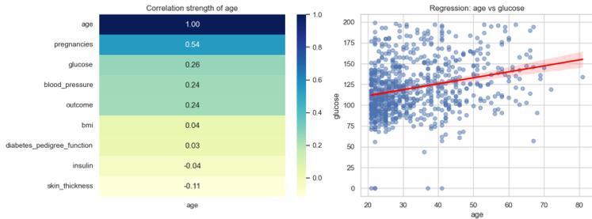
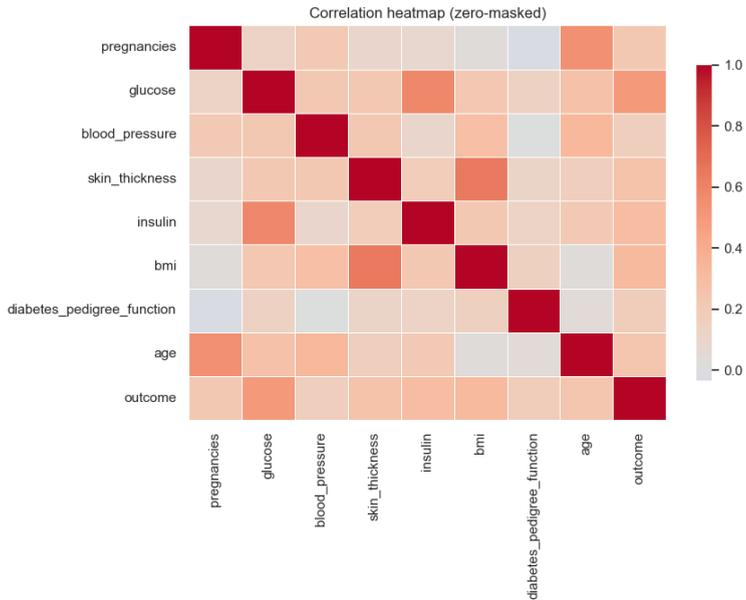
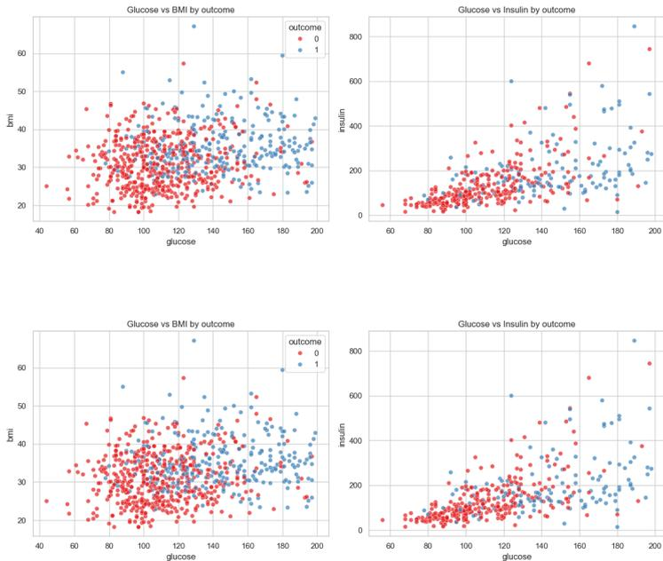
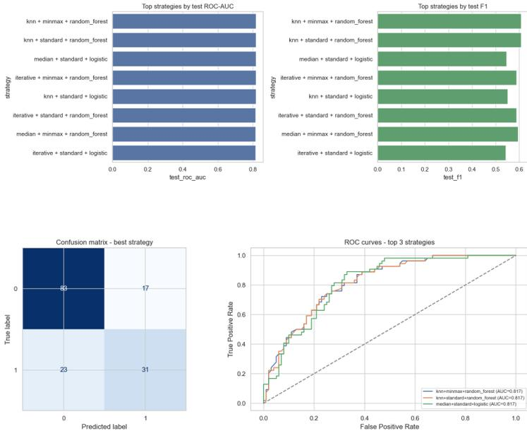

# pima\_indians\_diabetes\_lab03

May 2, 2026

## 1 Lab 03 - Rút trích dữ liệu và tiền xử lý: Pima Indians Diabetes

Notebook này tổng hợp và chuẩn hóa các phân tích rời rạc từ các thư mục thành viên (**chibang**, **duybao**, **tranhuyvu**, **truongphat**) thành một notebook thống nhất theo hướng trình bày báo cáo thực hành hoàn chỉnh.

### 1.1 Bối cảnh bài toán

Pima Indians Diabetes là bài toán phân lớp nhị phân nhằm dự đoán khả năng mắc bệnh tiểu đường (**outcome=1**) từ các chỉ số y sinh. Dữ liệu có đặc trưng định lượng nhưng tồn tại vấn đề chất lượng dữ liệu (đặc biệt là giá trị 0 phi sinh lý trong một số biến), vì vậy bước rút trích và tiền xử lý đóng vai trò then chốt.

### 1.2 Mục tiêu nghiên cứu

- Thực hiện đầy đủ quy trình lab: định nghĩa vấn đề, chuẩn bị dữ liệu, phân tích dữ liệu, tiền xử lý, chia tập thực nghiệm.
- So sánh nhiều phương án tiền xử lý (Median, KNN, Iterative/MICE) và chuẩn hóa (Standard, MinMax).
- Đánh giá baseline model (Logistic Regression, Random Forest) để chọn cấu hình preprocessing hợp lý.

### 1.3 Câu hỏi kiểm chứng

1. Chính sách **zero-as-missing** có cải thiện tính nhất quán thống kê và mô hình không?
2. Với dữ liệu Pima, chiến lược imputation/scaling nào cho kết quả ổn định hơn trên tập validation/test?
3. Trade-off giữa **precision** và **recall** thay đổi ra sao giữa các mô hình baseline?

### 1.4 Phạm vi và giả định

- Chỉ sử dụng dữ liệu tại **Lab\_03/data/pima-indians-diabetes.csv** và mô tả từ **Lab\_03/data/pima-indians-diabetes.names**.
- Không mở rộng thêm nguồn dữ liệu ngoài hoặc thông tin lâm sàng bổ sung.
- Kết quả tập trung vào so sánh quy trình tiền xử lý và baseline, chưa tối ưu hyperparameter chuyên sâu.

Notebook thuần Jupyter, không dùng marimo syntax (**mo.\***, **@app.cell**, **app.run**).

```

[1]: from pathlib import Path

import matplotlib.pyplot as plt
import numpy as np
import pandas as pd
import seaborn as sns

from IPython.display import Markdown, display

from sklearn.experimental import enable_iterative_imputer # noga: F401
from sklearn.ensemble import RandomForestClassifier
from sklearn.impute import IterativeImputer, KNNImputer, SimpleImputer
from sklearn.linear_model import LogisticRegression
from sklearn.metrics import (
    ConfusionMatrixDisplay,
    accuracy_score,
    f1_score,
    precision_score,
    recall_score,
    roc_auc_score,
    roc_curve,
)
from sklearn.model_selection import train_test_split
from sklearn.pipeline import Pipeline
from sklearn.preprocessing import MinMaxScaler, StandardScaler

plt.style.use("default")
sns.set_theme(style="whitegrid")

[2]: column_names = [
    'pregnancies',
    'glucose',
    'blood_pressure',
    'skin_thickness',
    'insulin',
    'bmi',
    'diabetes_pedigree_function',
    'age',
    'outcome',
]
feature_columns = [c for c in column_names if c != 'outcome']
zero_as_missing_columns = ['glucose', 'blood_pressure', 'skin_thickness',
    'insulin', 'bmi']
random_state = 42

[3]: def resolve_repo_root(start: Path) -> Path:
    candidates = [start, *start.parents]

```

```

for p in candidates:
    if (p / 'Lab_03' / 'data' / 'pima-indians-diabetes.csv').exists():
        return p
    raise FileNotFoundError('Cannot find Lab_03/data/pima-indians-diabetes.csv\n↳from current working tree')

repo_root = resolve_repo_root(Path.cwd())
data_path = repo_root / 'Lab_03' / 'data' / 'pima-indians-diabetes.csv'
names_path = repo_root / 'Lab_03' / 'data' / 'pima-indians-diabetes.names'

print('repo_root =', repo_root)
print('data_path =', data_path)

```

```

repo_root = /Users/chibangnguyen/ayai/BackupSGU26_ML/Nhom01_SGU26_ML
data_path =
/Users/chibangnguyen/ayai/BackupSGU26_ML/Nhom01_SGU26_ML/Lab_03/data/pima-
indians-diabetes.csv

```

```

[4]: df = pd.read_csv(data_path, header=None, names=column_names)

display(Markdown('## 1) Data Loading & Problem Definition'))
display(Markdown(f'-- Shape: **{df.shape[0]} rows x {df.shape[1]} columns**\n↳
↳BÀI TOÁN: **binary classification**\n↳ Target: `outcome` (0 = negative, 1 =↳
↳positive diabetes)'))

```

### 1.5 1) Data Loading & Problem Definition

- Shape: **768 rows x 9 columns**
- Bài toán: **binary classification**
- Target: outcome (0 = negative, 1 = positive diabetes)

```

[5]: df.head(10)

```

|   | pregnancies | glucose | blood_pressure | skin_thickness | insulin | bmi  | \ | diabetes_pedigree_function | age | outcome |
|---|-------------|---------|----------------|----------------|---------|------|---|----------------------------|-----|---------|
| 0 | 6           | 148     | 72             | 35             | 0       | 33.6 |   | 0.627                      | 50  | 1       |
| 1 | 1           | 85      | 66             | 29             | 0       | 26.6 |   | 0.351                      | 31  | 0       |
| 2 | 8           | 183     | 64             | 0              | 0       | 23.3 |   |                            |     |         |
| 3 | 1           | 89      | 66             | 23             | 94      | 28.1 |   |                            |     |         |
| 4 | 0           | 137     | 40             | 35             | 168     | 43.1 |   |                            |     |         |
| 5 | 5           | 116     | 74             | 0              | 0       | 25.6 |   |                            |     |         |
| 6 | 3           | 78      | 50             | 32             | 88      | 31.0 |   |                            |     |         |
| 7 | 10          | 115     | 0              | 0              | 0       | 35.3 |   |                            |     |         |
| 8 | 2           | 197     | 70             | 45             | 543     | 30.5 |   |                            |     |         |
| 9 | 8           | 125     | 96             | 0              | 0       | 0.0  |   |                            |     |         |

```

2      0.672  32      1
3      0.167  21      0
4      2.288  33      1
5      0.201  30      0
6      0.248  26      1
7      0.134  29      0
8      0.158  53      1
9      0.232  54      1

```

```

[6]: display(Markdown("## 2) Thông tin schema và mô tả thuộc tính"))

display(df.dtypes.to_frame(name="dtype"))

names_text = names_path.read_text(encoding="utf-8", errors="ignore")
lines = [line.rstrip() for line in names_text.splitlines()]

start_idx = next(i for i, line in enumerate(lines) if line.startswith("7. For↳
↳Each Attribute"))
end_idx = next(i for i, line in enumerate(lines) if line.startswith("8. Missing↳
↳Attribute Values"))

section_lines = lines[start_idx:end_idx]
attribute_lines = []
for line in section_lines:
    stripped = line.strip()
    if "For Each Attribute" in stripped:
        continue
    if any(stripped.startswith(f"{i}." for i in range(1, 10))):
        attribute_lines.append(stripped)

attribute_desc = [line.split(".", 1)[1].strip() for line in attribute_lines[:9]]
attributes_from_names = pd.DataFrame({"attribute_description": attribute_desc},↳
↳index=column_names)
attributes_from_names.index.name = "column"

display(attributes_from_names)

```

### 1.6 2) Thông tin schema và mô tả thuộc tính

|                            | dtype   |
|----------------------------|---------|
| pregnancies                | int64   |
| glucose                    | int64   |
| blood_pressure             | int64   |
| skin_thickness             | int64   |
| insulin                    | int64   |
| bmi                        | float64 |
| diabetes_pedigree_function | float64 |

```

age                      int64
outcome                  int64

attribute_description

column
pregnancies              Number of times pregnant
glucose                  Plasma glucose concentration a 2 hours in an o...
blood_pressure           Diastolic blood pressure (mm Hg)
skin_thickness           Triceps skin fold thickness (mm)
insulin                  2-Hour serum insulin (mu U/ml)
bmi                      Body mass index (weight in kg/(height in m)^2)
diabetes_pedigree_function Diabetes pedigree function
age                      Age (years)
outcome                  Class variable (0 or 1)

```

```

[7]: class_counts = df['outcome'].value_counts().sort_index().rename('count')
class_rate = df['outcome'].value_counts(normalize=True).sort_index().
    rename('rate')
class_distribution = (
    class_counts.to_frame()
        .join(class_rate.to_frame())
        .assign(rate_pct=lambda x: (100 * x['rate']).round(2))
)

display(Markdown('## 2) Class Distribution'))
class_distribution

```

### 1.7 2) Class Distribution

```

[7]:      count      rate rate_pct
outcome
0        500  0.651042    65.1
1        268  0.348958    34.9

[8]: fig_class_dist, ax_class_dist = plt.subplots(figsize=(6, 4))
sns.barplot(
    x=class_distribution.index.astype(str),
    y=class_distribution['count'].values,
    ax=ax_class_dist,
    palette='viridis',
    hue=class_distribution.index.astype(str),
    legend=False,
)
ax_class_dist.set_title('Class distribution of outcome')
ax_class_dist.set_xlabel('Outcome')
ax_class_dist.set_ylabel('Count')
plt.tight_layout()
fig_class_dist

```

[8] :


Class distribution of outcome

| Outcome | Count |
|---------|-------|
| 0       | 500   |
| 1       | 270   |

Bar chart showing the class distribution of outcome. The x-axis is labeled 'Outcome' with categories '0' and '1'. The y-axis is labeled 'Count' ranging from 0 to 500. The bar for '0' is dark blue and reaches 500. The bar for '1' is green and reaches approximately 270.


Class distribution of outcome

| Outcome | Count |
|---------|-------|
| 0       | 500   |
| 1       | 270   |

Bar chart showing the class distribution of outcome. The x-axis is labeled 'Outcome' with categories '0' and '1'. The y-axis is labeled 'Count' ranging from 0 to 500. The bar for '0' is dark blue and reaches 500. The bar for '1' is green and reaches approximately 270.

```

[9]: missing_report = pd.DataFrame(
    {
        'nan_count': df.isna().sum(),
        'nan_rate_pct': (100 * df.isna().mean()).round(2),
        'zero_count': (df == 0).sum(),
        'zero_rate_pct': (100 * (df == 0).mean()).round(2),
    }
)
duplicate_count = int(df.duplicated().sum())
duplicates_preview = df[df.duplicated()].head(10)
zero_focus_report = (
    missing_report.loc[zero_as_missing_columns + ['pregnancies', 'outcome']]
        .sort_values('zero_rate_pct', ascending=False)
        .copy()
)

df_masked = df.copy()
df_masked[zero_as_missing_columns] = df_masked[zero_as_missing_columns].\n    replace(0, np.nan)

print('Duplicate rows:', duplicate_count)

```

Duplicate rows: 0

```

[10]: display(Markdown('## 3) Data Quality Checks'))
missing_report

```

### 1.8 3) Data Quality Checks

```

[10]:

```

|                            | nan_count | nan_rate_pct | zero_count | zero_rate_pct |
|----------------------------|-----------|--------------|------------|---------------|
| pregnancies                | 0         | 0.0          | 111        | 14.45         |
| glucose                    | 0         | 0.0          | 5          | 0.65          |
| blood_pressure             | 0         | 0.0          | 35         | 4.56          |
| skin_thickness             | 0         | 0.0          | 227        | 29.56         |
| insulin                    | 0         | 0.0          | 374        | 48.70         |
| bmi                        | 0         | 0.0          | 11         | 1.43          |
| diabetes_pedigree_function | 0         | 0.0          | 0          | 0.00          |
| age                        | 0         | 0.0          | 0          | 0.00          |
| outcome                    | 0         | 0.0          | 500        | 65.10         |

```

[11]: display(Markdown('### Duplicate rows preview (nếu có'))
duplicates_preview

```

#### 1.8.1 Duplicate rows preview (nếu có)

```
[11]: Empty DataFrame
Columns: [pregnancies, glucose, blood_pressure, skin_thickness, insulin, bmi,
diabetes_pedigree_function, age, outcome]
Index: []
```

```
[12]: zero_focus_report
```

|                | nan_count | nan_rate_pct | zero_count | zero_rate_pct |
|----------------|-----------|--------------|------------|---------------|
| outcome        | 0         | 0.0          | 500        | 65.10         |
| insulin        | 0         | 0.0          | 374        | 48.70         |
| skin_thickness | 0         | 0.0          | 227        | 29.56         |
| pregnancies    | 0         | 0.0          | 111        | 14.45         |
| blood_pressure | 0         | 0.0          | 35         | 4.56          |
| bmi            | 0         | 0.0          | 11         | 1.43          |
| glucose        | 0         | 0.0          | 5          | 0.65          |

```
[13]: display(Markdown("## 4) Phân tích chuyên sâu theo thuộc tính (tổng hợp từ  
nhóm)"))
```

```
age_corr = df.corr(numeric_only=True)[["age"]].sort_values(by="age",  
ascending=False)
display(Markdown("### 4.1 Age - tương quan và quan hệ với glucose"))
display(age_corr)

fig_age, axes_age = plt.subplots(1, 2, figsize=(13, 5))
sns.heatmap(age_corr, annot=True, cmap="YlGnBu", fmt=".2f", cbar=True,  
ax=axes_age[0])
axes_age[0].set_title("Correlation strength of age")

sns.regplot(data=df, x="age", y="glucose", scatter_kws={"alpha": 0.5},  
line_kws={"color": "red"}, ax=axes_age[1])
axes_age[1].set_title("Regression: age vs glucose")
plt.tight_layout()
plt.show()
```

### 1.9 4) Phân tích chuyên sâu theo thuộc tính (tổng hợp từ nhóm)

#### 1.9.1 4.1 Age - tương quan và quan hệ với glucose

|                | age      |
|----------------|----------|
| age            | 1.000000 |
| pregnancies    | 0.544341 |
| glucose        | 0.263514 |
| blood_pressure | 0.239528 |
| outcome        | 0.238356 |
| bmi            | 0.036242 |

```
diabetes_pedigree_function 0.033561
insulin                    -0.042163
skin_thickness             -0.113970
```



The figure consists of two subplots. The left subplot is a heatmap titled "Correlation strength of age". It shows the correlation of the variable "age" with other variables in the dataset. The color scale ranges from 0.0 (yellow) to 1.0 (dark blue). The correlations are: age (1.00), pregnancies (0.54), glucose (0.26), blood\_pressure (0.24), outcome (0.24), bmi (0.04), diabetes\_pedigree\_function (0.03), insulin (-0.04), and skin\_thickness (-0.11). The right subplot is a scatter plot titled "Regression: age vs glucose". It shows the relationship between age (x-axis, 20 to 80) and glucose (y-axis, 0 to 200). A red regression line is plotted, showing a positive correlation. A shaded red area around the line represents the confidence interval.

Two side-by-side plots. The left plot is a heatmap titled 'Correlation strength of age' showing the correlation of 'age' with other variables. The right plot is a scatter plot titled 'Regression: age vs glucose' showing a positive linear regression line.

```
[14]: display(Markdown("### 4.2 Diabetes Pedigree Function (DPF) - phân phối và mức độ rủi ro"))

fig_dpf, axes_dpf = plt.subplots(1, 2, figsize=(13, 5))
sns.violinplot(data=df, x="outcome", y="diabetes_pedigree_function",
               palette="Set2", hue="outcome", legend=False, ax=axes_dpf[0])
axes_dpf[0].set_title("DPF distribution by outcome")

pedigree_df = df.copy()
pedigree_df["pedigree_bins"] = pd.qcut(
    pedigree_df["diabetes_pedigree_function"],
    q=4,
    labels=["Thấp", "Trung bình", "Kha cao", "Rất cao"],
)
pedigree_risk = pedigree_df.groupby("pedigree_bins", observed=False)["outcome"].
    mean().mul(100).round(2)
sns.barplot(x=pedigree_risk.index, y=pedigree_risk.values, ax=axes_dpf[1],
            color="#4C72B0")
axes_dpf[1].set_title("Diabetes rate by DPF quartile")
axes_dpf[1].set_ylabel("Rate (%)")
plt.tight_layout()
plt.show()

fig_focus, axes_focus = plt.subplots(1, 2, figsize=(13, 5))
sns.scatterplot(data=df_masked, x="glucose", y="bmi", hue="outcome", alpha=0.7,
               palette="Set1", ax=axes_focus[0])
axes_focus[0].set_title("Glucose vs BMI (zero-masked)")
```

```

sns.scatterplot(data=df_masked, x="insulin", y="age", hue="outcome", alpha=0.7,
             palette="Set1", ax=axs_focus[1])
axs_focus[1].set_title("Insulin vs Age (zero-masked)")
plt.tight_layout()
plt.show()

```

#### 1.9.2 4.2 Diabetes Pedigree Function (DPF) - phân phối và mức độ rủi ro


The figure consists of four subplots arranged in a 2x2 grid:

- Top-left: DPF distribution by outcome** (Violin plot). The y-axis is 'diabetes\_pedigree\_function' (0.0 to 2.5) and the x-axis is 'outcome' (0 and 1). The distribution for outcome 0 is centered around 0.4, and for outcome 1 it is centered around 0.8.
- Top-right: Diabetes rate by DPF quartile** (Bar chart). The y-axis is 'Rate (%)' (0 to 50) and the x-axis is 'pedigree\_bins' (Thấp, Trung bình, Kha cao, Rất cao). The rates are approximately 25%, 33%, 32%, and 48% respectively.
- Bottom-left: Glucose vs BMI (zero-masked)** (Scatter plot). The y-axis is 'bmi' (20 to 60) and the x-axis is 'glucose' (40 to 200). Data points are colored by 'outcome' (0: red, 1: blue).
- Bottom-right: Insulin vs Age (zero-masked)** (Scatter plot). The y-axis is 'age' (20 to 80) and the x-axis is 'insulin' (0 to 800). Data points are colored by 'outcome' (0: red, 1: blue).

Four plots showing the distribution and risk of Diabetes Pedigree Function (DPF). Top-left: Violin plot of DPF by outcome (0 and 1). Top-right: Bar chart of Diabetes rate by DPF quartile. Bottom-left: Scatter plot of Glucose vs BMI. Bottom-right: Scatter plot of Insulin vs Age.

```

[15]: display(Markdown('## 4) Descriptive Statistics'))

display(df[feature_columns].describe().T)

grouped_stats = df.groupby('outcome')[feature_columns].agg(['mean', 'median',
             'std']).round(3)
grouped_stats

```

### 1.10 4) Descriptive Statistics

|                            | count | mean       | std        | min    | 25%      |
|----------------------------|-------|------------|------------|--------|----------|
| pregnancies                | 768.0 | 3.845052   | 3.369578   | 0.000  | 1.00000  |
| glucose                    | 768.0 | 120.894531 | 31.972618  | 0.000  | 99.00000 |
| blood_pressure             | 768.0 | 69.105469  | 19.355807  | 0.000  | 62.00000 |
| skin_thickness             | 768.0 | 20.536458  | 15.952218  | 0.000  | 0.00000  |
| insulin                    | 768.0 | 79.799479  | 115.244002 | 0.000  | 0.00000  |
| bmi                        | 768.0 | 31.992578  | 7.884160   | 0.000  | 27.30000 |
| diabetes_pedigree_function | 768.0 | 0.471876   | 0.331329   | 0.078  | 0.24375  |
| age                        | 768.0 | 33.240885  | 11.760232  | 21.000 | 24.00000 |

|                            | 50%      | 75%       | max    |
|----------------------------|----------|-----------|--------|
| pregnancies                | 3.0000   | 6.00000   | 17.00  |
| glucose                    | 117.0000 | 140.25000 | 199.00 |
| blood_pressure             | 72.0000  | 80.00000  | 122.00 |
| skin_thickness             | 23.0000  | 32.00000  | 99.00  |
| insulin                    | 30.5000  | 127.25000 | 846.00 |
| bmi                        | 32.0000  | 36.60000  | 67.10  |
| diabetes_pedigree_function | 0.3725   | 0.62625   | 2.42   |
| age                        | 29.0000  | 41.00000  | 81.00  |

```
[15]:
```

|         | pregnancies |        |       | glucose |        |        | blood_pressure |        |     |
|---------|-------------|--------|-------|---------|--------|--------|----------------|--------|-----|
|         | mean        | median | std   | mean    | median | std    | mean           | median | std |
| outcome |             |        |       |         |        |        |                |        |     |
| 0       | 3.298       | 2.0    | 3.017 | 109.980 | 107.0  | 26.141 | 68.184         |        |     |
| 1       | 4.866       | 4.0    | 3.741 | 141.257 | 140.0  | 31.940 | 70.825         |        |     |

  

|         | skin_thickness |        |        | insulin |         |        | bmi    |       |  |
|---------|----------------|--------|--------|---------|---------|--------|--------|-------|--|
|         | median         | std    | mean   | ...     | std     | mean   | median | std   |  |
| outcome |                |        |        |         |         |        |        |       |  |
| 0       | 70.0           | 18.063 | 19.664 | ...     | 98.865  | 30.304 | 30.05  | 7.690 |  |
| 1       | 74.0           | 21.492 | 22.164 | ...     | 138.689 | 35.143 | 34.25  | 7.263 |  |

  

|         | diabetes_pedigree_function |        |       | age    |        |        |
|---------|----------------------------|--------|-------|--------|--------|--------|
|         | mean                       | median | std   | mean   | median | std    |
| outcome |                            |        |       |        |        |        |
| 0       | 0.43                       | 0.336  | 0.299 | 31.190 | 27.0   | 11.668 |
| 1       | 0.55                       | 0.449  | 0.372 | 37.067 | 36.0   | 10.968 |

[2 rows x 24 columns]

```
[16]: corr_source = df_masked.copy()
corr_matrix = corr_source.corr(numeric_only=True)

fig_corr, ax_corr = plt.subplots(figsize=(9, 7))
sns.heatmap(
    corr_matrix,
```

```

    cmap="coolwarm",
    center=0,
    annot=False,
    linewidths=0.4,
    cbar_kws={"shrink": 0.8},
    ax=ax_corr,
)
ax_corr.set_title("Correlation heatmap (zero-masked)")
plt.tight_layout()
plt.show()

corr_matrix["outcome"].sort_values(ascending=False).
    to_frame(name="corr_with_outcome")

```



The heatmap displays the correlation coefficients between various health-related variables. The variables are: pregnancies, glucose, blood\_pressure, skin\_thickness, insulin, bmi, diabetes\_pedigree\_function, age, and outcome. The diagonal line of dark red squares represents a correlation of 1.0. The highest correlations with the 'outcome' variable are with 'pregnancies' (dark red), 'glucose' (orange-red), and 'bmi' (orange). Other notable correlations include 'insulin' with 'glucose' and 'bmi', and 'skin\_thickness' with 'bmi'.

|                            | pregnancies | glucose | blood_pressure | skin_thickness | insulin | bmi | diabetes_pedigree_function | age | outcome |
|----------------------------|-------------|---------|----------------|----------------|---------|-----|----------------------------|-----|---------|
| pregnancies                | 1.0         | 0.1     | 0.1            | 0.1            | 0.1     | 0.0 | -0.1                       | 0.1 | 0.1     |
| glucose                    | 0.1         | 1.0     | 0.1            | 0.1            | 0.4     | 0.1 | 0.1                        | 0.1 | 0.5     |
| blood_pressure             | 0.1         | 0.1     | 1.0            | 0.1            | 0.1     | 0.1 | -0.1                       | 0.1 | 0.1     |
| skin_thickness             | 0.1         | 0.1     | 0.1            | 1.0            | 0.1     | 0.4 | 0.1                        | 0.1 | 0.1     |
| insulin                    | 0.1         | 0.4     | 0.1            | 0.1            | 1.0     | 0.1 | 0.1                        | 0.1 | 0.1     |
| bmi                        | 0.0         | 0.1     | 0.1            | 0.4            | 0.1     | 1.0 | 0.1                        | 0.0 | 0.3     |
| diabetes_pedigree_function | -0.1        | 0.1     | -0.1           | 0.1            | 0.1     | 0.1 | 1.0                        | 0.1 | 0.1     |
| age                        | 0.1         | 0.1     | 0.1            | 0.1            | 0.1     | 0.0 | 0.1                        | 1.0 | 0.1     |
| outcome                    | 0.1         | 0.5     | 0.1            | 0.1            | 0.1     | 0.3 | 0.1                        | 0.1 | 1.0     |

Correlation heatmap (zero-masked) showing relationships between pregnancies, glucose, blood\_pressure, skin\_thickness, insulin, bmi, diabetes\_pedigree\_function, age, and outcome. The color scale ranges from 0.0 (light blue) to 1.0 (dark red).

```

[16]:          corr_with_outcome
outcome      1.000000
glucose      0.494650
bmi          0.313680

```

```

insulin                      0.303454
skin_thickness               0.259491
age                          0.238356
pregnancies                  0.221898
diabetes_pedigree_function 0.173844
blood_pressure               0.170589

```

```

[17]: fig_scatter, axes_scatter = plt.subplots(1, 2, figsize=(13, 5))

sns.scatterplot(data=corr_source, x='glucose', y='bmi', hue='outcome', alpha=0.7, ax=axes_scatter[0], palette='Set1')
axes_scatter[0].set_title('Glucose vs BMI by outcome')

sns.scatterplot(data=corr_source, x='glucose', y='insulin', hue='outcome', alpha=0.7, ax=axes_scatter[1], palette='Set1', legend=False)
axes_scatter[1].set_title('Glucose vs Insulin by outcome')

plt.tight_layout()
fig_scatter

```

[17]:



The figure displays four scatter plots arranged in a 2x2 grid, showing relationships between glucose, BMI, and insulin, colored by outcome (0 or 1). The top-left plot is titled 'Glucose vs BMI by outcome' and shows BMI on the y-axis (ranging from 20 to 60) against glucose on the x-axis (ranging from 40 to 200). The top-right plot is titled 'Glucose vs Insulin by outcome' and shows insulin on the y-axis (ranging from 0 to 800) against glucose on the x-axis (ranging from 60 to 200). The bottom-left plot is titled 'Glucose vs BMI by outcome' and shows BMI on the y-axis (ranging from 20 to 60) against glucose on the x-axis (ranging from 40 to 200). The bottom-right plot is titled 'Glucose vs Insulin by outcome' and shows insulin on the y-axis (ranging from 0 to 800) against glucose on the x-axis (ranging from 60 to 200). All plots use a 'Set1' color palette where red represents outcome 0 and blue represents outcome 1. The plots show a positive correlation between glucose and both BMI and insulin, with outcome 1 generally having higher values for all three variables.

Four scatter plots arranged in a 2x2 grid, showing relationships between glucose, BMI, and insulin, colored by outcome (0 or 1).

[18]: display(Markdown("## 6) Chuẩn bị dữ liệu và chiến lược đánh giá"))

```
display(  
    Markdown(  
        ""
```

### ### 6.1. Lý do thiết kế tiền xử lý

- Các biến `glucose`, `blood_pressure`, `skin_thickness`, `insulin`, `bmi` có giá trị `0` không hợp lý về sinh lý trong nhiều bối cảnh lâm sàng, do đó được xem như missing ẩn.
- Với dữ liệu Pima, notebook **\*\*không loại bỏ outlier cũng\*\*** để tránh mất mẫu trên tập nhỏ; thay vào đó dùng các imputer và scaler để giảm tác động nhiễu trong huấn luyện.
- Các thuật toán dựa trên khoảng cách/gradient nhạy với chênh lệch thang đo, vì vậy cần so sánh chuẩn hóa `StandardScaler` và `MinMaxScaler`.
- Bài toán có khả năng bị ảnh hưởng bởi mất cân bằng lớp ở mức vừa phải; do đó cần theo dõi đồng thời `ROC-AUC`, `F1`, `precision`, `recall` thay vì chỉ `accuracy`.

### ### 6.2. Chiến lược đánh giá công bằng

- Chia dữ liệu theo `train/val/test = 60/20/20` với `stratify` để giữ tỷ lệ lớp ổn định giữa các tập.
- Mọi cấu hình (imputer + scaler + model) dùng cùng một split và cùng seed để so sánh công bằng.
- Chọn cấu hình theo hiệu năng tổng hợp trên validation và kiểm tra khả năng tổng quát hóa ở test.

```
""
```

```
)  
)
```

```
X = df[feature_columns].copy()  
y = df["outcome"].astype(int)
```

```
X[zero_as_missing_columns] = X[zero_as_missing_columns].replace(0, np.nan)
```

```
X_train_val, X_test, y_train_val, y_test = train_test_split(  
    X,  
    y,  
    test_size=0.2,  
    random_state=random_state,  
    stratify=y,  
)
```

```

X_train, X_val, y_train, y_val = train_test_split(
    X_train_val,
    y_train_val,
    test_size=0.25,
    random_state=random_state,
    stratify=y_train_val,
)

split_df = pd.DataFrame(
    {
        "subset": ["train", "val", "test"],
        "n_samples": [len(y_train), len(y_val), len(y_test)],
        "positive_rate": [y_train.mean(), y_val.mean(), y_test.mean()],
    }
)
split_df["positive_rate"] = split_df["positive_rate"].round(4)
split_df

```

### 1.11 6) Chuẩn bị dữ liệu và chiến lược đánh giá

#### 1.11.1 6.1. Lý do thiết kế tiền xử lý

- Các biến `glucose`, `blood_pressure`, `skin_thickness`, `insulin`, `bmi` có giá trị 0 không hợp lý về sinh lý trong nhiều bối cảnh lâm sàng, do đó được xem như missing ẩn.
- Với dữ liệu Pima, notebook **không loại bỏ outlier cứng** để tránh mất mẫu trên tập nhỏ; thay vào đó dùng các imputer và scaler để giảm tác động nhiễu trong huấn luyện.
- Các thuật toán dựa trên khoảng cách/gradient nhạy với chênh lệch thang đo, vì vậy cần so sánh chuẩn hóa `StandardScaler` và `MinMaxScaler`.
- Bài toán có khả năng bị ảnh hưởng bởi mất cân bằng lớp ở mức vừa phải; do đó cần theo dõi đồng thời `ROC-AUC`, `F1`, `precision`, `recall` thay vì chỉ `accuracy`.

#### 1.11.2 6.2. Chiến lược đánh giá công bằng

- Chia dữ liệu theo `train/val/test = 60/20/20` với `stratify` để giữ tỷ lệ lớp dương ổn định giữa các tập.
- Mọi cấu hình (imputer + scaler + model) dùng cùng một split và cùng seed để so sánh công bằng.
- Chọn cấu hình theo hiệu năng tổng hợp trên validation và kiểm tra khả năng tổng quát hóa ở test.

```

[18]: subset n_samples positive_rate
0  train      460          0.3478
1    val      154          0.3506
2   test      154          0.3506

```

```

[19]: display(Markdown("## 7) So sánh nhiều chiến lược imputation + scaling + baseline model"))

```

```

def build_model(model_name: str):
    if model_name == "logistic":
        return LogisticRegression(max_iter=5000, random_state=random_state)
    if model_name == "random_forest":
        return RandomForestClassifier(n_estimators=300,
                                     random_state=random_state)
    raise ValueError(f"Unsupported model: {model_name}")

def evaluate_strategy(imputer_name: str, scaler_name: str, model_name: str):
    if imputer_name == "median":
        imputer = SimpleImputer(strategy="median")
    elif imputer_name == "knn":
        imputer = KNNImputer(n_neighbors=5)
    elif imputer_name == "iterative":
        imputer = IterativeImputer(random_state=random_state, max_iter=10)
    else:
        raise ValueError(f"Unsupported imputer: {imputer_name}")

    if scaler_name == "standard":
        scaler = StandardScaler()
    elif scaler_name == "minmax":
        scaler = MinMaxScaler()
    else:
        raise ValueError(f"Unsupported scaler: {scaler_name}")

    model = build_model(model_name)
    pipe = Pipeline(
        steps=[
            ("imputer", imputer),
            ("scaler", scaler),
            ("model", model),
        ]
    )

    pipe.fit(X_train, y_train)

    y_val_pred = pipe.predict(X_val)
    y_val_prob = pipe.predict_proba(X_val)[:, 1]

    y_test_pred = pipe.predict(X_test)
    y_test_prob = pipe.predict_proba(X_test)[:, 1]

    metrics = {
        "imputer": imputer_name,
        "scaler": scaler_name,
        "model": model_name,
    }

```

```

        "val_accuracy": accuracy_score(y_val, y_val_pred),
        "val_f1": f1_score(y_val, y_val_pred),
        "val_roc_auc": roc_auc_score(y_val, y_val_prob),
        "test_accuracy": accuracy_score(y_test, y_test_pred),
        "test_precision": precision_score(y_test, y_test_pred),
        "test_recall": recall_score(y_test, y_test_pred),
        "test_f1": f1_score(y_test, y_test_pred),
        "test_roc_auc": roc_auc_score(y_test, y_test_prob),
    }

    artifacts = {
        "pipe": pipe,
        "y_test_pred": y_test_pred,
        "y_test_prob": y_test_prob,
        "y_val_pred": y_val_pred,
        "y_val_prob": y_val_prob,
    }

    return metrics, artifacts

strategies = []
strategy_artifacts = {}
for imputer_name in ["median", "knn", "iterative"]:
    for scaler_name in ["standard", "minmax"]:
        for model_name in ["logistic", "random_forest"]:
            metrics, artifacts = evaluate_strategy(imputer_name, scaler_name,
↳model_name)
            key = f"{imputer_name}|{scaler_name}|{model_name}"
            strategy_artifacts[key] = artifacts
            strategies.append(metrics)

comparison_df = pd.DataFrame(strategies).sort_values(by=["test_roc_auc",
↳"test_f1"], ascending=False)
comparison_df.round(4)

```

### 1.12 7) So sánh nhiều chiến lược imputation + scaling + baseline model

```

[19]:      imputer      scaler          model  val_accuracy  val_f1  val_roc_auc \
7          knn      minmax  random_forest          0.7727  0.6465        0.8700
5          knn  standard  random_forest          0.7727  0.6465        0.8690
0       median    standard       logistic          0.7792  0.6531        0.8498
11  iterative      minmax  random_forest          0.7922  0.6800        0.8572
4          knn    standard       logistic          0.7922  0.6667        0.8526
9  iterative    standard  random_forest          0.7857  0.6733        0.8556
3       median      minmax  random_forest          0.7857  0.6733        0.8596
8  iterative    standard       logistic          0.7857  0.6598        0.8476

```

|    |           |          |               |        |        |        |
|----|-----------|----------|---------------|--------|--------|--------|
| 1  | median    | standard | random_forest | 0.7792 | 0.6667 | 0.8604 |
| 6  | knn       | minmax   | logistic      | 0.8117 | 0.6882 | 0.8730 |
| 2  | median    | minmax   | logistic      | 0.8117 | 0.6882 | 0.8659 |
| 10 | iterative | minmax   | logistic      | 0.8117 | 0.6882 | 0.8709 |

|    | test_accuracy | test_precision | test_recall | test_f1 | test_roc_auc |
|----|---------------|----------------|-------------|---------|--------------|
| 7  | 0.7403        | 0.6458         | 0.5741      | 0.6078  | 0.8170       |
| 5  | 0.7403        | 0.6458         | 0.5741      | 0.6078  | 0.8168       |
| 0  | 0.7078        | 0.6000         | 0.5000      | 0.5455  | 0.8167       |
| 11 | 0.7273        | 0.6250         | 0.5556      | 0.5882  | 0.8156       |
| 4  | 0.7143        | 0.6136         | 0.5000      | 0.5510  | 0.8154       |
| 9  | 0.7273        | 0.6250         | 0.5556      | 0.5882  | 0.8153       |
| 3  | 0.7338        | 0.6383         | 0.5556      | 0.5941  | 0.8149       |
| 8  | 0.7143        | 0.6190         | 0.4815      | 0.5417  | 0.8148       |
| 1  | 0.7338        | 0.6383         | 0.5556      | 0.5941  | 0.8136       |
| 6  | 0.7208        | 0.6341         | 0.4815      | 0.5474  | 0.8117       |
| 2  | 0.7273        | 0.6500         | 0.4815      | 0.5532  | 0.8098       |
| 10 | 0.7208        | 0.6279         | 0.5000      | 0.5567  | 0.8093       |

### 1.13 8) Phân tích kết quả mô hình và sai số

Phần dưới đây tập trung vào chất lượng mô hình theo góc nhìn báo cáo: xếp hạng cấu hình, confusion matrix của cấu hình tốt nhất, ROC của các cấu hình top, và thảo luận trade-off giữa precision/recall.

```
[20]: top_view = comparison_df.copy()
top_view["strategy"] = top_view["imputer"] + " + " + top_view["scaler"] + " + " +
↳ top_view["model"]

fig_cmp, axes_cmp = plt.subplots(1, 2, figsize=(14, 5))
sns.barplot(data=top_view.head(8), y="strategy", x="test_roc_auc",
↳ ax=axes_cmp[0], color="#4C72B0")
axes_cmp[0].set_title("Top strategies by test ROC-AUC")
axes_cmp[0].set_xlabel("test_roc_auc")

sns.barplot(data=top_view.head(8), y="strategy", x="test_f1", ax=axes_cmp[1],
↳ color="#55A868")
axes_cmp[1].set_title("Top strategies by test F1")
axes_cmp[1].set_xlabel("test_f1")

plt.tight_layout()
plt.show()

best_row = comparison_df.iloc[0]
best_key = f"{best_row['imputer']}|{best_row['scaler']}|{best_row['model']}"
best_artifacts = strategy_artifacts[best_key]
```

```

fig_eval, axes_eval = plt.subplots(1, 2, figsize=(14, 5))
ConfusionMatrixDisplay.from_predictions(y_test, best_artifacts["y_test_pred"],
        ax=axes_eval[0], cmap="Blues", colorbar=False)
axes_eval[0].set_title("Confusion matrix - best strategy")

for _, row in comparison_df.head(3).iterrows():
    key = f"{row['imputer']}|{row['scaler']}|{row['model']}"
    probs = strategy_artifacts[key]["y_test_prob"]
    fpr, tpr, _ = roc_curve(y_test, probs)
    label = f"{row['imputer']}|{row['scaler']}|{row['model']}|⌞(AUC={row['test_roc_auc']:.3f})⌟"
    axes_eval[1].plot(fpr, tpr, label=label)

axes_eval[1].plot([0, 1], [0, 1], linestyle="--", color="gray")
axes_eval[1].set_title("ROC curves - top 3 strategies")
axes_eval[1].set_xlabel("False Positive Rate")
axes_eval[1].set_ylabel("True Positive Rate")
axes_eval[1].legend(loc="lower right", fontsize=8)
plt.tight_layout()
plt.show()

thresholds = np.arange(0.30, 0.75, 0.05)
threshold_rows = []
for thr in thresholds:
    pred_thr = (best_artifacts["y_test_prob"] >= thr).astype(int)
    threshold_rows.append(
        {
            "threshold": round(float(thr), 2),
            "precision": precision_score(y_test, pred_thr),
            "recall": recall_score(y_test, pred_thr),
            "f1": f1_score(y_test, pred_thr),
        }
    )

threshold_df = pd.DataFrame(threshold_rows)
threshold_df.round(4)

```



**Top strategies by test ROC-AUC**

| strategy                             | test_roc_auc |
|--------------------------------------|--------------|
| knn + minmax + random_forest         | 0.817        |
| knn + standard + random_forest       | 0.817        |
| median + standard + logistic         | 0.571        |
| iterative + minmax + random_forest   | 0.571        |
| knn + standard + logistic            | 0.571        |
| iterative + standard + random_forest | 0.571        |
| median + minmax + random_forest      | 0.571        |
| iterative + standard + logistic      | 0.571        |

**Top strategies by test F1**

| strategy                             | test_f1 |
|--------------------------------------|---------|
| knn + minmax + random_forest         | 0.6769  |
| knn + standard + random_forest       | 0.6612  |
| median + standard + logistic         | 0.6491  |
| iterative + minmax + random_forest   | 0.6296  |
| knn + standard + logistic            | 0.6296  |
| iterative + standard + random_forest | 0.6078  |
| median + minmax + random_forest      | 0.5625  |
| iterative + standard + logistic      | 0.5349  |

**Confusion matrix - best strategy**

| True \ Predicted | Predicted 0 | Predicted 1 |
|------------------|-------------|-------------|
| True 0           | 86          | 17          |
| True 1           | 23          | 31          |

**ROC curves - top 3 strategies**

- knn+minmax+random\_forest (AUC=0.817)
- knn+standard+random\_forest (AUC=0.817)
- median+standard+logistic (AUC=0.571)

Four plots showing model performance: Top strategies by test ROC-AUC, Top strategies by test F1, Confusion matrix - best strategy, and ROC curves - top 3 strategies.

```
[20]: threshold precision recall      fi
0      0.30      0.5789 0.8148 0.6769
1      0.35      0.5970 0.7407 0.6612
2      0.40      0.6167 0.6852 0.6491
3      0.45      0.6296 0.6296 0.6296
4      0.50      0.6458 0.5741 0.6078
5      0.55      0.6429 0.5000 0.5625
6      0.60      0.6944 0.4630 0.5556
7      0.65      0.7188 0.4259 0.5349
8      0.70      0.7500 0.3333 0.4615
```

```
[21]: gap_auc = best_row["val_roc_auc"] - best_row["test_roc_auc"]
if abs(gap_auc) <= 0.03:
    overfit_comment = "Chênh lệch val/test nhỏ, dấu hiệu tổng quát hóa tương đối ổn định."
elif gap_auc > 0.03:
    overfit_comment = "Val tốt hơn test đáng kể, có rủi ro overfitting nhẹ đến trung bình."
```

```

else:
    overfit_comment = "Test tốt hơn val, có thể do nhiều chia tập hoặc variance_u
    của dữ liệu nhỏ."

best_tradeoff = threshold_df.iloc[(threshold_df["f1"]).idxmax()]

final_md = f"""
### 8.1. Khuyến nghị cấu hình preprocessing

- Cấu hình tốt nhất theo `test_roc_auc`: **{best_row['imputer']} +_
  {best_row['scaler']} + {best_row['model']}**
- `val_roc_auc`: **{best_row['val_roc_auc']:.4f}**
- `test_roc_auc`: **{best_row['test_roc_auc']:.4f}**
- `test_f1`: **{best_row['test_f1']:.4f}**
- `test_precision`: **{best_row['test_precision']:.4f}**
- `test_recall`: **{best_row['test_recall']:.4f}**

### 8.2. Nhận định trade-off precision/recall

- Threshold mặc định 0.50 chưa chắc tối ưu cho mục tiêu phát hiện ca dương tính.
- Theo bảng threshold, điểm cân bằng tốt nhất theo F1 nằm quanh_
  **{best_tradeoff['threshold']:.2f}**
- Ở threshold này: `precision={best_tradeoff['precision']:.4f}`,_
  `recall={best_tradeoff['recall']:.4f}`, `f1={best_tradeoff['f1']:.4f}`.

### 8.3. Dấu hiệu overfitting/underfitting (sơ bộ)

- `val_roc_auc - test_roc_auc = {gap_auc:.4f}`
- {overfit_comment}

### Checklist yêu cầu Lab 03 (Bài 2)

- [x] Định nghĩa vấn đề phân lớp và xác định input/output.
- [x] Tải dữ liệu và mô tả thuộc tính từ file `.names`.
- [x] Phân tích dữ liệu: mô tả thống kê, phân bố lớp, tương quan, trực quan đơn_
  biến/đa biến.
- [x] Làm sạch dữ liệu: kiểm tra trùng lặp, xử lý missing ẩn dưới giá trị 0.
- [x] Chuẩn hóa và chia dữ liệu train/val/test có stratify.
- [x] So sánh nhiều chiến lược tiền xử lý và baseline để chọn cấu hình đề xuất.
- [x] Phân tích kết quả mô hình theo confusion matrix, ROC và threshold_
  trade-off.
"""

display(Markdown(final_md))

```

#### 1.13.1 8.1. Khuyến nghị cấu hình preprocessing

- Cấu hình tốt nhất theo `test_roc_auc`: **knn + minmax + random\_forest**.
- `val_roc_auc`: **0.8700**
- `test_roc_auc`: **0.8170**
- `test_f1`: **0.6078**
- `test_precision`: **0.6458**
- `test_recall`: **0.5741**

#### 1.13.2 8.2. Nhận định trade-off precision/recall

- Threshold mặc định 0.50 chưa chắc tối ưu cho mục tiêu phát hiện ca dương tính.
- Theo bảng threshold, điểm cân bằng tốt nhất theo F1 nằm quanh **0.30**.
- Ở threshold này: `precision=0.5789`, `recall=0.8148`, `f1=0.6769`.

#### 1.13.3 8.3. Dấu hiệu overfitting/underfitting (sơ bộ)

- `val_roc_auc - test_roc_auc = 0.0530`.
- Val tốt hơn test đáng kể, có rủi ro overfitting nhẹ đến trung bình.

#### 1.13.4 Checklist yêu cầu Lab 03 (Bài 2)

- ☑ Định nghĩa vấn đề phân lớp và xác định input/output.
- ☑ Tải dữ liệu và mô tả thuộc tính từ file `.names`.
- ☑ Phân tích dữ liệu: mô tả thống kê, phân bố lớp, tương quan, trực quan đơn biến/đa biến.
- ☑ Làm sạch dữ liệu: kiểm tra trùng lặp, xử lý missing ẩn dưới giá trị 0.
- ☑ Chuẩn hóa và chia dữ liệu train/val/test có stratify.
- ☑ So sánh nhiều chiến lược tiền xử lý và baseline để chọn cấu hình đề xuất.
- ☑ Phân tích kết quả mô hình theo confusion matrix, ROC và threshold trade-off.

```
[22]: limitations_md = """
## 9) Hạn chế nghiên cứu

1. **Giới hạn dữ liệu**: bộ Pima có quy mô nhỏ (768 mẫu) và chỉ gồm các biến
   -lâm sàng cơ bản, chưa có thông tin điều trị, bệnh sử chi tiết hoặc yếu tố
   -hành vi.
2. **Giả định missing**: quy ước `0` là missing ở một số biến sinh lý hợp lý về
   -mặt miền tri thức, nhưng vẫn có thể tạo sai lệch nếu tồn tại trường hợp đo
   -thực sự bằng 0.
3. **Thiết kế thực nghiệm**: so sánh hiện dùng một lần chia train/val/test;
   -chưa dùng cross-validation lặp lại nên độ ổn định còn phụ thuộc seed.
4. **Tối ưu mô hình**: chưa thực hiện hyperparameter tuning có hệ thống (Grid/
   -Random/Bayesian search), chưa đánh giá calibration xác suất.
5. **Khả năng khái quát hóa**: kết quả chủ yếu phản ánh dữ liệu Pima, chưa kiểm
   -định external validity trên tập dân số khác.

## 10) Hướng phát triển và kiến nghị
```

1. Áp dụng **\*\*Stratified K-Fold CV\*\*** để đánh giá ổn định và giảm phụ thuộc vào một lần chia dữ liệu.
  2. Bổ sung **\*\*hyperparameter tuning\*\*** cho Logistic Regression và Random Forest để cải thiện hiệu năng và tính công bằng khi so sánh.
  3. Mở rộng phân tích với **\*\*calibration curve\*\*** và tối ưu threshold theo mục tiêu nghiệp vụ (ưu tiên recall hoặc precision).
  4. Thử thêm mô hình boosting (XGBoost/LightGBM) và phương pháp cân bằng lớp nếu cần.
  5. Đóng gói pipeline suy luận và tạo báo cáo tự động để dễ tái lập khi cập nhật dữ liệu.
- """

```
display(Markdown(limitations_md))
```

### 1.14 9) Hạn chế nghiên cứu

1. **Giới hạn dữ liệu:** bộ Pima có quy mô nhỏ (768 mẫu) và chỉ gồm các biến lâm sàng cơ bản, chưa có thông tin điều trị, bệnh sử chi tiết hoặc yếu tố hành vi.
2. **Giả định missing:** quy ước 0 là missing ở một số biến sinh lý hợp lý về mặt miền tri thức, nhưng vẫn có thể tạo sai lệch nếu tồn tại trường hợp do thực sự bằng 0.
3. **Thiết kế thực nghiệm:** so sánh hiện dùng một lần chia train/val/test; chưa dùng cross-validation lặp lại nên độ ổn định còn phụ thuộc seed.
4. **Tối ưu mô hình:** chưa thực hiện hyperparameter tuning có hệ thống (Grid/Random/Bayesian search), chưa đánh giá calibration xác suất.
5. **Khả năng khái quát hóa:** kết quả chủ yếu phản ánh dữ liệu Pima, chưa kiểm định external validity trên tập dân số khác.

### 1.15 10) Hướng phát triển và kiến nghị

1. Áp dụng **Stratified K-Fold CV** để đánh giá ổn định và giảm phụ thuộc vào một lần chia dữ liệu.
2. Bổ sung **hyperparameter tuning** cho Logistic Regression và Random Forest để cải thiện hiệu năng và tính công bằng khi so sánh.
3. Mở rộng phân tích với **calibration curve** và tối ưu threshold theo mục tiêu nghiệp vụ (ưu tiên recall hoặc precision).
4. Thử thêm mô hình boosting (XGBoost/LightGBM) và phương pháp cân bằng lớp nếu cần.
5. Đóng gói pipeline suy luận và tạo báo cáo tự động để dễ tái lập khi cập nhật dữ liệu.